# 处理不得当的场景

#### on_intersection - 4894b317f1fe574e

规划轨迹拥堵不动了，但实际应该直接打方向加速过弯，而不是减速等待。

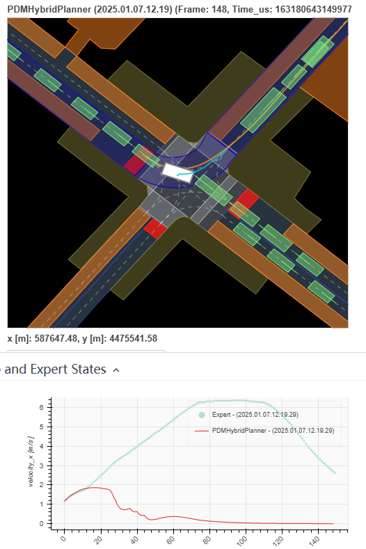

类似的还有 on_intersection - 2021.09.16.15.12.03_veh-42_01037_01434 - 613421d628a15313

#### on_intersection - 16f9c58a29a05547

撞了

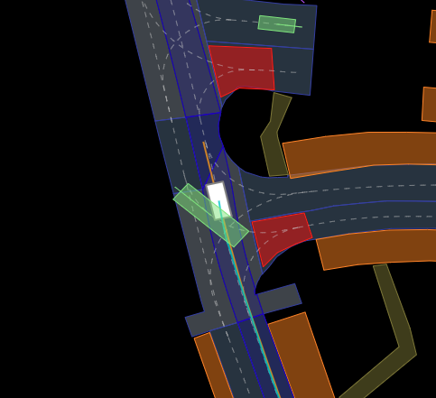

#### on_traffic_light_intersection - a4e10f4e702e54d0

突然出现VRU导致碰撞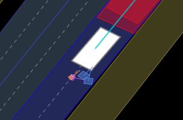

#### stopping_at_stop_sign_no_crosswalk - 459f5f6f7f1651a8

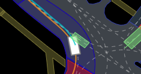

#### on_intersection - 2021.06.24.21.00.48_veh-35_01165_02891 - 000001b4f8c5578d

明明是红灯，但是走了（虽然没有撞车）

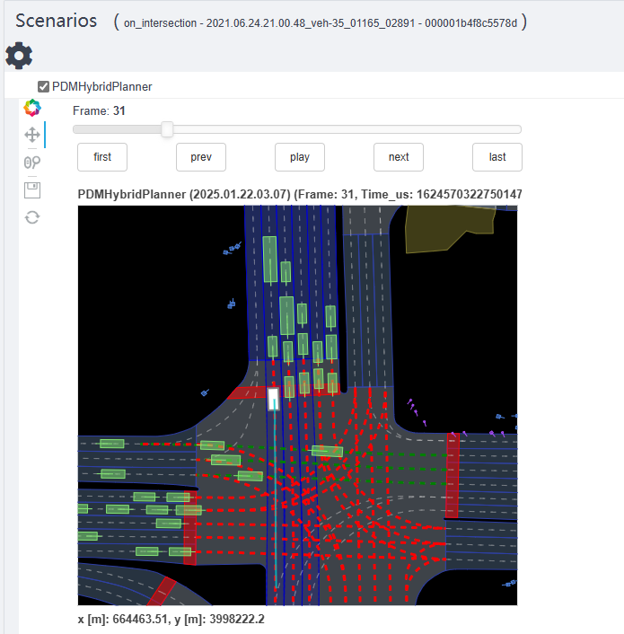

#### changing_lane_to_left - 2021.06.10.16.57.46_veh-38_02067_03812 - 3046444562b95102

撞了突然出现的VRU

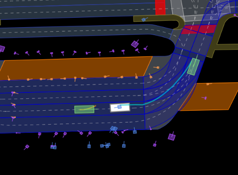

#### changing_lane_to_left - 2021.07.23.21.07.18_veh-47_01458_02100 - ece082b4cbcf5b7c

撞了突然出现的VRU

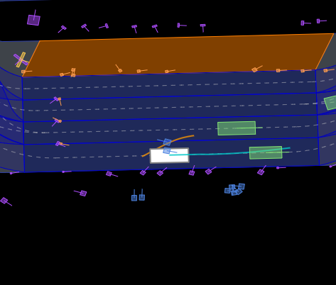


#### changing_lane_to_left - 2021.06.14.15.15.37_veh-47_02213_02564 - bc7469f281e75975

撞了突然出现的行人

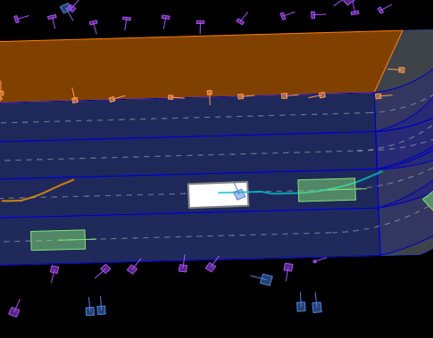


#### changing_lane_to_right - 2021.06.29.19.37.20_veh-26_00016_01863 - 25581a58c80b50ad

stuck

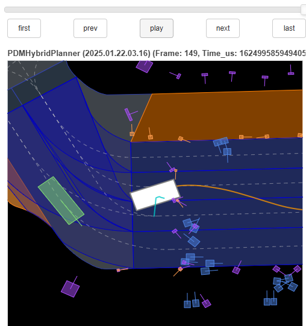


#### changing_lane_to_right - 2021.07.09.15.54.09_veh-37_05595_08092 - c73176b7e0265e25

撞到突然出现的traffic cone

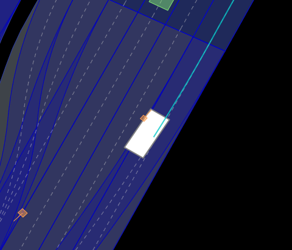


#### changing_lane_to_left - 2021.06.25.14.42.38_veh-38_00005_00881 - cfb84ac562e557b3

撞到突然出现的行人

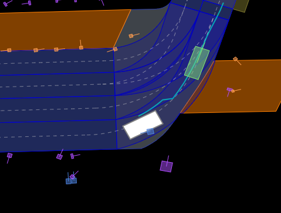


#### changing_lane_to_left - 2021.07.13.22.05.35_veh-35_03308_04360 - f3a11b6c28175fb0

撞到突然出现的xx

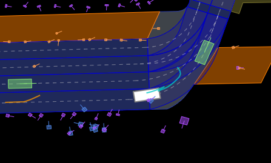

#### changing_lane_to_right - 2021.09.28.08.23.59_veh-50_00115_00298 - ae4a626c1e9e57d1

突然出现

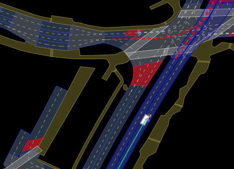

#### changing_lane_to_left - 2021.06.11.12.09.55_veh-16_04449_05055 - a31d78386de053d8

stuck（但后面有点通行的感觉了）

同样的场景，另一个表现还可以changing_lane_to_left - 2021.07.06.23.01.25_veh-38_00093_00390 - 5b62c248da6955a1

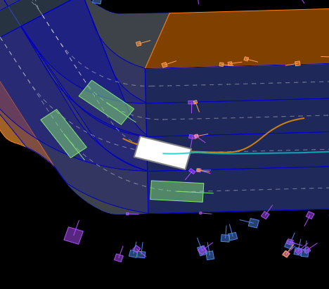

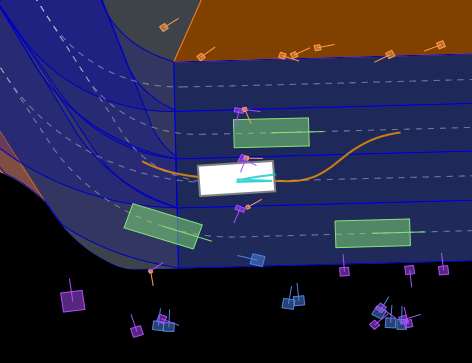


#### changing_lane_to_left - 2021.06.09.16.29.25_veh-47_01487_01640 - ab76e664fa3d513b

emm倒也不能怪车吧。车以及几乎静止了，行人直接撞上来。 评分时认为是collisions

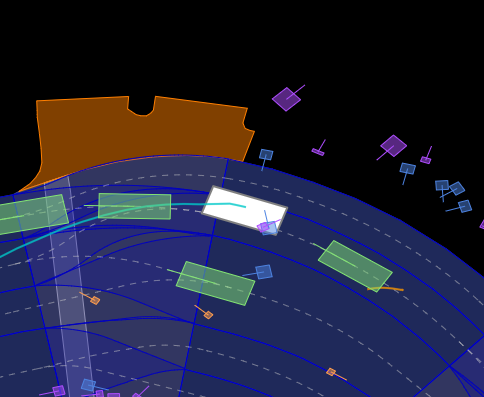


#### changing_lane_to_left - 2021.09.28.16.50.03_veh-44_00782_01293 - 88b2a52f82b7515e

直接越过前车了

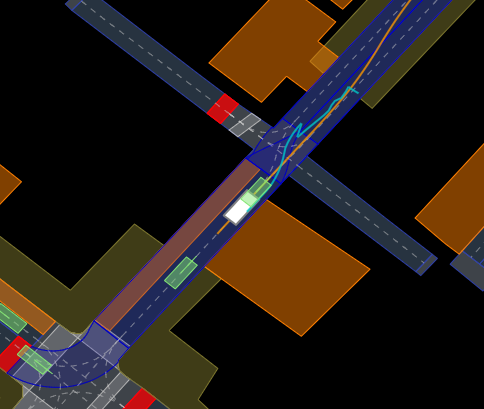


其他：

```
10db9db6282b5355 (2021.06.12.16.57.06_veh-35_01681_02239)场景不错
5a569542d9725bf3 (2021.07.23.23.47.09_veh-35_01604_03034)挺有意思的场景 被行人逼退了一点
```


# 盲区stuck场景

#### on_pickup_dropoff - 075ba1725dd55506

蓝色是bicycle 紫色是generic

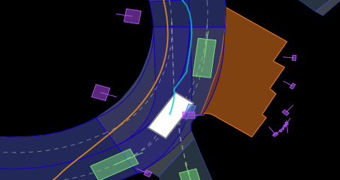

不知道是不是 可以撞的 也和他车有相交了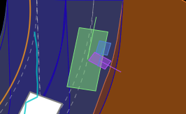

问题：为什么velocity_y   accelaration_y 始终为0？哪个是y方向？

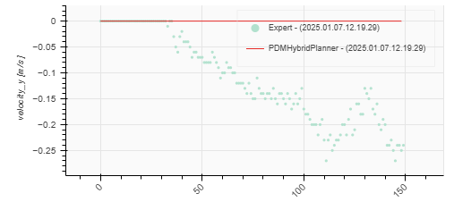


# 场景check

```
Frequency:	47
Values:	False
Scenarios:	a8594fc95b45528e (2021.10.06.07.26.10_veh-52_00006_00398)
63dc2866e8ba5f6f (2021.09.16.15.12.03_veh-42_01037_01434)
ed9872f1e7a35d8e (2021.10.06.07.26.10_veh-52_00006_00398)
c278b4de1bd55db9 (2021.10.06.07.26.10_veh-52_00006_00398)
b7e64de3350e5118 (2021.08.30.14.54.34_veh-40_00439_00835)
459f5f6f7f1651a8 (2021.10.06.07.26.10_veh-52_00006_00398)
99dd01557986575c (2021.09.16.15.12.03_veh-42_01037_01434)
197f9921aa9c548c (2021.09.16.15.12.03_veh-42_01037_01434)
a4e10f4e702e54d0 (2021.08.30.14.54.34_veh-40_00439_00835)
8d6bc3f8ee9c53b7 (2021.10.06.07.26.10_veh-52_00006_00398)
3397cc06f2fa56ba (2021.09.16.15.12.03_veh-42_01037_01434)
0c1111a445e95c36 (2021.05.25.14.16.10_veh-35_01690_02183)
a91ec8498fc4518e (2021.10.06.07.26.10_veh-52_00006_00398)
a0f781b432345784 (2021.08.30.14.54.34_veh-40_00439_00835)
5f015163cae95dee (2021.10.06.07.26.10_veh-52_00006_00398)
a9003e1796cd5538 (2021.09.16.15.12.03_veh-42_01037_01434)
343761de05105b5c (2021.09.16.15.12.03_veh-42_01037_01434)
1e26132b737859dd (2021.05.25.14.16.10_veh-35_01690_02183)
d13aaba2be515a2a (2021.08.30.14.54.34_veh-40_00439_00835)
f068c994bb9352df (2021.05.25.14.16.10_veh-35_01690_02183)
```

number_of_at_fault_collisions_with_VRUS

```
Frequency:	3
Values:	1.0
Scenarios:	
a4e10f4e702e54d0 (2021.08.30.14.54.34_veh-40_00439_00835)
d13aaba2be515a2a (2021.08.30.14.54.34_veh-40_00439_00835)
8c363c1da6a55703 (2021.08.30.14.54.34_veh-40_00439_00835)
```

number_of_at_fault_collisions_with_vehicles

```
Frequency:	32
Values:	1.0
Scenarios:	

a8594fc95b45528e (2021.10.06.07.26.10_veh-52_00006_00398)
63dc2866e8ba5f6f (2021.09.16.15.12.03_veh-42_01037_01434)
ed9872f1e7a35d8e (2021.10.06.07.26.10_veh-52_00006_00398)
c278b4de1bd55db9 (2021.10.06.07.26.10_veh-52_00006_00398)
459f5f6f7f1651a8 (2021.10.06.07.26.10_veh-52_00006_00398)
99dd01557986575c (2021.09.16.15.12.03_veh-42_01037_01434)
197f9921aa9c548c (2021.09.16.15.12.03_veh-42_01037_01434)
8d6bc3f8ee9c53b7 (2021.10.06.07.26.10_veh-52_00006_00398)
3397cc06f2fa56ba (2021.09.16.15.12.03_veh-42_01037_01434)
0c1111a445e95c36 (2021.05.25.14.16.10_veh-35_01690_02183)
a91ec8498fc4518e (2021.10.06.07.26.10_veh-52_00006_00398)
5f015163cae95dee (2021.10.06.07.26.10_veh-52_00006_00398)
a9003e1796cd5538 (2021.09.16.15.12.03_veh-42_01037_01434)
343761de05105b5c (2021.09.16.15.12.03_veh-42_01037_01434)
e088da3fee315168 (2021.10.06.07.26.10_veh-52_00006_00398)
1d33208c85c95470 (2021.10.06.07.26.10_veh-52_00006_00398)
e21b96b8c6ff546c (2021.05.25.14.16.10_veh-35_01690_02183)
ff7fb8f88df555d4 (2021.09.16.15.12.03_veh-42_01037_01434)
67f75ebea9d45b0a (2021.10.06.07.26.10_veh-52_00006_00398)
0a9712684a3b5d22 (2021.09.16.15.12.03_veh-42_01037_01434)
```

已完成（顶格）

```
  - accelerating_at_crosswalk
  - accelerating_at_stop_sign
  - accelerating_at_stop_sign_no_crosswalk
  - accelerating_at_traffic_light
accelerating_at_traffic_light_with_lead
  - accelerating_at_traffic_light_without_lead
  - behind_bike
  - behind_long_vehicle
  - behind_pedestrian_on_driveable
  - behind_pedestrian_on_pickup_dropoff
  - changing_lane
  - changing_lane_to_left
  - changing_lane_to_right
  - changing_lane_with_lead
  - changing_lane_with_trail
  - crossed_by_bike
  - crossed_by_vehicle
  - following_lane_with_lead
  - following_lane_with_slow_lead
  - following_lane_without_lead
  - high_lateral_acceleration
  - high_magnitude_jerk
  - high_magnitude_speed
  - low_magnitude_speed
  - medium_magnitude_speed
  - near_barrier_on_driveable
  - near_construction_zone_sign
  - near_high_speed_vehicle
  - near_long_vehicle
  - near_multiple_bikes
  - near_multiple_pedestrians
  - near_multiple_vehicles
  - near_pedestrian_at_pickup_dropoff
  - near_pedestrian_on_crosswalk
  - near_pedestrian_on_crosswalk_with_ego
  - near_trafficcone_on_driveable
  - on_all_way_stop_intersection
  - on_carpark
on_intersection
on_pickup_dropoff
on_stopline_crosswalk
  - on_stopline_stop_sign
  - on_stopline_traffic_light
  - on_traffic_light_intersection
  - starting_high_speed_turn
  - starting_left_turn
  - starting_low_speed_turn
  - starting_protected_cross_turn
  - starting_protected_noncross_turn
  - starting_right_turn
  - starting_straight_stop_sign_intersection_traversal
  - starting_straight_traffic_light_intersection_traversal
  - starting_u_turn
  - starting_unprotected_cross_turn
  - starting_unprotected_noncross_turn
  - stationary
  - stationary_at_crosswalk
  - stationary_at_traffic_light_with_lead
  - stationary_at_traffic_light_without_lead
  - stationary_in_traffic
  - stopping_at_crosswalk
  - stopping_at_stop_sign_no_crosswalk
  - stopping_at_stop_sign_with_lead
  - stopping_at_stop_sign_without_lead
  - stopping_at_traffic_light_with_lead
  - stopping_at_traffic_light_without_lead
  - stopping_with_lead
  - traversing_crosswalk
  - traversing_intersection
  - traversing_narrow_lane
  - traversing_pickup_dropoff
  - traversing_traffic_light_intersection
  - waiting_for_pedestrian_to_cross
```

