hydra: https://zhuanlan.zhihu.com/p/640898896

lightning: https://zhuanlan.zhihu.com/p/669897894

## run_training.py

```python
logging.getLogger('numba').setLevel(logging.WARNING)
logger = logging.getLogger(__name__)

# If set, use the env. variable to overwrite the default dataset and experiment paths
set_default_path()

# If set, use the env. variable to overwrite the Hydra config
CONFIG_PATH = os.getenv('NUPLAN_HYDRA_CONFIG_PATH', 'config/training')

'''
这里面cfg在~/nuplan-devkit/nuplan/planning/script/config/training下，有：
callbacks
data_augmentation_scheduler
lightning
objective scenario_type_weights
warm_up_lr_scheduler
data_augmentation
data_loader
lr_scheduler
optimizer
training_metric
default_training.yaml
__init__.py
'''
if os.environ.get('NUPLAN_HYDRA_CONFIG_PATH') is not None:
    CONFIG_PATH = os.path.join('../../../../', CONFIG_PATH)

if os.path.basename(CONFIG_PATH) != 'training':
    CONFIG_PATH = os.path.join(CONFIG_PATH, 'training')
CONFIG_NAME = 'default_training'


@hydra.main(config_path=CONFIG_PATH, config_name=CONFIG_NAME)
def main(cfg: DictConfig) -> Optional[TrainingEngine]:
    """
    Main entrypoint for training/validation experiments.
    :param cfg: omegaconf dictionary
    """
    # Fix random seed 设置随机种子
    pl.seed_everything(cfg.seed, workers=True)

    # Configure logger 返回配置好的日志记录器，可以同时将日志输出到控制台和文件中（如果指定了文件路径）
    build_logger(cfg)

    # Override configs based on setup, and print config 更新config
    update_config_for_training(cfg)

    # Create output storage folder：output_dir和scenario_builder
    build_training_experiment_folder(cfg=cfg)

    # Build worker 根据提供的配置 cfg 来构建一个 WorkerPool 实例（通常用于提高应用程序的并行处理能力，特别是在需要执行大量计算密集型任务时。实现线程池模式，维护一系列工作者（workers）。）
    # 执行完该行后，左侧CALL BACK出现subprocess i 和 Thread i
    worker = build_worker(cfg)

    if cfg.py_func == 'train':
        # Build training engine
        #  使用 with 语句创建一个 ProfilerContextManager(在代码的特定段落中启动和停止性能分析，并且可以保存分析结果到指定的目录) 上下文管理器
        # with这一行不产生输出。它创建了一个代码块，在块内的任何代码执行都将被性能分析工具监控
        with ProfilerContextManager(cfg.output_dir, cfg.enable_profiling, "build_training_engine"):
            # 返回的是TrainingEngine类。该类是：Lightning training engine dataclass wrapping the lightning trainer, model and datamodule，初始化了三个（pl就是pytorch_lightning）
            # trainer: pl.Trainer  # Trainer for models
            # model: pl.LightningModule  # Module describing NN model, loss, metrics, visualization
    		# datamodule: pl.LightningDataModule  # Loading data
            engine = build_training_engine(cfg, worker)
         
            
        # Run training
        logger.info('Starting training...')
        with ProfilerContextManager(cfg.output_dir, cfg.enable_profiling, "training"):
            engine.trainer.fit(model=engine.model, datamodule=engine.datamodule)
        return engine
  
if __name__ == '__main__':
    main()

```

debug的时候左侧VARIABLES出现的更新：

```txt
<nuplan.planning.script.builders.logging_builder.PathKeywordMatch object at 0x7f68c748fe50>
<method-wrapper '__call__' of method object at 0x7f68c7003400>
```

## 1 build_training_engine

`training.py`中，`build_train_engine`函数 build了三个lightning modules

```python
def build_training_engine(cfg: DictConfig, worker: WorkerPool) -> TrainingEngine:
    """
    Build the three core lightning modules: LightningDataModule, LightningModule and Trainer
    :param cfg: omegaconf dictionary
    :param worker: Worker to submit tasks which can be executed in parallel
    :return: TrainingEngine
    """
    logger.info('Building training engine...')

    # Create model
    torch_module_wrapper = build_torch_module_wrapper(cfg.model)

    # Build the datamodule
    datamodule = build_lightning_datamodule(cfg, worker, torch_module_wrapper)

    if cfg.lightning.trainer.params.accelerator == 'ddp':  # Update the learning rate parameters to suit ddp
        cfg = scale_cfg_for_distributed_training(cfg, datamodule=datamodule, worker=worker)
    else:
        logger.info(
            f'Updating configs based on {cfg.lightning.trainer.params.accelerator} strategy is currently not supported. Optimizer and LR Scheduler configs will not be updated.'
        )

    # Build lightning module
    model = build_lightning_module(cfg, torch_module_wrapper)

    # Build trainer
    trainer = build_trainer(cfg)

    engine = TrainingEngine(trainer=trainer, datamodule=datamodule, model=model)

    return engine
```

### 1.1 build_torch_module_wrapper

`module_builder.py `这里create model了，函数返回的是PDMOffsetModel

```python
def build_torch_module_wrapper(cfg: DictConfig) -> TorchModuleWrapper:
    """
    Builds the NN module.
    :param cfg: DictConfig. Configuration that is used to run the experiment.
    :return: Instance of TorchModuleWrapper.
    """
    logger.info('Building TorchModuleWrapper...')
    model = instantiate(cfg)
    validate_type(model, TorchModuleWrapper)
    logger.info('Building TorchModuleWrapper...DONE!')

    return model
```


核心是`model = instantiate(cfg)`，如下：

`batch_idm_policy.py`

```
TrajectorySampling(num_poses=16, time_horizon=None, interval_length=0.5)
interval_length = 0.2
num_poses = 10
step_time = 0.1
time_horizon = None

TrajectorySampling(num_poses=80, time_horizon=None, interval_length=0.1)
interval_length = 0.1
num_poses = 80
step_time = 0.1
time_horizon = None

TrajectorySampling(num_poses=40, time_horizon=None, interval_length=0.1)
interval_length = 0.1
num_poses = 40
step_time = 0.1
time_horizon = None
```

```python
class BatchIDMPolicy:
    """
    IDM policies operating on a batch of proposals.
    """
    """
    Constructor for BatchIDMPolicy
    :param target_velocity: Desired fallback velocity in free traffic [m/s]
    :param speed_limit_fraction: Fraction of speed-limit desired in free traffic
    :param min_gap_to_lead_agent: Minimum relative distance to lead vehicle [m]
    :param headway_time: Desired time headway. Minimum time to the vehicle in front [s]
    :param accel_max: maximum acceleration [m/s^2]
    :param decel_max: maximum deceleration (positive value) [m/s^2]
    """
传入：
accel_max = 1.5
decel_max = 3.0
fallback_target_velocity = 15.0
headway_time = 1.5
min_gap_to_lead_agent = 1.0
speed_limit_fraction = [0.2, 0.4, 0.6, 0.8, 1.0]
以上6个量写成：
parameter_list = [15.0, [0.2, 0.4, 0.6, 0.8, 1.0], 1.0, 1.5, 1.5, 3.0]
---
num_policies = 5

```

#### 1.1.1 AbstractPlanner

`abtract_planner.py`

```python
kwargs = 
{'trajectory_sampling': TrajectorySampling(num_poses=80, time_horizon=8.0, interval_length=0.1), 'proposal_sampling': TrajectorySampling(num_poses=40, time_horizon=4.0, interval_length=0.1),  'lateral_offsets': [-1.0, 1.0], 'map_radius': 50},
'idm_policies': <tuplan_garage.planning.simulation.planner.pdm_planner.proposal.batch_idm_policy.BatchIDMPolicy object at 0x7f68c9b22460>
---
idm_policies，是刚才的BatchIDMPolicy:
max_target_velocity = 0.0
num_policies = 5
_accel_max = array([1.5, 1.5, 1.5, 1.5, 1.5])
_decel_max = array([3., 3., 3., 3., 3.])
_fallback_target_velocities = array([15., 15., 15., 15., 15.])
_headway_time = array([1.5, 1.5, 1.5, 1.5, 1.5])
_min_gap_to_lead_agent = array([1., 1., 1., 1., 1.])
_num_policies = 5
_speed_limit_fractions = array([0.2, 0.4, 0.6, 0.8, 1. ])
_target_velocities = array([0., 0., 0., 0., 0.])
```

#### 1.1.2 PDMClosedPlanner

`pdm_closed_planner.py`

```python
class PDMClosedPlanner(AbstractPDMClosedPlanner):
    """PDM-Closed planner class."""

    # Inherited property, see superclass.
    requires_scenario: bool = False

    def __init__(
        self,
        trajectory_sampling: TrajectorySampling,
        proposal_sampling: TrajectorySampling,
        idm_policies: BatchIDMPolicy,
        lateral_offsets: Optional[List[float]],
        map_radius: float,
    ):
        """
        Constructor for PDMClosedPlanner
        :param trajectory_sampling: Sampling parameters for final trajectory
        :param proposal_sampling: Sampling parameters for proposals
        :param idm_policies: BatchIDMPolicy class
        :param lateral_offsets: centerline offsets for proposals (optional)
        :param map_radius: radius around ego to consider
        """
        super(PDMClosedPlanner, self).__init__(
            trajectory_sampling,
            proposal_sampling,
            idm_policies,
            lateral_offsets,
            map_radius,
        )
super(PDMClosedPlanner, self).__init__(...) 调用了 AbstractPDMClosedPlanner类（父类）的 __init__ 方法，并传递了与子类构造函数相同的参数
```

--

#### 1.1.3 AbstractPDMClosedPlanner

`abstract_pdm_closed_planner.py`

```python
class AbstractPDMClosedPlanner(AbstractPDMPlanner):
    """
    Interface for planners incorporating PDM-Closed. Used for PDM-Closed and PDM-Hybrid.
    """
    """
    Constructor for AbstractPDMClosedPlanner
    :param trajectory_sampling: Sampling parameters for final trajectory
    :param proposal_sampling: Sampling parameters for proposals
    :param idm_policies: BatchIDMPolicy class
    :param lateral_offsets: centerline offsets for proposals (optional)
    :param map_radius: radius around ego to consider
    """
    传的还是之前那些
    ---
    以下挨个进一遍
    # observation/forecasting class
    self._observation = PDMObservation(
        trajectory_sampling, proposal_sampling, map_radius
    )

    # proposal/trajectory related classes
    self._generator = PDMGenerator(trajectory_sampling, proposal_sampling)
    self._simulator = PDMSimulator(proposal_sampling)
    self._scorer = PDMScorer(proposal_sampling)
    self._emergency_brake = PDMEmergencyBrake(trajectory_sampling)
```

##### 1.1.3.1 PDMObservation

`pdm_observation.py`

```
observation_sample_res = 2 # res 指 resolution 分辨率
```

##### 1.1.3.2 PDMGenerator

`pdm_generator.py`

```python
class PDMGenerator:
    """Class to generate proposals in PDM."""

    def __init__(
        self,
        trajectory_sampling: TrajectorySampling,
        proposal_sampling: TrajectorySampling,
        leading_agent_update_rate: int = 2,
    ):
        """
        Constructor of PDMGenerator
        :param trajectory_sampling: Sampling parameters for final trajectory
        :param proposal_sampling: Sampling parameters for proposals
        :param leading_agent_update_rate: sample update-rate of leading agent state, defaults to 2
        """
       
leading_agent_update_rate = 2
其他的原来一样   
```

##### 1.1.3.3 PDMSimulator

`pdm_simulator.py`

```python
class PDMSimulator:
    """
    Re-implementation of nuPlan's simulation pipeline. Enables batch-wise simulation.
    """

    def __init__(self, proposal_sampling: TrajectorySampling):
        """
        Constructor of PDMSimulator.
        :param proposal_sampling: Sampling parameters for proposals
        """
        # time parameters
        self._proposal_sampling = proposal_sampling

        # simulation objects
        self._motion_model = BatchKinematicBicycleModel()
        self._tracker = BatchLQRTracker()
        

proposal_sampling = TrajectorySampling(num_poses=40, time_horizon=4.0, interval_length=0.1) # 和之前一样
BatchKinematicBicycleModel
```

###### 1.1.3.3.1 BatchKinematicBicycleModel

`batch_kinematic_bicycle.py`

```python
class BatchKinematicBicycleModel:
    """
    A batch-wise operating class describing the kinematic motion model where the rear axle is the point of reference.
    """

    def __init__(
        self,
        vehicle: VehicleParameters = get_pacifica_parameters(),
        max_steering_angle: float = np.pi / 3,
        : float = 0.2,
        steering_angle_time_constant: float = 0.05,
    ):
        """
        Construct BatchKinematicBicycleModel.
        :param vehicle: Vehicle parameters.
        :param max_steering_angle: [rad] Maximum absolute value steering angle allowed by model.
        :param accel_time_constant: low pass filter time constant for acceleration in s
        :param steering_angle_time_constant: low pass filter time constant for steering angle in s
        """
        self._vehicle = vehicle
        self._max_steering_angle = max_steering_angle
        self._accel_time_constant = accel_time_constant
        self._steering_angle_time_constant = steering_angle_time_constant
        
accel_time_constant = 0.2
max_steering_angle = 1.0471975511965976
steering_angle_time_constant = 0.05
vehicle = VehicleParameters(width=2.297, length=5.176)
	cog_position_from_rear_axle = 1.67
    front_length = 4.049
    half_length = 2.588
    half_width = 1.1485
    height = 1.777
    length = 5.176
    length_cog_to_front_axle = 1.419
    rear_axle_to_center = 1.461
    rear_length = 1.127
    vehicle_name = 'pacifica'
    vehicle_type = 'gen1'
    wheel_base = 3.089
    width = 2.297
```

###### 1.1.3.3.2 BatchLQRTracker

```python
class BatchLQRTracker:
    """
    Implements an LQR tracker for a kinematic bicycle model.
	运动学自行车模型 LQR跟踪器
    Tracker operates on a batch of proposals. Implementation directly based on the nuplan-devkit
    Link: https://github.com/motional/nuplan-devkit

    We decouple into two subsystems, longitudinal and lateral, with small angle approximations for linearization.
    解耦成纵向和横向两个子系统，小角度近似->线性化
    We then solve two sequential LQR subproblems to find acceleration and steering rate inputs.

    Longitudinal Subsystem: 纵向：速度和加速度的关系
        States: [velocity]
        Inputs: [acceleration]
        Dynamics (continuous time):
            velocity_dot = acceleration

    Lateral Subsystem (After Linearization/Small Angle Approximation):
    横向：
        States: [lateral_error, heading_error, steering_angle] [横向误差，航向误差，转向角]
        Inputs: [steering_rate] [转向角速率]
        Parameters: [velocity, curvature] [速度，曲率]
        Dynamics (continuous time):
            lateral_error_dot  = velocity * heading_error
            heading_error_dot  = velocity * (steering_angle / wheelbase_length - curvature)
            steering_angle_dot = steering_rate

    The continuous time dynamics are discretized using Euler integration and zero-order-hold on the input. 离散化
    In case of a stopping reference, we use a simplified stopping P controller instead of LQR.

    The final control inputs passed on to the motion model are: 最终控制输入：加速度、转向角速率
        - acceleration
        - steering_rate
    """

    def __init__(
        self,
        q_longitudinal: npt.NDArray[np.float64] = [10.0],
        r_longitudinal: npt.NDArray[np.float64] = [1.0],
        q_lateral: npt.NDArray[np.float64] = [1.0, 10.0, 0.0],
        r_lateral: npt.NDArray[np.float64] = [1.0],
        discretization_time: float = 0.1,
        tracking_horizon: int = 10,
        jerk_penalty: float = 1e-4,
        curvature_rate_penalty: float = 1e-2,
        stopping_proportional_gain: float = 0.5,
        stopping_velocity: float = 0.2,
        vehicle: VehicleParameters = get_pacifica_parameters(),
    ):
        """
        Constructor for LQR controller
        :param q_longitudinal: The weights for the Q matrix for the longitudinal subystem.
        :param r_longitudinal: The weights for the R matrix for the longitudinal subystem.
        :param q_lateral: The weights for the Q matrix for the lateral subystem.
        :param r_lateral: The weights for the R matrix for the lateral subystem.
        :param discretization_time: [s] The time interval used for discretizing the continuous time dynamics.
        :param tracking_horizon: How many discrete time steps ahead to consider for the LQR objective.
        :param stopping_proportional_gain: The proportional_gain term for the P controller when coming to a stop.
        :param stopping_velocity: [m/s] The velocity below which we are deemed to be stopping and we don't use LQR.
        :param vehicle: Vehicle parameters
        """
        
curvature_rate_penalty = 0.01
discretization_time = 0.1
jerk_penalty = 0.0001
q_lateral = [1.0, 10.0, 0.0]
q_longitudinal = [10.0]
r_lateral = [1.0]
r_longitudinal = [1.0]
stopping_proportional_gain = 0.5
stopping_velocity = 0.2
tracking_horizon = 10
vehicle和之前一样
```


##### 1.1.3.4 PDMScorer

 `pdm_scorer.py`

```python
class PDMScorer:
    """Class to score proposals in PDM pipeline. Re-implements nuPlan's closed-loop metrics."""

    def __init__(self, proposal_sampling: TrajectorySampling):
        """
        Constructor of PDMScorer
        :param proposal_sampling: Sampling parameters for proposals
        """
---
和之前一样
proposal_sampling = TrajectorySampling(num_poses=40, time_horizon=4.0, interval_length=0.1) 
很多optional的，在VARIABLES-Locals里面没看见？
```


##### 1.1.3.5 PDMEmergencyBrake

`pdm_emergency_brake.py`

```python
class PDMEmergencyBrake:
    """Class for emergency brake maneuver of PDM-Closed."""

    def __init__(
        self,
        trajectory_sampling: TrajectorySampling,
        time_to_infraction_threshold: float = 2.0,
        max_ego_speed: float = 5.0,
        max_long_accel: float = 2.40,
        min_long_accel: float = -4.05,
        infraction: str = "collision",
    ):
        """
        Constructor for PDMEmergencyBrake
        :param trajectory_sampling: Sampling parameters for final trajectory
        :param time_to_infraction_threshold: threshold for applying brake, defaults to 2.0
        :param max_ego_speed: maximum speed to apply brake, defaults to 5.0
        :param max_long_accel: maximum longitudinal acceleration for braking, defaults to 2.40
        :param min_long_accel: min longitudinal acceleration for braking, defaults to -4.05
        :param infraction: infraction to determine braking (collision or ttc), defaults to "collision"
        """
        
infraction = 'collision'
max_ego_speed = 5.0 # [m/s]
max_long_accel = 2.4 # [m/s^2]
min_long_accel = -4.05
time_to_infraction_theshold = 2.0
trajectory_sampling = TrajectorySampling(num_poses=80, time_horizon=8.0, interval_length=0.1)
```

--

出来到`pdm_closed_planner.py`

再到`pdm_offset_model.py`

#### 1.1.4 PDMOffsetModel

```python
class PDMOffsetModel(TorchModuleWrapper):
    """
    Wrapper around PDM-Offset MLP that consumes the ego history (position, velocity, acceleration),
    the trajectory of PDM-Closed and the centerline to regresses correction deltas.
    """

    def __init__(
        self,
        trajectory_sampling: TrajectorySampling,
        history_sampling: TrajectorySampling,
        planner: AbstractPlanner,
        centerline_samples: int = 120,
        centerline_interval: float = 1.0,
        hidden_dim: int = 512,
    ):
        """
        Constructor for PDMOffset
        :param trajectory_sampling: Sampling parameters of future trajectory
        :param history_sampling: Sampling parameters of past ego states
        :param planner: Planner for centerline extraction
        :param centerline_samples: Number of poses on the centerline, defaults to 120
        :param centerline_interval: Distance between centerline poses [m], defaults to 1.0
        :param hidden_dim: Size of the hidden dimensionality of the MLP, defaults to 512
        """

        feature_builders = [
            PDMFeatureBuilder(
                trajectory_sampling,
                history_sampling,
                planner,
                centerline_samples,
                centerline_interval,
            )
        ]

        target_builders = [
            EgoTrajectoryTargetBuilder(trajectory_sampling),
        ]

       ...
    
        super().__init__(
            feature_builders=feature_builders,
            target_builders=target_builders,
            future_trajectory_sampling=trajectory_sampling,
        ) # 父类初始化

        self.state_encoding = nn.Sequential(
            nn.Linear(
                (history_sampling.num_poses + 1) * 3 * len(SE2Index), self.hidden_dim
            ),
            nn.ReLU(),
        )

        self.centerline_encoding = nn.Sequential(
            nn.Linear(self.centerline_samples * len(SE2Index), self.hidden_dim),
            nn.ReLU(),
        )

        self.trajectory_encoding = nn.Sequential(
            nn.Linear(trajectory_sampling.num_poses * len(SE2Index), self.hidden_dim),
            nn.ReLU(),
        )

        self.planner_head = nn.Sequential(
            nn.Linear(self.hidden_dim * 3, self.hidden_dim),
            nn.Dropout(0.1),
            nn.ReLU(),
            nn.Linear(self.hidden_dim, self.hidden_dim),
            nn.ReLU(),
            nn.Linear(self.hidden_dim, trajectory_sampling.num_poses * len(SE2Index)),
        )
---
hidden_dim = 512
---

```

##### 1.1.4.1 PDMFeatureBuilder

`pdm_feature_builder.py`

```python
class PDMFeatureBuilder(AbstractFeatureBuilder):
    """Feature builder class for PDMOpen and PDMOffset."""

    def __init__(
        self,
        trajectory_sampling: TrajectorySampling,
        history_sampling: TrajectorySampling,
        planner: Optional[PDMClosedPlanner],
        centerline_samples: int = 120,
        centerline_interval: float = 1.0,
    ):
        """
        Constructor for PDMFeatureBuilder
        :param history_sampling: dataclass for storing trajectory sampling
        :param centerline_samples: number of centerline poses
        :param centerline_interval: interval of centerline poses [m]
        :param planner: PDMClosed planner for correction
        """
---        
centerline_interval = 1.0
centerline_samples = 120
hidden_dim = 512
history_sampling = TrajectorySampling(num_poses=10, time_horizon=2.0, interval_length=0.2)
planner = <tuplan_garage.planning.simulation.planner.pdm_planner.pdm_closed_planner.PDMClosedPlanner object at 0x7f68c9b1a880>
self  = <tuplan_garage.planning.training.preprocessing.feature_builders.pdm_feature_builder.PDMFeatureBuilder object at 0x7f68c95a1bb0>
trajectory_sampling = TrajectorySampling(num_poses=16, time_horizon=8.0, interval_length=0.5)
---
```

##### 1.1.4.2 EgoTrajectoryTargetBuilder

`ego_trajectory_target_builder.py`

```python
class EgoTrajectoryTargetBuilder(AbstractTargetBuilder):
    """Trajectory builders constructed the desired ego's trajectory from a scenario."""

    def __init__(self, future_trajectory_sampling: TrajectorySampling) -> None:
        """
        Initializes the class.
        :param future_trajectory_sampling: parameters for sampled future trajectory
        """
        self._num_future_poses = future_trajectory_sampling.num_poses
        self._time_horizon = future_trajectory_sampling.time_horizon
        
---
future_trajectory_sampling = TrajectorySampling(num_poses=16, time_horizon=8.0, interval_length=0.5)

```

##### 1.1.4.3 TorchModuleWrapper

`torch_module_wrapper.py`

```python
class TorchModuleWrapper(torch.nn.Module):
    """Torch module wrapper that encapsulates builders for constructing model features and targets."""

    def __init__(
        self,
        future_trajectory_sampling: TrajectorySampling,
        feature_builders: List[AbstractFeatureBuilder],
        target_builders: List[AbstractTargetBuilder],
    ):
```


##### 1.1.4.4 网络部分

```
        self.planner_head = nn.Sequential(
            nn.Linear(self.hidden_dim * 3, self.hidden_dim),
            nn.Dropout(0.1),
            nn.ReLU(),
            nn.Linear(self.hidden_dim, self.hidden_dim),
            nn.ReLU(),
            nn.Linear(self.hidden_dim, trajectory_sampling.num_poses * len(SE2Index)),
        )
---
hidden_dim = 512
---

```

1. `self.planner_head = nn.Sequential(...)`：
   - `nn.Sequential`是一个容器，它按照它们在构造函数中传递的顺序包含不同的模块（如层和激活函数），并按顺序对输入数据应用它们。
2. `nn.Linear(self.hidden_dim * 3, self.hidden_dim)`：
   - 这是第一个线性层，它将输入特征的数量从`self.hidden_dim * 3`（即3个编码器的输出维度之和，每个编码器的输出维度都是`self.hidden_dim`，所以是`512 * 3 = 1536`）转换为`self.hidden_dim`（即512）。
3. `nn.Dropout(0.1)`：
   - `Dropout`是一种正则化技术，用于防止神经网络过拟合。在这个例子中，`0.1`表示在训练过程中，有10%的概率将输入单元的值设置为0。
4. `nn.ReLU()`：
   - `ReLU`（Rectified Linear Unit）是一种非线性激活函数，它将所有负值置为0，而保持正值不变。这有助于增加网络的非线性能力，使其能够学习更复杂的模式。
5. `nn.Linear(self.hidden_dim, self.hidden_dim)`：
   - 这是第二个线性层，它保持特征数量不变，即输入和输出都是`self.hidden_dim`（即512）。
6. `nn.ReLU()`：
   - 这是第二个`ReLU`激活函数，应用于第二个线性层的输出。
7. `nn.Linear(self.hidden_dim, trajectory_sampling.num_poses * len(SE2Index))`：
   - 这是第三个线性层，它将特征数量从`self.hidden_dim`（即512）转换为`trajectory_sampling.num_poses * len(SE2Index)`。这个输出维度可能代表最终预测轨迹的每个时间步的位置和方向信息。`trajectory_sampling.num_poses`是预测轨迹中的时间步数，而`len(SE2Index)`是每个时间步的位置和方向信息的维度数。

总结来说，`self.planner_head`是一个由三个线性层和两个`ReLU`激活函数组成的序列模型，中间还有一个`Dropout`层用于正则化。这个模型的输入是三个编码器的输出拼接在一起的特征，输出是预测轨迹的特征表示。每个线性层都紧跟一个`ReLU`激活函数，除了最后一个线性层，这有助于引入非线性并加速训练过程。`Dropout`层有助于减少过拟合，提高模型的泛化能力。

---

### 1.2 build_lightning_datamodule

这里返回的比较多，其中有：

1. feature_and_targets_builder，是一个FeaturePreprocessor object。里面有方法compute_features、get_list_of_feature_types、get_list_of_targeget_list_of_feature_types_types

2. all_samples，NuplanScenario object，里面有train用到的50320个NuplanScenario object。每一个里有map scenario ego_vehicle_params log等，如下图。


3. 还有一些test train val的fraction transform等


```python
def build_lightning_datamodule(
    cfg: DictConfig, worker: WorkerPool, model: TorchModuleWrapper
) -> pl.LightningDataModule:
    """
    Build the lightning datamodule from the config.
    :param cfg: Omegaconf dictionary.
    :param model: NN model used for training.
    :param worker: Worker to submit tasks which can be executed in parallel.
    :return: Instantiated datamodule object.
    """
    # Build features and targets
    feature_builders = model.get_list_of_required_feature()
    target_builders = model.get_list_of_computed_target()

    # Build splitter
    splitter = build_splitter(cfg.splitter)

    # Create feature preprocessor
    feature_preprocessor = FeaturePreprocessor(
        cache_path=cfg.cache.cache_path,
        force_feature_computation=cfg.cache.force_feature_computation,
        feature_builders=feature_builders,
        target_builders=target_builders,
    )

    # Create data augmentation
    augmentors = build_agent_augmentor(cfg.data_augmentation) if 'data_augmentation' in cfg else None

    # Build dataset scenarios
    scenarios = build_scenarios(cfg, worker, model)

    # Create datamodule
    datamodule: pl.LightningDataModule = DataModule(
        feature_preprocessor=feature_preprocessor,
        splitter=splitter,
        all_scenarios=scenarios,
        dataloader_params=cfg.data_loader.params,
        augmentors=augmentors,
        worker=worker,
        scenario_type_sampling_weights=cfg.scenario_type_weights.scenario_type_sampling_weights,
        **cfg.data_loader.datamodule,
    )

    return datamodule
```

#### 1.2.1 feature_builders&target_builders

```python
    # Build features and targets，model就是上一步返回的PDMOffsetModel
    feature_builders = model.get_list_of_required_feature() 是输入给模型的特征
    target_builders = model.get_list_of_computed_target() 是模型计算（输出）的特征
    这里重点是区分这两个含义，分别返回得到PDMFeatureBuilder object和 EgoTrajectoryTargetBuilder object。但此时变量里面没什么实际内容。
```

见下面

#### 1.2.2 TorchModuleWrapper

`torch_module_wrapper.py`中 `class TorchModuleWrapper(torch.nn.Module)`

```python
class TorchModuleWrapper(torch.nn.Module):
    """Torch module wrapper that encapsulates builders for constructing model features and targets."""

    def __init__(
        self,
        future_trajectory_sampling: TrajectorySampling,
        feature_builders: List[AbstractFeatureBuilder],
        target_builders: List[AbstractTargetBuilder],
    ):
        """
        Construct a model with feature and target builders.
        :param future_trajectory_sampling: Parameters for a predicted trajectory.
        :param feature_builders: The list of builders which will compute features for this model.
        :param target_builders: The list of builders which will compute targets for this model.
        """
        super().__init__()

        self.future_trajectory_sampling = future_trajectory_sampling
        self.feature_builders = feature_builders
        self.target_builders = target_builders

    def get_list_of_required_feature(self) -> List[AbstractFeatureBuilder]:
        """Get list of required input features to the model."""
        return self.feature_builders

    def get_list_of_computed_target(self) -> List[AbstractTargetBuilder]:
        """Get list of features that the model computes."""
        return self.target_builders
```

返回：

```shell
self = PDMOffsetModel(
	T_destination = ~T_destination  
	centerline_encoding = Sequential(
		(0): Linear(in_features=360, out_features=512, bias=True)
		(1): ReLU()
    )
    centerline_interval = 1.0
    centerline_samples = 120
    dump_patches = False
    feature_builders = [<tuplan_garage.planning.training.preprocessing.feature_builders.pdm_feature_builder.PDMFeatureBuilder object at 0x7f68c95a1bb0>]
    future_trajectory_sampling = TrajectorySampling(num_poses=16, time_horizon=8.0, interval_length=0.5)
    hidden_dim = 512
    history_sampling = TrajectorySampling(num_poses=10, time_horizon=2.0, interval_length=0.2)
    planner_head = Sequential(
  		(0): Linear(in_features=1536, out_features=512, bias=True)
  		(1): Dropout(p=0.1, inplace=False)
  		(2): ReLU()
  		(3): Linear(in_features=512, out_features=512, bias=True)
  		(4): ReLU()
  		(5): Linear(in_features=512, out_features=48, bias=True)
    )
    state_encoding = Sequential(
		(0): Linear(in_features=99, out_features=512, bias=True)
        (1): ReLU()
    )
    target_builder = [<nuplan.planning.training.preprocessing.target_builders.ego_trajectory_target_builder.EgoTrajectoryTargetBuilder object at 0x7f68c9c2b250>]
    training = True
    trajectory_encoding = Sequential(
		(0): Linear(in_features=48, out_features=512, bias=True)
		(1): ReLU()
	)
    trajectory_sampling = TrajectorySampling(num_poses=16, time_horizon=8.0, interval_length=0.5)
    _apply = <bound method Module._apply of PDMOffsetModel(
      (state_encoding): Sequential(
        (0): Linear(in_features=99, out_features=512, bias=True)
        (1): ReLU()
      )
      (centerline_encoding): Sequential(
        (0): Linear(in_features=360, out_features=512, bias=True)
        (1): ReLU()
      )
      (trajectory_encoding): Sequential(
        (0): Linear(in_features=48, out_features=512, bias=True)
        (1): ReLU()
      )
      (planner_head): Sequential(
        (0): Linear(in_features=1536, out_features=512, bias=True)
        (1): Dropout(p=0.1, inplace=False)
        (2): ReLU()
        (3): Linear(in_features=512, out_features=512, bias=True)
        (4): ReLU()
        (5): Linear(in_features=512, out_features=48, bias=True)
      )
    )>
	_backward_hooks = OrderedDict([])
    后面还有一些 变量名不一样，但值也都是_apply或_backward_hooks的值
    _version = 1
)
```

#### 1.2.2 build_splitter

`splitter_builder.py` 划分数据集，返回test_logs train_logs val_logs，数量分别是 1349、13180、1381。

```python
def build_splitter(cfg: DictConfig) -> AbstractSplitter:
    """
    Build the splitter.
    :param cfg: DictConfig. Configuration that is used to run the experiment.
    :return: Instance of Splitter.
    """
    logger.info('Building Splitter...')
    splitter: AbstractSplitter = instantiate(cfg)
    validate_type(splitter, AbstractSplitter)
    logger.info('Building Splitter...DONE!')
    return splitter
```

##### 1.2.2.1 LogSplitter

进`log_splitter.py`

```python
class LogSplitter(AbstractSplitter):
    """
    Splitter that splits database to lists of samples for each of train/val/test sets based on log name.
    """

    def __init__(self, log_splits: Dict[str, List[str]]) -> None:
        """
        Initializes the class.

        :param log_splits: dictionary containing 'train', 'val', 'test' keys mapped to lists of log names
        """
```

#### 1.2.3 FeaturePreprocessor *


```python
class FeaturePreprocessor:
    """
    Compute features and targets for a scenario. This class also manages cache. If a feature/target
    is not present in a cache, it is computed, otherwise it is loaded
    """
    def __init__(
        self,
        cache_path: Optional[str],
        force_feature_computation: bool,
        feature_builders: List[AbstractFeatureBuilder],
        target_builders: List[AbstractTargetBuilder],
    ):
        """
        Initialize class.
        :param cache_path: Whether to cache features.
        :param force_feature_computation: If true, even if cache exists, it will be overwritten.
        :param feature_builders: List of feature builders.
        :param target_builders: List of target builders.
        """
    def compute_features(
        self, scenario: AbstractScenario
    ) -> Tuple[FeaturesType, TargetsType, List[CacheMetadataEntry]]:
        """
        Compute features for a scenario, in case cache_path is set, features will be stored in cache,
        otherwise just recomputed
        :param scenario for which features and targets should be computed
        :return: model features and targets and cache metadata
        """
```

#### 1.2.4 build_scenarios

`scenario_builder.py` 

建立场景，从dataset or cache中，返回若干NuplanScenario object，每一个多了initial_state initial_tracked objects等信息

```python
def build_scenarios(cfg: DictConfig, worker: WorkerPool, model: TorchModuleWrapper) -> List[AbstractScenario]:
    """
    Build the scenario objects that comprise the training dataset.
    :param cfg: Omegaconf dictionary.
    :param worker: Worker to submit tasks which can be executed in parallel.
    :param model: NN model used for training.
    :return: List of extracted scenarios.
    """
---
model = PDMOffsetModel(
  (state_encoding): Sequential(
    (0): Linear(in_features=99, out_features=512, bias=True)
    (1): ReLU()
  )
  (centerline_encoding): Sequential(
    (0): Linear(in_features=360, out_features=512, bias=True)
    (1): ReLU()
  )
  (trajectory_encoding): Sequential(
    (0): Linear(in_features=48, out_features=512, bias=True)
    (1): ReLU()
  )
  (planner_head): Sequential(
    (0): Linear(in_features=1536, out_features=512, bias=True)
    (1): Dropout(p=0.1, inplace=False)
    (2): ReLU()
    (3): Linear(in_features=512, out_features=512, bias=True)
    (4): ReLU()
    (5): Linear(in_features=512, out_features=48, bias=True)
  )
)
config = {'group': '/mnt/home/jiayukun/nuplan-devkit/nuplan/exp/exp', 'experiment_name': 'training_pdm_offset_model', 'job_name': 'training_pdm_offset_model', 'date_format': '%Y.%m.%d.%H.%M.%S', 'experiment_uid': '2024.11.27.01.06.09', 'experiment': 'training_pdm_offset_model/training_pdm_offset_model/2024.11.27.01.06.09', 'output_dir': '/mnt/home/jiayukun/nuplan-devkit/nuplan/exp/exp/training_pdm_offset_model/training_pdm_offset_model/2024.11.27.01.06.09', 'metric_dir': 'metrics', 'aggregator_metric_dir': 'aggregator_metric', 'runner_report_file': 'runner_report.parquet', 'log_config': False, 'max_number_of_workers': None, 'seed': 0, 'enable_profiling': False, 'gpu': True, 'logger_level': 'info', 'logger_format_string': None, 'scenario_builder': {'vehicle_parameters': {'_target_': 'nuplan.common.actor_state.vehicle_parameters.VehicleParameters', '_convert_': 'all', 'width': 2.297, 'front_length': 4.049, 'rear_length': 1.127, 'cog_position_from_rear_axle': 1.67, 'height': 1.777, 'wheel_base': 3.089, 'vehicle_name': 'pacifica', 'vehicle_type': 'gen1'}, 'scenario_mapping': {'_target_': 'nuplan.planning.scenario_builder.nuplan_db.nuplan_scenario_utils.ScenarioMapping', '_convert_': 'all', 'subsample_ratio_override': 0.5, 'scenario_map': {'accelerating_at_crosswalk': [15.0, -3.0], 'accelerating_at_stop_sign': [15.0, -3.0], 'accelerating_at_stop_sign_no_crosswalk': [15.0, -3.0], 'accelerating_at_traffic_light': [15.0, -3.0], 'accelerating_at_traffic_light_with_lead': [15.0, -3.0], 'accelerating_at_traffic_light_without_lead': [15.0, -3.0], 'behind_bike': [15.0, -3.0], 'behind_long_vehicle': [15.0, -3.0], 'behind_pedestrian_on_driveable': [15.0, -3.0], 'behind_pedestrian_on_pickup_dropoff': [15.0, -3.0], 'changing_lane': [15.0, -3.0], 'changing_lane_to_left': [15.0, -3.0], 'changing_lane_to_right': [15.0, -3.0], 'changing_lane_with_lead': [15.0, -3.0], 'changing_lane_with_trail': [15.0, -3.0], 'crossed_by_bike': [15.0, -3.0], 'crossed_by_vehicle': [15.0, -3.0], 'following_lane_with_lead': [15.0, -3.0], 'following_lane_with_slow_lead': [15.0, -3.0], 'following_lane_without_lead': [15.0, -3.0], 'high_lateral_acceleration': [15.0, -3.0], 'high_magnitude_jerk': [15.0, -3.0], 'high_magnitude_speed': [15.0, -3.0], 'low_magnitude_speed': [15.0, -3.0], 'medium_magnitude_speed': [15.0, -3.0], 'near_barrier_on_driveable': [15.0, -3.0], 'near_construction_zone_sign': [15.0, -3.0], 'near_high_speed_vehicle': [15.0, -3.0], 'near_long_vehicle': [15.0, -3.0], 'near_multiple_bikes': [15.0, -3.0], 'near_multiple_pedestrians': [15.0, -3.0], 'near_multiple_vehicles': [15.0, -3.0], 'near_pedestrian_at_pickup_dropoff': [15.0, -3.0], 'near_pedestrian_on_crosswalk': [15.0, -3.0], 'near_pedestrian_on_crosswalk_with_ego': [15.0, -3.0], 'near_trafficcone_on_driveable': [15.0, -3.0], 'on_all_way_stop_intersection': [15.0, -3.0], 'on_carpark': [15.0, -3.0], 'on_intersection': [15.0, -3.0], 'on_pickup_dropoff': [15.0, -3.0], 'on_stopline_crosswalk': [15.0, -3.0], 'on_stopline_stop_sign': [15.0, -3.0], 'on_stopline_traffic_light': [15.0, -3.0], 'on_traffic_light_intersection': [15.0, -3.0], 'starting_high_speed_turn': [15.0, -3.0], 'starting_left_turn': [15.0, -3.0], 'starting_low_speed_turn': [15.0, -3.0], 'starting_protected_cross_turn': [15.0, -3.0], 'starting_protected_noncross_turn': [15.0, -3.0], 'starting_right_turn': [15.0, -3.0], 'starting_straight_stop_sign_intersection_traversal': [15.0, -3.0], 'starting_straight_traffic_light_intersection_traversal': [15.0, -3.0], 'starting_u_turn': [15.0, -3.0], 'starting_unprotected_cross_turn': [15.0, -3.0], 'starting_unprotected_noncross_turn': [15.0, -3.0], 'stationary': [15.0, -3.0], 'stationary_at_crosswalk': [15.0, -3.0], 'stationary_at_traffic_light_with_lead': [15.0, -3.0], 'stationary_at_traffic_light_without_lead': [15.0, -3.0], 'stationary_in_traffic': [15.0, -3.0], 'stopping_at_crosswalk': [15.0, -3.0], 'stopping_at_stop_sign_no_crosswalk': [15.0, -3.0], 'stopping_at_stop_sign_with_lead': [15.0, -3.0], 'stopping_at_stop_sign_without_lead': [15.0, -3.0], 'stopping_at_traffic_light_with_lead': [15.0, -3.0], 'stopping_at_traffic_light_without_lead': [15.0, -3.0], 'stopping_with_lead': [15.0, -3.0], 'traversing_crosswalk': [15.0, -3.0], 'traversing_intersection': [15.0, -3.0], 'traversing_narrow_lane': [15.0, -3.0], 'traversing_pickup_dropoff': [15.0, -3.0], 'traversing_traffic_light_intersection': [15.0, -3.0], 'waiting_for_pedestrian_to_cross': [15.0, -3.0]}}, '_target_': 'nuplan.planning.scenario_builder.nuplan_db.nuplan_scenario_builder.NuPlanScenarioBuilder', '_convert_': 'all', 'data_root': '/mnt/home/shared_folder/nuPlan/dataset/nuplan-v1.1/splits/mini', 'map_root': '/mnt/home/shared_folder/nuPlan/dataset/maps', 'sensor_root': '/mnt/home/shared_folder/nuPlan/dataset/nuplan-v1.1/sensor_blobs', 'db_files': None, 'map_version': 'nuplan-maps-v1.0', 'include_cameras': False, 'max_workers': None, 'verbose': False}, 'scenario_filter': {'_target_': 'nuplan.planning.scenario_builder.scenario_filter.ScenarioFilter', '_convert_': 'all', 'scenario_types': None, 'scenario_tokens': None, 'log_names': None, 'map_names': None, 'num_scenarios_per_type': 4000, 'limit_total_scenarios': None, 'timestamp_threshold_s': None, 'ego_displacement_minimum_m': None, 'ego_start_speed_threshold': None, 'ego_stop_speed_threshold': None, 'speed_noise_tolerance': None, 'expand_scenarios': True, 'remove_invalid_goals': True, 'shuffle': True}, 'model': {'_target_': 'tuplan_garage.planning.training.modeling.models.pdm_offset_model.PDMOffsetModel', '_convert_': 'all', 'trajectory_sampling': {'_target_': 'nuplan.planning.simulation.trajectory.trajectory_sampling.TrajectorySampling', '_convert_': 'all', 'num_poses': 16, 'interval_length': 0.5}, 'history_sampling': {'_target_': 'nuplan.planning.simulation.trajectory.trajectory_sampling.TrajectorySampling', '_convert_': 'all', 'num_poses': 10, 'interval_length': 0.2}, 'planner': {'_target_': 'tuplan_garage.planning.simulation.planner.pdm_planner.pdm_closed_planner.PDMClosedPlanner', '_convert_': 'all', 'trajectory_sampling': {'_target_': 'nuplan.planning.simulation.trajectory.trajectory_sampling.TrajectorySampling', '_convert_': 'all', 'num_poses': 80, 'interval_length': 0.1}, 'proposal_sampling': {'_target_': 'nuplan.planning.simulation.trajectory.trajectory_sampling.TrajectorySampling', '_convert_': 'all', 'num_poses': 40, 'interval_length': 0.1}, 'idm_policies': {'_target_': 'tuplan_garage.planning.simulation.planner.pdm_planner.proposal.batch_idm_policy.BatchIDMPolicy', '_convert_': 'all', 'speed_limit_fraction': [0.2, 0.4, 0.6, 0.8, 1.0], 'fallback_target_velocity': 15.0, 'min_gap_to_lead_agent': 1.0, 'headway_time': 1.5, 'accel_max': 1.5, 'decel_max': 3.0}, 'lateral_offsets': [-1.0, 1.0], 'map_radius': 50}, 'centerline_samples': 120, 'centerline_interval': 1.0, 'hidden_dim': 512}, 'worker': {'_target_': 'nuplan.planning.utils.multithreading.worker_ray.RayDistributed', '_convert_': 'all', 'master_node_ip': None, 'threads_per_node': None, 'debug_mode': False, 'log_to_driver': True, 'logs_subdir': 'logs', 'use_distributed': False}, 'distribute_by_scenario': True, 'distributed_timeout_seconds': 7200, 'selected_simulation_metrics': None, 'verbose': False, 'lightning': {'distributed_training': {'equal_variance_scaling_strategy': True}, 'trainer': {'checkpoint': {'resume_training': False, 'save_top_k': 1, 'monitor': 'loss/val_loss', 'mode': 'min'}, 'params': {'max_time': '00:16:00:00', 'max_epochs': 1, 'check_val_every_n_epoch': 1, 'val_check_interval': 1.0, 'limit_train_batches': 1.0, 'limit_val_batches': 1.0, 'limit_test_batches': 1.0, 'gpus': -1, 'accelerator': 'ddp', 'precision': 16, 'amp_level': 'O2', 'num_nodes': 1, 'auto_scale_batch_size': False, 'auto_lr_find': False, 'terminate_on_nan': True, 'num_sanity_val_steps': 0, 'fast_dev_run': False, 'accumulate_grad_batches': 1, 'track_grad_norm': -1, 'gradient_clip_val': 0.0, 'gradient_clip_algorithm': 'norm', 'checkpoint_callback': True}, 'overfitting': {'enable': False, 'params': {'max_epochs': 150, 'overfit_batches': 1}}}}, 'callbacks': {'learning_rate_monitor_callback': {'_target_': 'pytorch_lightning.callbacks.LearningRateMonitor', '_convert_': 'all', 'logging_interval': 'step', 'log_momentum': True}, 'model_checkpoint_callback': {'_target_': 'nuplan.planning.training.callbacks.checkpoint_callback.ModelCheckpointAtEpochEnd', '_convert_': 'all', 'save_last': False, 'dirpath': '/mnt/home/jiayukun/nuplan-devkit/nuplan/exp/exp/training_pdm_offset_model/training_pdm_offset_model/2024.11.27.01.06.09/best_model', 'save_top_k': 1, 'monitor': 'loss/val_loss', 'mode': 'min'}, 'time_logging_callback': {'_target_': 'nuplan.planning.training.callbacks.time_logging_callback.TimeLoggingCallback', '_convert_': 'all'}, 'visualization_callback': {'_target_': 'nuplan.planning.training.callbacks.visualization_callback.VisualizationCallback', '_convert_': 'all', 'images_per_tile': 8, 'num_train_tiles': 5, 'num_val_tiles': 5, 'pixel_size': 0.1}}, 'optimizer': {'_target_': 'torch.optim.Adam', '_convert_': 'all', 'lr': 0.0001, 'weight_decay': 0.0005, 'betas': [0.9, 0.999]}, 'lr_scheduler': {'_target_': 'torch.optim.lr_scheduler.MultiStepLR', '_convert_': 'all', 'milestones': [50, 75], 'gamma': 0.1}, 'data_loader': {'datamodule': {'train_fraction': 1.0, 'val_fraction': 1.0, 'test_fraction': 1.0}, 'params': {'batch_size': 64, 'num_workers': 8, 'pin_memory': True, 'drop_last': True}}, 'splitter': {'_target_': 'nuplan.planning.training.data_loader.log_splitter.LogSplitter', '_convert_': 'all', 'log_splits': {'train': [...],'val': [...],'test': [...]}}, 'objective': {'l1_objective': {'_target_': 'tuplan_garage.planning.training.modeling.objectives.l1_objective.L1Objective', '_convert_': 'all', 'weight': 1.0}}, 'training_metric': {'avg_displacement_error': {'_target_': 'nuplan.planning.training.modeling.metrics.planning_metrics.AverageDisplacementError', '_convert_': 'all'}, 'avg_heading_error': {'_target_': 'nuplan.planning.training.modeling.metrics.planning_metrics.AverageHeadingError', '_convert_': 'all'}, 'final_displacement_error': {'_target_': 'nuplan.planning.training.modeling.metrics.planning_metrics.FinalDisplacementError', '_convert_': 'all'}, 'final_heading_error': {'_target_': 'nuplan.planning.training.modeling.metrics.planning_metrics.FinalHeadingError', '_convert_': 'all'}}, 'scenario_type_weights': {'scenario_type_sampling_weights': {'enable': False, 'scenario_type_weights': {'unknown': 1.0}}, 'scenario_type_loss_weights': {'unknown': 1.0}}, 'objective_aggregate_mode': 'mean', 'cache': {'cache_path': '/mnt/home/jiayukun/nuplan-devkit/nuplan/exp', 'use_cache_without_dataset': False, 'force_feature_computation': False, 'cleanup_cache': False}, 'py_func': 'train'}

worker = <nuplan.planning.utils.multithreading.worker_ray.RayDistributed object at 0x7f68c73dc280>
```


#### 1.2.5 DataModule(pl.LightningDataModule)

创建datamodule `datamodule.py`

```python
class DataModule(pl.LightningDataModule):
    """
    Datamodule wrapping all preparation and dataset creation functionality.
    """

    def __init__(
        self,
        feature_preprocessor: FeaturePreprocessor,
        splitter: AbstractSplitter,
        all_scenarios: List[AbstractScenario],
        train_fraction: float,
        val_fraction: float,
        test_fraction: float,
        dataloader_params: Dict[str, Any],
        scenario_type_sampling_weights: DictConfig,
        worker: WorkerPool,
        augmentors: Optional[List[AbstractAugmentor]] = None,
    ) -> None:
        """
        Initialize the class.
        :param feature_preprocessor: Feature preprocessor object.
        :param splitter: Splitter object used to retrieve lists of samples to construct train/val/test sets.
        :param train_fraction: Fraction of training examples to load.
        :param val_fraction: Fraction of validation examples to load.
        :param test_fraction: Fraction of test examples to load.
        :param dataloader_params: Parameter dictionary passed to the dataloaders.
        :param augmentors: Augmentor object for providing data augmentation to data samples.
        """
---
all_scenarios = [<nuplan.planning.scenario_builder.nuplan_db.nuplan_scenario.NuPlanScenario object at 0x7f67695bf520>, <nuplan.planning.scenario_builder.nuplan_db.nuplan_scenario.NuPlanScenario object at 0x7f6774ad5f70>, <nuplan.planning.scenario_builder.nuplan_db.nuplan_scenario.NuPlanScenario object at 0x7f6774d58940>, <nuplan.planning.scenario_builder.nuplan_db.nuplan_scenario.NuPlanScenario object at 0x7f67690085b0>, <nuplan.planning.scenario_builder.nuplan_db.nuplan_scenario.NuPlanScenario object at 0x7f6776b8ed30>, <nuplan.planning.scenario_builder.nuplan_db.nuplan_scenario.NuPlanScenario object at 0x7f679edc7130>, <nuplan.planning.scenario_builder.nuplan_db.nuplan_scenario.NuPlanScenario object at 0x7f679f5120d0>, <nuplan.planning.scenario_builder.nuplan_db.nuplan_scenario.NuPlanScenario object at 0x7f67698b06a0>, <nuplan.planning.scenario_builder.nuplan_db.nuplan_scenario.NuPlanScenario object at 0x7f67692458b0>, <nuplan.planning.scenario_builder.nuplan_db.nuplan_scenario.NuPlanScenario object at 0x7f6769cab520>, <nuplan.planning.scenario_builder.nuplan_db.nuplan_scenario.NuPlanScenario object at 0x7f676945e700>, <nuplan.planning.scenario_builder.nuplan_db.nuplan_scenario.NuPlanScenario object at 0x7f6774bd1df0>, <nuplan.planning.scenario_builder.nuplan_db.nuplan_scenario.NuPlanScenario object at 0x7f67751f2760>, <nuplan.planning.scenario_builder.nuplan_db.nuplan_scenario.NuPlanScenario object at 0x7f6774267d60>, <nuplan.planning.scenario_builder.nuplan_db.nuplan_scenario.NuPlanScenario object at 0x7f6768cf52e0>, <nuplan.planning.scenario_builder.nuplan_db.nuplan_scenario.NuPlanScenario object at 0x7f6821e144c0>, <nuplan.planning.scenario_builder.nuplan_db.nuplan_scenario.NuPlanScenario object at 0x7f677441b370>, <nuplan.planning.scenario_builder.nuplan_db.nuplan_scenario.NuPlanScenario object at 0x7f679e5b39a0>, <nuplan.planning.scenario_builder.nuplan_db.nuplan_scenario.NuPlanScenario object at 0x7f67753eed90>, <nuplan.planning.scenario_builder.nuplan_db.nuplan_scenario.NuPlanScenario object at 0x7f6775837730>, <nuplan.planning.scenario_builder.nuplan_db.nuplan_scenario.NuPlanScenario object at 0x7f6776f62f40>, <nuplan.planning.scenario_builder.nuplan_db.nuplan_scenario.NuPlanScenario object at 0x7f679f10c970>, <nuplan.planning.scenario_builder.nuplan_db.nuplan_scenario.NuPlanScenario object at 0x7f679f56b6a0>, <nuplan.planning.scenario_builder.nuplan_db.nuplan_scenario.NuPlanScenario object at 0x7f688a4ccf40>, <nuplan.planning.scenario_builder.nuplan_db.nuplan_scenario.NuPlanScenario object at 0x7f67775dc1f0>, <nuplan.planning.scenario_builder.nuplan_db.nuplan_scenario.NuPlanScenario object at 0x7f6777192b80>, <nuplan.planning.scenario_builder.nuplan_db.nuplan_scenario.NuPlanScenario object at 0x7f679f4bd850>, <nuplan.planning.scenario_builder.nuplan_db.nuplan_scenario.NuPlanScenario object at 0x7f6768c1acd0>, <nuplan.planning.scenario_builder.nuplan_db.nuplan_scenario.NuPlanScenario object at 0x7f67778e9130>, <nuplan.planning.scenario_builder.nuplan_db.nuplan_scenario.NuPlanScenario object at 0x7f679f349ca0>, <nuplan.planning.scenario_builder.nuplan_db.nuplan_scenario.NuPlanScenario object at 0x7f6776388610>, <nuplan.planning.scenario_builder.nuplan_db.nuplan_scenario.NuPlanScenario object at 0x7f688a5c2eb0>, <nuplan.planning.scenario_builder.nuplan_db.nuplan_scenario.NuPlanScenario object at 0x7f67764b3640>, <nuplan.planning.scenario_builder.nuplan_db.nuplan_scenario.NuPlanScenario object at 0x7f68cc2dc7c0>, <nuplan.planning.scenario_builder.nuplan_db.nuplan_scenario.NuPlanScenario object at 0x7f67696e5cd0>, <nuplan.planning.scenario_builder.nuplan_db.nuplan_scenario.NuPlanScenario object at 0x7f679f3274c0>, <nuplan.planning.scenario_builder.nuplan_db.nuplan_scenario.NuPlanScenario object at 0x7f67762a1520>, <nuplan.planning.scenario_builder.nuplan_db.nuplan_scenario.NuPlanScenario object at 0x7f68cbdf11c0>, <nuplan.planning.scenario_builder.nuplan_db.nuplan_scenario.NuPlanScenario object at 0x7f6775f42af0>, <nuplan.planning.scenario_builder.nuplan_db.nuplan_scenario.NuPlanScenario object at 0x7f6775b23d00>, <nuplan.planning.scenario_builder.nuplan_db.nuplan_scenario.NuPlanScenario object at 0x7f679f1cf5e0>, <nuplan.planning.scenario_builder.nuplan_db.nuplan_scenario.NuPlanScenario object at 0x7f679ed192b0>, <nuplan.planning.scenario_builder.nuplan_db.nuplan_scenario.NuPlanScenario object at 0x7f6769674400>, <nuplan.planning.scenario_builder.nuplan_db.nuplan_scenario.NuPlanScenario object at 0x7f67765553d0>, <nuplan.planning.scenario_builder.nuplan_db.nuplan_scenario.NuPlanScenario object at 0x7f6775291490>, <nuplan.planning.scenario_builder.nuplan_db.nuplan_scenario.NuPlanScenario object at 0x7f677799ff40>, <nuplan.planning.scenario_builder.nuplan_db.nuplan_scenario.NuPlanScenario object at 0x7f67766d0610>, <nuplan.planning.scenario_builder.nuplan_db.nuplan_scenario.NuPlanScenario object at 0x7f6775291850>, <nuplan.planning.scenario_builder.nuplan_db.nuplan_scenario.NuPlanScenario object at 0x7f6775240cd0>, <nuplan.planning.scenario_builder.nuplan_db.nuplan_scenario.NuPlanScenario object at 0x7f679f62bb80>, <nuplan.planning.scenario_builder.nuplan_db.nuplan_scenario.NuPlanScenario object at 0x7f679e884940>, <nuplan.planning.scenario_builder.nuplan_db.nuplan_scenario.NuPlanScenario object at 0x7f679f505e20>, <nuplan.planning.scenario_builder.nuplan_db.nuplan_scenario.NuPlanScenario object at 0x7f676938ffd0>, <nuplan.planning.scenario_builder.nuplan_db.nuplan_scenario.NuPlanScenario object at 0x7f679f54a610>, <nuplan.planning.scenario_builder.nuplan_db.nuplan_scenario.NuPlanScenario object at 0x7f6774d093d0>, <nuplan.planning.scenario_builder.nuplan_db.nuplan_scenario.NuPlanScenario object at 0x7f68cc2693d0>, <nuplan.planning.scenario_builder.nuplan_db.nuplan_scenario.NuPlanScenario object at 0x7f677770e8e0>, <nuplan.planning.scenario_builder.nuplan_db.nuplan_scenario.NuPlanScenario object at 0x7f6769803d30>, <nuplan.planning.scenario_builder.nuplan_db.nuplan_scenario.NuPlanScenario object at 0x7f6774d091c0>, ...]
dataloader_params = {'batch_size': 64, 'num_workers': 8, 'pin_memory': True, 'drop_last': True}
feature_preprocessor = <nuplan.planning.training.preprocessing.feature_preprocessor.FeaturePreprocessor object at 0x7f68c4540d90>
scenario_type_sampling_weights = {'enable': False, 'scenario_type_weights': {'unknown': 1.0}}
self = <nuplan.planning.training.data_loader.datamodule.DataModule object at 0x7f679edc78e0>
splitter = <nuplan.planning.training.data_loader.log_splitter.LogSplitter object at 0x7f68c73a9850>
test_fraction = 1.0
train_fraction = 1.0
val_fraction = 1.0
worker = <nuplan.planning.utils.multithreading.worker_ray.RayDistributed object at 0x7f68c73dc280>
```


### 1.3 scale_cfg_for_distributed_training

```python
def scale_cfg_for_distributed_training(
    cfg: DictConfig, datamodule: pl.LightningDataModule, worker: WorkerPool
) -> DictConfig:
    """
    Adjusts parameters in cfg for ddp.
    :param cfg: Config with parameters for instantiation.
    :param datamodule: Datamodule which will be used for updating the lr_scheduler parameters.
    :return cfg: Updated config.
    """
    cfg = update_distributed_optimizer_config(cfg)
    ...
```

调整优化器的配置，特别是学习率和动量（对于 Adam 或 AdamW 优化器）

```python
def update_distributed_optimizer_config(cfg: DictConfig) -> DictConfig:
    """
    Scale the learning rate according to scaling method provided in distributed setting with ddp strategy.
    :param cfg: DictConfig. Configuration that is used to run the experiment.
    :return cfg: DictConfig. Updated configuration that is used to run the experiment.
    """
```


### 1.4 build_lightning_module

```python
def build_lightning_module(cfg: DictConfig, torch_module_wrapper: TorchModuleWrapper) -> pl.LightningModule:
    """
    Builds the lightning module from the config.
    :param cfg: omegaconf dictionary
    :param torch_module_wrapper: NN model used for training
    :return: built object.
    """
    # Build loss
    objectives = build_objectives(cfg)
---
(return)build_objectives = [<tuplan_garage.planning.training.modeling.objectives.l1_objective.L1Objective object at 0x7f679ed67e20>]
---
    # Build metrics to evaluate the performance of predictions
    metrics = build_training_metrics(cfg)
---
(return)build_training_metrics = [<nuplan.planning.training.modeling.metrics.planning_metrics.AverageDisplacementError object at 0x7f679ed89e20>, <nuplan.planning.training.modeling.metrics.planning_metrics.AverageHeadingError object at 0x7f679ed89c10>, <nuplan.planning.training.modeling.metrics.planning_metrics.FinalDisplacementError object at 0x7f679edb59d0>, <nuplan.planning.training.modeling.metrics.planning_metrics.FinalHeadingError object at 0x7f679ed575e0>]
---
    # Create the complete Module
    model = LightningModuleWrapper(
        model=torch_module_wrapper,
        objectives=objectives,
        metrics=metrics,
        batch_size=cfg.data_loader.params.batch_size,
        optimizer=cfg.optimizer,
        lr_scheduler=cfg.lr_scheduler if 'lr_scheduler' in cfg else None,
        warm_up_lr_scheduler=cfg.warm_up_lr_scheduler if 'warm_up_lr_scheduler' in cfg else None,
        objective_aggregate_mode=cfg.objective_aggregate_mode,
    )

    return cast(pl.LightningModule, model)
```

#### 1.4.1 LightningModuleWrapper

```python
class LightningModuleWrapper(pl.LightningModule):
    """
    Lightning module that wraps the training/validation/testing procedure and handles the objective/metric computation.
    """

    def __init__(
        self,
        model: TorchModuleWrapper,
        objectives: List[AbstractObjective],
        metrics: List[AbstractTrainingMetric],
        batch_size: int,
        optimizer: Optional[DictConfig] = None,
        lr_scheduler: Optional[DictConfig] = None,
        warm_up_lr_scheduler: Optional[DictConfig] = None,
        objective_aggregate_mode: str = 'mean',
    ) -> None:
        """
        Initializes the class.

        :param model: pytorch model
        :param objectives: list of learning objectives used for supervision at each step
        :param metrics: list of planning metrics computed at each step
        :param batch_size: batch_size taken from dataloader config
        :param optimizer: config for instantiating optimizer. Can be 'None' for older models.
        :param lr_scheduler: config for instantiating lr_scheduler. Can be 'None' for older models and when an lr_scheduler is not being used.
        :param warm_up_lr_scheduler: config for instantiating warm up lr scheduler. Can be 'None' for older models and when a warm up lr_scheduler is not being used.
        :param objective_aggregate_mode: how should different objectives be combined, can be 'sum', 'mean', and 'max'.
        """
---
batch_size = 64
lr_schedule = {'_target_': 'torch.optim.Adam', '_convert_': 'all', 'lr': 0.0002, 'weight_decay': 0.0005, 'betas': [0.81, 0.998001]} --??
lr_schedule = {'_target_': 'torch.optim.lr_scheduler.MultiStepLR', '_convert_': 'all', 'milestones': [50, 75], 'gamma': 0.1}
metrics = [<nuplan.planning.training.modeling.metrics.planning_metrics.AverageDisplacementError object at 0x7f679ed89e20>, <nuplan.planning.training.modeling.metrics.planning_metrics.AverageHeadingError object at 0x7f679ed89c10>, <nuplan.planning.training.modeling.metrics.planning_metrics.FinalDisplacementError object at 0x7f679edb59d0>, <nuplan.planning.training.modeling.metrics.planning_metrics.FinalHeadingError object at 0x7f679ed575e0>]
model = PDMOffsetModel(
  (state_encoding): Sequential(
    (0): Linear(in_features=99, out_features=512, bias=True)
    (1): ReLU()
  )
  (centerline_encoding): Sequential(
    (0): Linear(in_features=360, out_features=512, bias=True)
    (1): ReLU()
  )
  (trajectory_encoding): Sequential(
    (0): Linear(in_features=48, out_features=512, bias=True)
    (1): ReLU()
  )
  (planner_head): Sequential(
    (0): Linear(in_features=1536, out_features=512, bias=True)
    (1): Dropout(p=0.1, inplace=False)
    (2): ReLU()
    (3): Linear(in_features=512, out_features=512, bias=True)
    (4): ReLU()
    (5): Linear(in_features=512, out_features=48, bias=True)
  )
)
objective_aggregate_mode = 'mean'
objectives = [<tuplan_garage.planning.training.modeling.objectives.l1_objective.L1Objective object at 0x7f679ed67e20>]
optimizer = {'_target_': 'torch.optim.Adam', '_convert_': 'all', 'lr': 0.0002, 'weight_decay': 0.0005, 'betas': [0.81, 0.998001]}
self = LightningModuleWrapper(
  (model): PDMOffsetModel(
    (state_encoding): Sequential(
      (0): Linear(in_features=99, out_features=512, bias=True)
      (1): ReLU()
    )
    (centerline_encoding): Sequential(
      (0): Linear(in_features=360, out_features=512, bias=True)
      (1): ReLU()
    )
    (trajectory_encoding): Sequential(
      (0): Linear(in_features=48, out_features=512, bias=True)
      (1): ReLU()
    )
    (planner_head): Sequential(
      (0): Linear(in_features=1536, out_features=512, bias=True)
      (1): Dropout(p=0.1, inplace=False)
      (2): ReLU()
      (3): Linear(in_features=512, out_features=512, bias=True)
      (4): ReLU()
      (5): Linear(in_features=512, out_features=48, bias=True)
    )
  )
)
warm_up_lr_scheduler = None

```

```
torch_module_wrapper = PDMOffsetModel(
  (state_encoding): Sequential(
    (0): Linear(in_features=99, out_features=512, bias=True)
    (1): ReLU()
  )
  (centerline_encoding): Sequential(
    (0): Linear(in_features=360, out_features=512, bias=True)
    (1): ReLU()
  )
  (trajectory_encoding): Sequential(
    (0): Linear(in_features=48, out_features=512, bias=True)
    (1): ReLU()
  )
  (planner_head): Sequential(
    (0): Linear(in_features=1536, out_features=512, bias=True)
    (1): Dropout(p=0.1, inplace=False)
    (2): ReLU()
    (3): Linear(in_features=512, out_features=512, bias=True)
    (4): ReLU()
    (5): Linear(in_features=512, out_features=48, bias=True)
  )
)
```

---


```
 Extracted 50320 scenarios for training
```

---

### 1.5 build_trainer

```python
def build_trainer(cfg: DictConfig) -> pl.Trainer:
    """
    Builds the lightning trainer from the config.
    :param cfg: omegaconf dictionary
    :return: built object.
    """
    trainer = pl.Trainer(
        callbacks=callbacks,
        plugins=plugins,
        logger=loggers,
        **params,
    )
 ---
callbacks = {'max_time': '00:16:00:00', 'max_epochs': 1, 'check_val_every_n_epoch': 1, 'val_check_interval': 1.0, 'limit_train_batches': 1.0, 'limit_val_batches': 1.0, 'limit_test_batches': 1.0, 'gpus': -1, 'accelerator': 'ddp', 'precision': 16, 'amp_level': 'O2', 'num_nodes': 1, 'auto_scale_batch_size': False, 'auto_lr_find': False, 'terminate_on_nan': True, 'num_sanity_val_steps': 0, 'fast_dev_run': False, 'accumulate_grad_batches': 1, 'track_grad_norm': -1, 'gradient_clip_val': 0.0, 'gradient_clip_algorithm': 'norm', 'checkpoint_callback': True}
plugins = [<pytorch_lightning.plugins.training_type.ddp.DDPPlugin object at 0x7f4425aa60d0>]
logger = [<pytorch_lightning.loggers.tensorboard.TensorBoardLogger object at 0x7f448dfd6ac0>]
---
(return)trainer = <pytorch_lightning.trainer.trainer.Trainer object at 0x7f43f47eb6a0>

```

为只用一块gpu训练，在最后增加`gpus = [1] `，指定使用第二块GPU训练。参考：https://zhuanlan.zhihu.com/p/440961384

ps：但是改了没起作用，可能是上层某一次的赋值 覆盖了该修改。


## 2 engine.trainer.fit

### 2.1 run planner

```python
# run planner
self._planner.initialize(initialization)
trajectory: InterpolatedTrajectory = self._planner.compute_planner_trajectory(
current_input
)
```

1：InterpolatedTrajectory

```python
class InterpolatedTrajectory(AbstractTrajectory):
    """表示可以从一系列点进行插值的轨迹的类。"""

    def __init__(self, trajectory: List[InterpolatableState]):
        """
        :param trajectory: 创建轨迹的状态列表。
            轨迹至少必须有2个元素，否则被认为是无效的，类将引发异常。
        """
```

2：compute_planner_trajectory

应该来自`IDMPlanner`  `idm_planner.py`

```python
def compute_planner_trajectory(self, current_input: PlannerInput) -> AbstractTrajectory:
        """Inherited, see superclass."""
        # Ego current state
        ego_state, observations = current_input.history.current_state

        if not self._initialized:
            self._initialize_ego_path(ego_state)
            self._initialized = True

        # Create occupancy map
        occupancy_map, unique_observations = self._construct_occupancy_map(ego_state, observations)

        # Traffic light handling
        traffic_light_data = current_input.traffic_light_data
        self._annotate_occupancy_map(traffic_light_data, occupancy_map)

        return self._get_planned_trajectory(ego_state, occupancy_map, unique_observations)
```

`abstract_idm_planner.py`

```python
def _get_planned_trajectory(
        self, ego_state: EgoState, occupancy_map: OccupancyMap, unique_observations: UniqueObjects
    ) -> InterpolatedTrajectory:
        """
        Plan a trajectory w.r.t. the occupancy map. 根据占用地图来规划一条轨迹
        :param ego_state: EgoState at current iteration.
        :param occupancy_map: OccupancyMap containing all objects in the scene.
        :param unique_observations: A mapping between the object token and the object itself.
        :return: A trajectory representing the predicted ego's position in future.
        """
        assert (
            self._ego_path_linestring
        ), "_ego_path_linestring has not yet been initialized. Please call the initialize() function first!"
        # Extract ego IDM state
        ego_progress = self._ego_path_linestring.project(Point(*ego_state.center.point.array))
        ego_idm_state = IDMAgentState(progress=ego_progress, velocity=ego_state.dynamic_car_state.center_velocity_2d.x)
        vehicle_parameters = ego_state.car_footprint.vehicle_parameters

        # Initialize planned trajectory with current state
        current_time_point = ego_state.time_point
        projected_ego_state = self._idm_state_to_ego_state(ego_idm_state, current_time_point, vehicle_parameters)
        planned_trajectory: List[EgoState] = [projected_ego_state]

        # Propagate planned trajectory for set number of samples
        for _ in range(self._planned_trajectory_samples):

            # Propagate IDM state w.r.t. selected leading agent
            leading_agent = self._get_leading_object(ego_idm_state, ego_state, occupancy_map, unique_observations)
            self._propagate(ego_idm_state, leading_agent, self._planned_trajectory_sample_interval)

            # Convert IDM state back to EgoState
            current_time_point += TimePoint(int(self._planned_trajectory_sample_interval * 1e6))
            ego_state = self._idm_state_to_ego_state(ego_idm_state, current_time_point, vehicle_parameters)

            planned_trajectory.append(ego_state)

        return InterpolatedTrajectory(planned_trajectory)
```

3: current_input

维度？


### 2.2 planner trajectory

```python
# 从一个轨迹对象中提取自车的规划轨迹，并将其转换为相对坐标系下的数组
# extract planner trajectory
future_step_time: TimeDuration = TimeDuration.from_s(
self._trajectory_sampling.step_time
)
future_time_points: List[TimePoint] = [
trajectory.start_time + future_step_time * (i + 1)
for i in range(self._trajectory_sampling.num_poses)
]
trajectory_ego_states = trajectory.get_state_at_times(
future_time_points
)  # sample to model trajectory

planner_trajectory = ego_states_to_state_array(
trajectory_ego_states
)  # convert to array
planner_trajectory = planner_trajectory[
..., StateIndex.STATE_SE2
]  # drop values
planner_trajectory = convert_absolute_to_relative_se2_array(
current_pose, planner_trajectory
)  # convert to relative coords
```


### 2.3 planner centerline

```python
    def interpolate(
        self,
        distances: Union[List[float], npt.NDArray[np.float64]],
        as_array=False,
    ) -> Union[npt.NDArray[np.object_], npt.NDArray[np.float64]]:
        """
        Calculates (x,y,θ) for a given distance along the path.
        :param distances: list of array of distance values
        :param as_array: whether to return in array representation, defaults to False
        :return: array of StateSE2 class or (x,y,θ) values
        """
```


```python
def create_pdm_feature(
    model: TorchModuleWrapper,
    planner_input: PlannerInput,
    centerline: PDMPath,
    closed_loop_trajectory: Optional[InterpolatedTrajectory] = None,
    device: str = "cpu",
) -> PDMFeature:
    """
    Creates a PDMFeature (for PDM-Open and PDM-Offset) during simulation
    :param model: torch model (used to retrieve parameters)
    :param planner_input: nuPlan's planner input during simulation
    :param centerline: centerline path of PDM-* methods
    :param closed_loop_trajectory: trajectory of PDM-Closed (ignored if None)
    :return: PDMFeature dataclass
    """

    # feature building
    num_past_poses = model.history_sampling.num_poses
    past_time_horizon = model.history_sampling.time_horizon

    history = planner_input.history
    current_ego_state, _ = history.current_state
    past_ego_states = history.ego_states[:-1]

    indices = sample_indices_with_time_horizon(
        num_past_poses, past_time_horizon, history.sample_interval
    )
    sampled_past_ego_states = [past_ego_states[-idx] for idx in reversed(indices)]
    sampled_past_ego_states = sampled_past_ego_states + [current_ego_state]

    ego_position = get_ego_position(sampled_past_ego_states)
    ego_velocity = get_ego_velocity(sampled_past_ego_states)
    ego_acceleration = get_ego_acceleration(sampled_past_ego_states)

    # extract planner centerline
    current_progress: float = centerline.project(
        Point(*current_ego_state.rear_axle.array)
    )
    centerline_progress_values = (
        np.arange(model.centerline_samples, dtype=np.float64)
        * model.centerline_interval
        + current_progress
    )  # distance values to interpolate
    planner_centerline = convert_absolute_to_relative_se2_array(
        current_ego_state.rear_axle,
        centerline.interpolate(centerline_progress_values, as_array=True),
    )  # convert to relative coords

    if closed_loop_trajectory is not None:
        current_time: TimePoint = current_ego_state.time_point
        future_step_time: TimeDuration = TimeDuration.from_s(
            model.trajectory_sampling.step_time
        )
        future_time_points: List[TimePoint] = [
            current_time + future_step_time * (i + 1)
            for i in range(model.trajectory_sampling.num_poses)
        ]
        trajectory_ego_states = closed_loop_trajectory.get_state_at_times(
            future_time_points
        )  # sample to model trajectory

        planner_trajectory = ego_states_to_state_array(
            trajectory_ego_states
        )  # convert to array
        planner_trajectory = planner_trajectory[
            ..., StateIndex.STATE_SE2
        ]  # drop values
        planner_trajectory = convert_absolute_to_relative_se2_array(
            current_ego_state.rear_axle, planner_trajectory
        )  # convert to relative coords

    else:
        # use centerline as dummy value
        planner_trajectory = planner_centerline

    pdm_feature = PDMFeature(
        ego_position=ego_position,
        ego_velocity=ego_velocity,
        ego_acceleration=ego_acceleration,
        planner_centerline=planner_centerline,
        planner_trajectory=planner_trajectory,
    )

    pdm_feature = pdm_feature.to_feature_tensor()
    pdm_feature = pdm_feature.to_device(device)
    pdm_feature = pdm_feature.collate([pdm_feature])

    return pdm_feature
```


`scenario_dataset.py`

```
class ScenarioDataset(torch.utils.data.Dataset):

def __getitem__:
	return features, targets, scenarios
```


## 3

 datamodule里 

```python
train_samples = self._splitter.get_train_samples(self._all_samples, self._worker)
```


## 4 route_roadblock_ids


认为是只scenario相关的，含义为该scenario下涉及到的所有roadblock及对应id。id如何计算未知。

## 5 fit

```python
    def setup(self, stage: Optional[str] = None) -> None:
        """
        Set up the dataset for each target set depending on the training stage.
        This is called by every process in distributed training.
        :param stage: Stage of training, can be "fit" or "test".
        """
        if stage is None:
            return

        if stage == 'fit':
            # Training Dataset
            train_samples = self._splitter.get_train_samples(self._all_samples, self._worker)
            assert len(train_samples) > 0, 'Splitter returned no training samples'

            self._train_set = create_dataset(
                train_samples,
                self._feature_preprocessor,
                self._train_fraction,
                "train",
                self._augmentors,
            )

```

```python
----
train_samples = [<nuplan.planning.scenario_builder.nuplan_db.nuplan_scenario.NuPlanScenario object at 0x7fd485aad220>, ...]
一系列的NuPlanScenario object，train是有len()=32288。
每一个里面是和scenario(scenario_type, scenario_name)、log文件(database)、map(map_api root version)、vehicle params、roadblocks_id、sensor(没有用到？）等有关，此外还有token，database_interval=0.05，start_time end_time。

self._feature_preprocessor = <nuplan.planning.training.preprocessing.feature_preprocessor.FeaturePreprocessor object at 0x7fd5dbf8e310>
	feature_builders
		_centerline_interval = 1.0
		_centerline_samples = 120
		_compute_feature
		_get_planner_params_from_scenario
		_history_sampling = TrajectorySampling(num_poses=10, time_horizon=2.0, interval_length=0.2)
		_planner
			_emergency_brake
			_generator
			_get_closed_loop_trajectory
			_get_discrete_centerline
			_get_intersecting_lanes
			_get_proposal_paths
			_get_starting_lane
			_idm_policies
			_iteration
			_lateral_offsets = [-1.0, 1.0]
			_load_route_dicts
			_map_api
			_map_radius
			_observation
			_proposal_sampling = TrajectorySampling(num_poses=40, time_horizon=4.0, interval_length=0.1)
			_route_roadblock_correction
			_route_roadblock_dict
			_scorer
			_simulator
			
		_trajectory_sampling = TrajectorySampling(num_poses=16, time_horizon=8.0, interval_length=0.5)
		
	targets_builders = [<nuplan.planning.training.preprocessing.target_builders.ego_trajectory_target_builder.EgoTrajectoryTargetBuilder object at 0x7fd5cf908880>]
		get_feature_type
		get_feature_unique_name
		get_targets
		_num_future_poses = 16
		_time_horizon = 8.0
	_cache_path
	_compute_all_features
self._train_fraction = 1.0

```

```python
    def get_targets(self, scenario: AbstractScenario) -> AbstractModelFeature:
        """
        Constructs model output targets from database scenario.
		从数据库场景构建模型输出目标
        :param scenario: generic scenario
        :return: constructed targets
        """
        pass
```

```python
    def get_targets(self, scenario: AbstractScenario) -> MultiModalTrajectories:
        """Inherited, see superclass."""
        current_absolute_state = scenario.initial_ego_state
        trajectory_absolute_states = scenario.get_ego_future_trajectory(
            iteration=0,
            num_samples=self._num_future_poses,
            time_horizon=self._time_horizon,
        )

        # Get all future poses relative to the ego coordinate system
        trajectory_relative_poses = convert_absolute_to_relative_poses(
            current_absolute_state.rear_axle,
            [state.rear_axle for state in trajectory_absolute_states],
        )

        if len(trajectory_relative_poses) != self._num_future_poses:
            raise RuntimeError(
                f"Expected {self._num_future_poses} num poses but got {len(trajectory_absolute_states)}"
            )

        return MultiModalTrajectories(
            trajectories=trajectory_relative_poses[None, ...],
            probabilities=np.array([1]),
        )
```


```python
def create_dataset(
    samples: List[AbstractScenario],
    feature_preprocessor: FeaturePreprocessor,
    dataset_fraction: float,
    dataset_name: str,
    augmentors: Optional[List[AbstractAugmentor]] = None,
) -> torch.utils.data.Dataset:
    """
    从样本列表创建数据集。
    :param samples: 数据集候选样本列表。
    :param feature_preprocessor: 特征预处理对象。
    :param dataset_fraction: 要加载的数据集的比例。
    :param dataset_name: 设置名称（训练/验证/测试）。
    :param augmentors: 提供数据样本增强的对象列表。
    :return: 实例化的torch数据集。
    """
```

```python
setup结束后更新了initial_ego_state initial_tracked_objects _extract_expert_trajectory等
---
initial_ego_state = <nuplan.common.actor_state.ego_state.EgoState object at 0x7fac9f6097f0>
	car_footprint 里面有oriented_box center(x,y,heading) 车辆长宽高 后轴轴距 rear_axle_to_center_dist等几何参数
	dynamic_car_state 有加速度 速度 位置（center和rear_axle）
	way_point在 (x,y,heading) oriented_box【即 car_footprint】基础上多了时间time_point
---	
initial_tracked_objects =  DetectionsTracks(tracked_objects=<nuplan.common.actor_state.tracked_objects.TrackedObjects object at 0x7fac981112e0>)
举例类似下图
这里有00-90共91个tracked_objects，分为：Agent和OrientedBox.前者category_name理论上有：vehicle pedestrian bicycle；后者都是static object，分为traffic_cone、generic_object等（至少有6种，tracked_object_type有编号）。
其中timestamp_us是相同的，center(x,y,heading)是自己的，token tracktoken是自己的，track_id是按顺序标的。

即，对于当前帧（时刻）获得周围的objects信息。在论文supplementary中提到，We only consider the nearest 50 vehicles, 25 pedestrians, 10 bicycles, and 50 static objects to the ego agent.
```


```
LightningModuleWrapper
里面有
lr_scheduler
metrics
model
objectives
optimizer
trainer
```


log和scenario

形式：log_name-scenario_name

```
'2021.06.07.12.54.00_veh-35_01843_02314'-'131e121d08bc5b5d'
'2021.07.24.20.37.45_veh-17_00015_00375'-'1e77a04e93c75ba5'
'2021.06.07.12.54.00_veh-35_01843_02314'-'1f92b9e3409f52bd'
'2021.10.05.07.10.04_veh-52_01442_01802'-'3069f8795e1c5116'
'2021.06.08.16.31.33_veh-38_01589_02072'-'52e379ab3196503b'
'2021.07.24.20.37.45_veh-17_00015_00375'-'71a1225cd14a53c0'
'2021.10.05.07.10.04_veh-52_01442_01802'-'9af3c5d9eadb562a'
'2021.07.24.23.50.16_veh-17_01696_02071'-'ae68d243a14a5e73'
'2021.06.08.12.54.54_veh-26_04262_04732'-'b117d99525275c5c'
'2021.07.24.20.37.45_veh-17_00015_00375'-'bd9267c026a85b24'
'2021.06.08.16.31.33_veh-38_01589_02072'-'c8281e1e1ad454b3'
'2021.06.08.14.35.24_veh-26_02555_03004'-'fb110f8fa95d578b'
```

结论：一个log，里面有若干sceanario。同一个log，不同start_time，划分为不同scenario,有不同scenario_name。


## 6

pdm_feature_builder.py

```python
# run planner
self._planner.initialize(initialization)
# 初始化的时候有map_api mission_goal(一个(x,y,heading)的姿态点) route_roadblock_ids(这个也是和场景database有关的)

```


```
DictConfig.__getattr__
```


```shell
cfg.keys = dict_keys(['group', 'experiment_name', 'job_name', 'date_format', 'experiment_uid', 'experiment', 'output_dir', 'metric_dir', 'aggregator_metric_dir', 'runner_report_file', 'log_config', 'max_number_of_workers', 'seed', 'enable_profiling', 'gpu', 'logger_level', 'logger_format_string', 'scenario_builder', 'scenario_filter', 'worker', 'distribute_by_scenario', 'distributed_timeout_seconds', 'selected_simulation_metrics', 'verbose', 'contestant_id', 'submission_id', 'simulation_metric', 'callback', 'main_callback', 'splitter', 'observation', 'ego_controller', 'planner', 'simulation_time_controller', 'metric_aggregator', 'aggregated_metric_folder_name', 'aggregator_save_path', 'enable_simulation_progress_bar', 'simulation_history_buffer_duration', 'number_of_gpus_allocated_per_simulation', 'number_of_cpus_allocated_per_simulation', 'run_metric', 'simulation_log_main_path', 'exit_on_failure', 'max_callback_workers', 'disable_callback_parallelization', 'distributed_mode'])
```


```python
[<TrackedObjectType.PEDESTRIAN: 1>, <TrackedObjectType.BARRIER: 4>, <TrackedObjectType.CZONE_SIGN: 5>, <TrackedObjectType.TRAFFIC_CONE: 3>, <TrackedObjectType.GENERIC_OBJECT: 6>]
```


# run_simulation.py

```python
    # Execute simulation with preconfigured planner(s).
    run_simulation(cfg=cfg)
```

## run_simulation

```python
def run_simulation(cfg: DictConfig, planners: Optional[Union[AbstractPlanner, List[AbstractPlanner]]] = None) -> None:
    """
    Execute all available challenges simultaneously on the same scenario. Helper function for main to allow planner to be specified via config or directly passed as argument. 
    该处所用方式是前一种，即，参数只传入了cfg，在cfg中有对于planner的指定
    :param cfg: Configuration that is used to run the experiment.
        Already contains the changes merged from the experiment's config to default config.
    :param planners: Pre-built planner(s) to run in simulation. Can either be a single planner or list of planners.
    """
```

## 1 set_up_common_builder

```python
profiler_name = 'building_simulation'
common_builder = set_up_common_builder(cfg=cfg, profiler_name=profiler_name)
```

```python
def set_up_common_builder(cfg: DictConfig, profiler_name: str) -> CommonBuilder:
    """
    Set up a common builder when running simulations.
    :param cfg: Hydra configuration.
    :param profiler_name: Profiler name.
    :return A data classes with common builders.
    """
```

builder--worker(Worker for job execution)

### 1.1 build_worker

```
worker = build_worker(cfg)
```

建立workerpool来Builds the worker

返回的worker是一个workerpool类，worker.number_of_threads = 128

---

```shell
(return)set_up_common_builder = CommonBuilder(worker=<nuplan.planning.utils.multithreading.worker_ray.RayDistributed object at 0x7f9efce08d60>, multi_main_callback=<nuplan.planning.simulation.main_callback.multi_main_callback.MultiMainCallback object at 0x7fa00287b280>, output_dir=PosixPath('/mnt/home/jiayukun/nuplan-devkit/nuplan/exp/exp/simulation/closed_loop_reactive_agents/2024.12.18.12.29.08'), profiler=None)
```

## 2 build_simulations

返回的是simulation engines， 字典类型

```python
    runners = build_simulations(
        cfg=cfg,
        callbacks=callbacks, # []
        worker=common_builder.worker,
        pre_built_planners=planners, # 这里面的planners = None
        callbacks_worker=callbacks_worker_pool, # None
    )
```

```python
def build_simulations(
    cfg: DictConfig,
    worker: WorkerPool,
    callbacks: List[AbstractCallback],
    callbacks_worker: Optional[WorkerPool] = None,
    pre_built_planners: Optional[List[AbstractPlanner]] = None,
) -> List[SimulationRunner]:
    """
    Build simulations.
    :param cfg: DictConfig. Configuration that is used to run the experiment.
    :param callbacks: Callbacks for simulation.
    :param worker: Worker for job execution.
    :param callbacks_worker: worker pool to use for callbacks from sim
    :param pre_built_planners: List of pre-built planners to run in simulation.
    :return A dict of simulation engines with challenge names.
    """
```


### 2.1 scenario_filter

```python
    scenario_filter = DistributedScenarioFilter(
        cfg=cfg,
        worker=worker,
        node_rank=int(os.environ.get("NODE_RANK", 0)),
        num_nodes=int(os.environ.get("NUM_NODES", 1)),
        synchronization_path=cfg.output_dir,
        timeout_seconds=cfg.distributed_timeout_seconds,
        distributed_mode=DistributedMode[cfg.distributed_mode],
    )
```

这一步是使scenario_filter变为DistributedScenarioFilter类、并具有传入参数这些值

DistributedScenarioFilter里面有self._cfg = cfg等等，赋值到self上。结束执行后：

```
<nuplan.common.utils.distributed_scenario_filter.DistributedScenarioFilter object at 0x7f9ef70ee760>
scenario_filter
	synchronization_path
	_cfg
	_distributed_mode = <DistributedMode.SINGLE_NODE: 'single_node'>
	_node_rank = 0
	_num_nodes = 1
	_timeout_seconds = 7200
```


### 2.2 get_scenarios

```python
scenarios = scenario_filter.get_scenarios()
```

```python
    def get_scenarios(self) -> List[AbstractScenario]:
        """
        Get all the scenarios that the current node should process
        :returns: list of scenarios for the current node
        """
```


#### 2.2.1 build_scenario_builder

```python
scenario_builder = build_scenario_builder(cfg=self._cfg)
```

```python
def build_scenario_builder(cfg: DictConfig) -> AbstractScenarioBuilder:
    """
    Builds scenario builder.
    :param cfg: DictConfig. Configuration that is used to run the experiment.
    :return: Instance of scenario builder.
    """
```

返回的是一个AbstractScenarioBuilder类型。一个实例化。`scenario_builder = instantiate(cfg.scenario_builder)`

```
(return)build_scenario_builder = <nuplan.planning.scenario_builder.nuplan_db.nuplan_scenario_builder.NuPlanScenarioBuilder object at 0x7f9e200f5b50>
	get_map_factory
	get_scenario_type
	get_scenarios
	_data_root
	_db_files
	_map_root
	_map_version
	_scenario_mapping
	_vehicle_parameters
```

#### 2.2.2 build_scenario_filter

```python
scenario_filter = build_scenario_filter(cfg=self._cfg.scenario_filter)
```

```python
def build_scenario_filter(cfg: DictConfig) -> ScenarioFilter:
    """
    Builds the scenario filter.
    :param cfg: DictConfig. Configuration that is used to run the experiment.
    :param db: dabatase.
    :return: Instance of ScenarioFilter.
    """
```

返回

```python
scenario_filter = ScenarioFilter(scenario_types=['changing_lane', 'changing_lane_to_left'], scenario_tokens=None, log_names=['2021.05.25.12.30.39_veh-25_00005_00215', ..., '2021.10.06.08.34.20_veh-53_01089_01868'], map_names=None, num_scenarios_per_type=50, limit_total_scenarios=None, timestamp_threshold_s=0, ego_displacement_minimum_m=None, expand_scenarios=False, remove_invalid_goals=False, shuffle=False, ego_start_speed_threshold=None, ego_stop_speed_threshold=None, speed_noise_tolerance=None, token_set_path=None, fraction_in_token_set_threshold=None, ego_route_radius=None) # 和传入的参数self._cfg.scenario_filter里面的内容基本一致
```


#### 2.2.3 get_scenarios

```python
scenarios = scenario_builder.get_scenarios(scenario_filter, self._worker)
```

```python
    def get_scenarios(self, scenario_filter: ScenarioFilter, worker: WorkerPool) -> List[AbstractScenario]:
        """
        Retrieve filtered scenarios from the database.
        :param scenario_filter: Structure that contains scenario filtering instructions.
        :param worker: Worker pool for concurrent scenario processing.
        :return: A list of scenarios.
        """
        # Create scenario dictionary and series of filters to apply
        scenario_dict = self._create_scenarios(scenario_filter, worker)
        filter_wrappers = self._create_filter_wrappers(scenario_filter, worker)

        # Apply filtering strategy sequentially to the scenario dictionary
        for filter_wrapper in filter_wrappers:
            scenario_dict = filter_wrapper.run(scenario_dict)

        return scenario_dict_to_list(scenario_dict, shuffle=scenario_filter.shuffle)  # type: ignore
```


---

返回所有场景 len = 3(变道1+变道向左2)

```
scenarios =
[<nuplan.planning.scenario_builder.nuplan_db.nuplan_scenario.NuPlanScenario object at 0x7f9e1679b190>, <nuplan.planning.scenario_builder.nuplan_db.nuplan_scenario.NuPlanScenario object at 0x7f9e1679b5b0>, <nuplan.planning.scenario_builder.nuplan_db.nuplan_scenario.NuPlanScenario object at 0x7f9e1679b610>]
```

```
返回
scenarios = [<nuplan.planning.scenario_builder.nuplan_db.nuplan_scenario.NuPlanScenario object at 0x7fe2cc6779d0>, <nuplan.planning.scenario_builder.nuplan_db.nuplan_scenario.NuPlanScenario object at 0x7fe2cc677910>, <nuplan.planning.scenario_builder.nuplan_db.nuplan_scenario.NuPlanScenario object at 0x7fe2cc677a00>]
三个 
0
1
2
每一个里哪些是有用的？？
1、initial_ego_state 初始自车状态信息= <nuplan.common.actor_state.ego_state.EgoState object at 0x7fe2cc580bb0>包括：
	Rear Axle| velocity: x: 9.570682920307933, y: 0.22126904104830356, acceleration: x: 0.23829308551918169, y: 0.017155828469201242
	Center   | velocity: x: 9.570682920307933, y: 0.22126904104830356, acceleration: x: 0.23829308551918169, y: 0.017155828469201242
	angular velocity: 0.0, angular acceleration: 0.0
	rear_axle_to_center_dist: 1.461 
2、initial_tracked_objects 初始 周围车辆/障碍物信息=DetectionsTracks(tracked_objects=<nuplan.common.actor_state.tracked_objects.TrackedObjects object at 0x7fe2cd0f2760>)
3、waypoint 我理解是boundingbox信息 = Waypoint(_time_point=TimePoint(time_us=1630335846200414), _oriented_box=<nuplan.common.actor_state.car_footprint.CarFootprint object at 0x7fe2cd0eec10>, _velocity=x: 9.570682920307933, y: 0.22126904104830356)
4、_route_roadblock_ids 道路信息（？ = ['50455', '49105']
```


### 2.3 build_metrics_engines

### 2.4 build_planners

```python
planners = build_planners(cfg.planner, scenario) 
# 意思就是planners没有作为参数传入，而是在cfg之中的，此时要build planners
# 实例化planners,最终为class AbstractPlanner类（？PDMHybridPlanner？）。注意该类里有compute_planner_trajectory、compute_trajectory方法。
```

```python
(return)build_planners = [<tuplan_garage.planning.simulation.planner.pdm_planner.pdm_hybrid_planner.PDMHybridPlanner object at 0x7f9d8e4dfa90>]
```

```
proposal_sampling 和 trajectory_sampling （红色框）分别是什么含义？
proposal_sampling 	0.1*40 = 4s
trajectory_sampling 0.1*80 = 8s
```

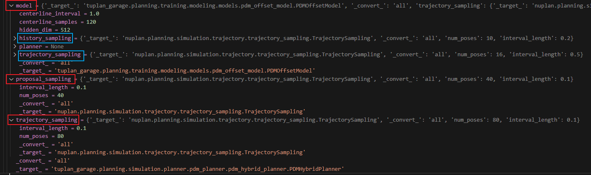


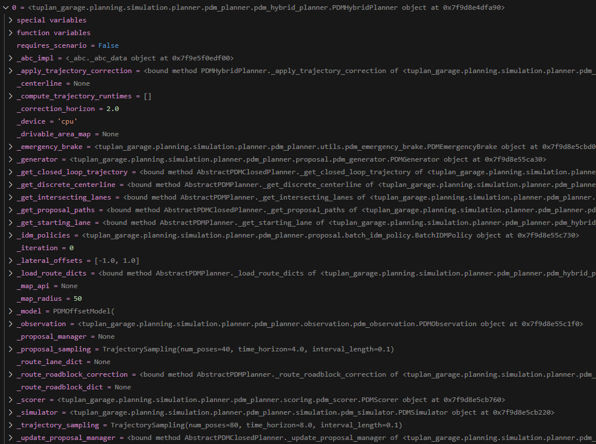

------


```python
        for planner in planners:
            # Ego Controller
            ego_controller: AbstractEgoController = instantiate(cfg.ego_controller, scenario=scenario)

            # Simulation Manager
            simulation_time_controller: AbstractSimulationTimeController = instantiate(
                cfg.simulation_time_controller, scenario=scenario
            )

            # Perception
            observations: AbstractObservation = build_observations(cfg.observation, scenario=scenario)

            # Metric Engine
            metric_engine = metric_engines_map.get(scenario.scenario_type, None)
            if metric_engine is not None:
                stateful_callbacks = [MetricCallback(metric_engine=metric_engine, worker_pool=callbacks_worker)]
            else:
                stateful_callbacks = []

            if "simulation_log_callback" in cfg.callback:
                stateful_callbacks.append(
                    instantiate(cfg.callback["simulation_log_callback"], worker_pool=callbacks_worker)
                )

            # Construct simulation and manager
            simulation_setup = SimulationSetup(
                time_controller=simulation_time_controller,
                observations=observations,
                ego_controller=ego_controller,
                scenario=scenario,
            )

            simulation = Simulation(
                simulation_setup=simulation_setup,
                callback=MultiCallback(callbacks + stateful_callbacks),
                simulation_history_buffer_duration=cfg.simulation_history_buffer_duration,
            )
            simulations.append(SimulationRunner(simulation, planner))
```

### 2.5 ego_controller

实例化

```python
ego_controller: AbstractEgoController = instantiate(cfg.ego_controller, scenario=scenario)
```

```python
class AbstractEgoController(abc.ABC):
    """
    Interface for generic ego controllers. ego controller通用接口
    """

    @abc.abstractmethod
    def get_state(self) -> EgoState:
        """
        Returns the current ego state.
        :return: The current ego state.
        """
        pass

    @abc.abstractmethod
    def reset(self) -> None:
        """
        Reset the observation (all internal states should be reseted, if any).
        """
        pass

    @abc.abstractmethod
    def update_state(
        self,
        current_iteration: SimulationIteration,
        next_iteration: SimulationIteration,
        ego_state: EgoState,
        trajectory: AbstractTrajectory,
    ) -> None:
        """
        Update ego's state from current iteration to next iteration.

        :param current_iteration: The current simulation iteration.
        :param next_iteration: The desired next simulation iteration.
        :param ego_state: The current ego state.
        :param trajectory: The output trajectory of a planner.
        """
        pass
```

到了 `two_stage_controller.py`

```python
class TwoStageController(AbstractEgoController):
    """
    实现了一个两阶段跟踪控制器。这两个阶段包括：
        1. 一个 AbstractTracker - 用于模拟真实自动驾驶汽车中存在的一层低级控制器。
        2. 一个 AbstractMotionModel - 描述自动驾驶汽车根据物理模型的演变过程。
        
    Implements a two stage tracking controller. The two stages comprises of:
        1. an AbstractTracker - This is to simulate a low level controller layer that is present in real AVs.
        2. an AbstractMotionModel - Describes how the AV evolves according to a physical model.
    """
    def __init__(self, scenario: AbstractScenario, tracker: AbstractTracker, motion_model: AbstractMotionModel):
        """
        Constructor for TwoStageController
        :param scenario: Scenario
        :param tracker: The tracker used to compute control actions
        :param motion_model: The motion model to propagate the control actions
        """
        self._scenario = scenario
        self._tracker = tracker
        self._motion_model = motion_model

        # set to None to allow lazily loading of initial ego state
        self._current_state: Optional[EgoState] = None
```

----

0106：

两段控制，第一段：

`/nupan-devkit/nuplan/planning/simulation/controller/tracker/lqr.py`

```python
class LQRTracker(AbstractTracker):
```

第二段：

`/nupan-devkit/nuplan/planning/simulation/controller/motion_model/kinematic_bicycle.py`

问题：
经过这两段控制的输入、输出？是保存在self里面了吗？？

```python
tracker = <nuplan.planning.simulation.controller.tracker.lqr.LQRTracker object at 0x7fe5661ec940>
	track_trajectory
    _compute_initial_velocity_and_lateral_state
    _compute_reference_velocity_and_curvature_profile
    _curvature_rate_penalty
    _discretization_time
	_jerk_penalty
    _lateral_lqr_controller
    _longitudinal_lqr_controller
    _q_lateral
    _q_longitudinal
    _r_lateral
    _r_longitudinal
    _solve_one_step_lqr
    _stopping_contoller
    _stopping_proportional_gain
    _stopping_velocity
    _tracking_horizon
    _wheel_base

motion_model = <nuplan.planning.simulation.controller.motion_model.kinematic_bicycle.KinematicBicycleModel object at 0x7fe566215310>
	get_state_dot
	propagate_state
	_accel_time_constant = 0.2
	_max_steering_angle = 1.0471975511965976
	_steering_angle_time_constant = 0.05
    _update_command
    _vehicle
    
scenario = ...
self = ...
```

出来 回到`simulation_builder.py`，此时scenarios里面每一个scenario-initial_tracked_objects-tracked_objects有若干objects，分为Agent object和StaticObject object。第一个change_lane scenario有65个objects

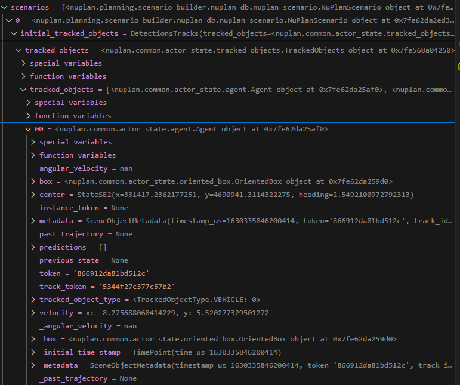

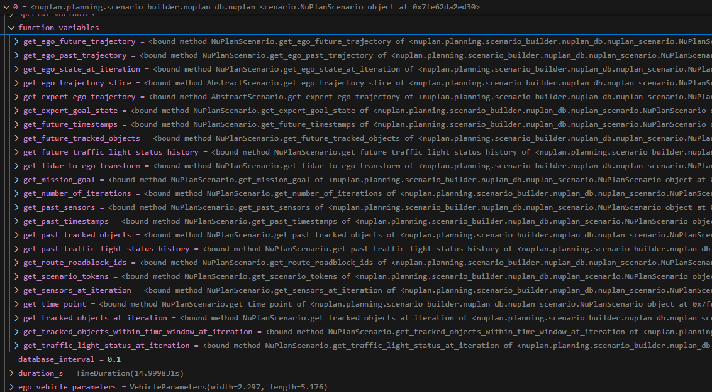

这些objects是输入给模型了吗？--是的 提取了objects的什么信息？--就是objects吧 一个类 里面保存了障碍物 是作为centerline输入的吗？--不是，是occupancy tracked objects

有一系列函数？在哪使用？ --这一系列函数未必完全使用 是类里面保存着这些方法可以用

在这一步之前、scenario是什么？有这些吗？---emm，是有的，scenario应该一直没变

新的是：ego_controller

```
ego_controller = 
<nuplan.planning.simulation.controller.two_stage_controller.TwoStageController object at 0x7fe56618ce50>
	get_state
	reset
	update_state
	_current_state
	_motion_model
	_scenario
	_tracker
```


### 2.6 simulation_time_controller

```python
# Simulation Manager
simulation_time_controller: AbstractSimulationTimeController = instantiate(
	cfg.simulation_time_controller, scenario=scenario
)
```

```python
class AbstractSimulationTimeController(abc.ABC):
    """
    Generic simulation time manager.
    """
    主要和迭代有关，有方法：
	get_iteration
	reset
	next_iteration
	reached_end
	number_of_iterations
```

返回的是 有

```
current_iteration_index = 0
scenario
+ 同上方法
```


### 2.7 build_observations

```python
# Perception
observations: AbstractObservation = build_observations(cfg.observation, scenario=scenario)
```

输入：

```
cfg.observation
headway_time = 1.5 ??（不过后续是否使用了headway_time呢？在哪里使用的？）
```

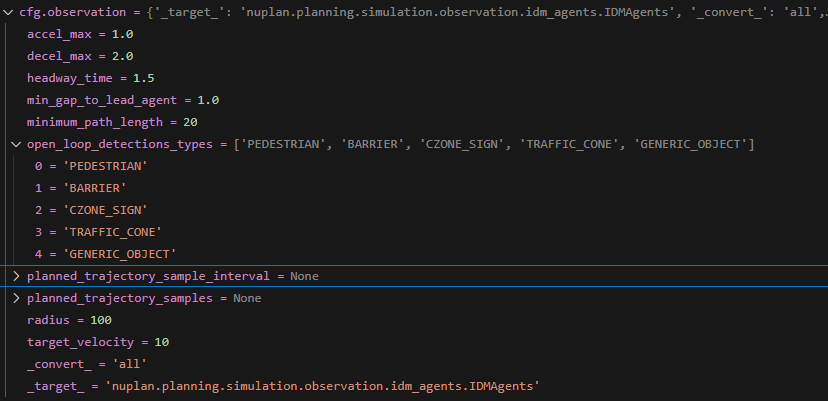

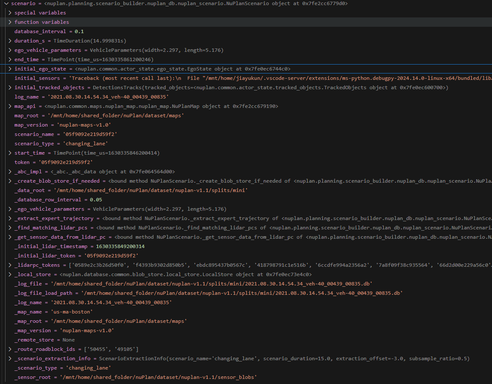

问题：为什么很多变量中都重复出现了同一信息？？

比如：scenario-initial_ego_state中的

* agent(含义？？) 有：box（我理解是boundingbox) 、metadata(含义？？) 、velocity
* car_footprint有：oriented_box
* dynamic_car_state有：center_velocity_2d（还是速度）
* waypoint有：oriented_box、velocity


```python
def build_observations(observation_cfg: DictConfig, scenario: AbstractScenario) -> AbstractObservation:
    """
    Instantiate observations
    :param observation_cfg: config of a planner
    :param scenario: scenario
    :return AbstractObservation 一个实例化
    """
	observation = cast(AbstractObservation, instantiate(observation_cfg, scenario=scenario))
```

```python
class AbstractObservation(metaclass=ABCMeta):
    """
    Interface for a generic observation engine.
    Observations can include sensor data (pointclouds, images, velocities), tracker ouputs (bounding boxes) and more.
    
    有方法：
    observation_type
    reset
    get_observation # 获得current observation object，返回TrackedObjects
    initialize
    update_observation # 见下
    """
    @abstractmethod
    def update_observation(
        self, iteration: SimulationIteration, next_iteration: SimulationIteration, history: SimulationHistoryBuffer
    ) -> None:
        """
        Propagate observation into the next simulation iteration.
	 	Running a planning model to compute agent trajectories and update their state accordingly.

        :param iteration: The current simulation iteration.
        :param next_iteration: the next simulation iteration that we update to.
        :param history: Past simulation states including the state at the current time step [t_-N, ..., t_-1, t_0]
                        The buffer contains the past ego trajectory and past observations.
        """
        pass
```

返回：

```
observations = <nuplan.planning.simulation.observation.idm_agents.IDMAgents object at 0x7fe566290340>
```

### 2.8 metric_engine

### 2.9 Simulation

先`SimulationSetup`检查了一下各输入、构建setup

```python
# Construct simulation and manager
simulation_setup = SimulationSetup(
    time_controller=simulation_time_controller,
    observations=observations,
    ego_controller=ego_controller,
    scenario=scenario,
)
simulation = Simulation(
    simulation_setup=simulation_setup,
    callback=MultiCallback(callbacks + stateful_callbacks),
    simulation_history_buffer_duration=cfg.simulation_history_buffer_duration,
)
# history_buffer就是存储着当前时刻的历史前2秒信息对吧？
# --是的，是动态滚动窗口
```


```python
class Simulation:
    """
    This class queries data for initialization of a planner, and propagates simulation a step forward based on the planned trajectory of a planner.
    """

    def __init__(
        self,
        simulation_setup: SimulationSetup,
        callback: Optional[AbstractCallback] = None,
        simulation_history_buffer_duration: float = 2,
    ):
        """
        Create Simulation.
        :param simulation_setup: Configuration that describes the simulation.
        :param callback: A callback to be executed for this simulation setup
        :param simulation_history_buffer_duration: [s] Duration to pre-load scenario into the buffer.
        """
        ...
        # History where the steps of a simulation are stored
        self._history = SimulationHistory(self._scenario.map_api, self._scenario.get_mission_goal())
----
进到nuplan_scenario.py中
    def get_mission_goal(self) -> Optional[StateSE2]:
        """Inherited, see superclass."""
        return get_mission_goal_for_sensor_data_token_from_db(
            self._log_file, get_lidarpc_sensor_data(), self._initial_lidar_token
        )
返回：
StateSE2(x=331712.0641503615, y=4690882.21242352, heading=-2.123611299165918)
NuPlanScenario.get_mission_goal = StateSE2(x=331712.0641503615, y=4690882.21242352, heading=-2.123611299165918)
mission goal含义？ --Goal far into future (in generally more than 100m far beyond scenario length).是final state
这个mission goal是从哪里取得的？ -- get_mission_goal_for_sensor_data_token_from_db, 从given lidar_pc token获得，是scenario带着的
----
		# 后面是interval：
    	# 2.1s； 22
        此外还有history_buffer_size = 21steps（因为在scenario中设置了database_interval=0.1s），2/0.1 + 1 = 21
```

### 2.10 SimulationRunner

```python
simulations.append(SimulationRunner(simulation, planner))
```

每个场景跑完使用append，将scenario加到列表scenarios中。共3个（0 1 2）

这里面有`report = RunnerReport()`


返回一个`SimulationRunner object`，里面有

```python
planner(PDMHybridPlanner object)
scenario(NuPlanScenario object)
simulation(Simulation object)
```

----

这里有simulation iterations, compute_trajectory, on_planner_end, propagate, on_step_end等

这是是在run simulation吧？？--此时只是初始化，完成`__init__` 里面的 `self._simulation = simulation` 和` self._planner = planner`  

那下面的 3 run_runners是在？--真的run

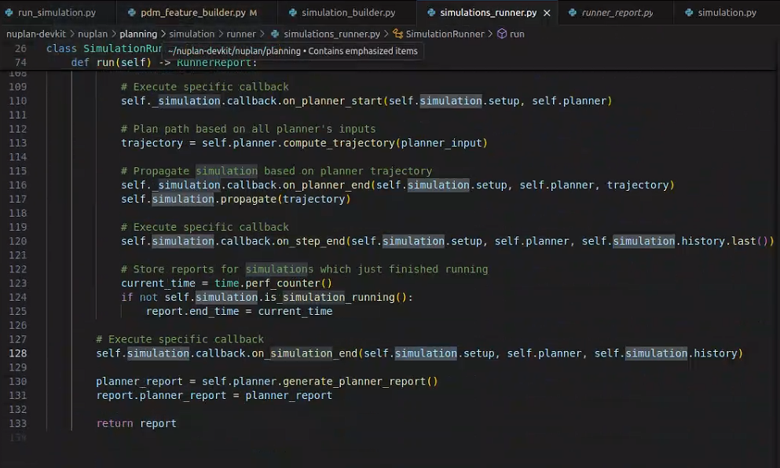

## 3 run_runners

```python
run_runners(runners=runners, common_builder=common_builder, cfg=cfg, profiler_name='running_simulation')
```

```python
def run_runners(
    runners: List[AbstractRunner], common_builder: CommonBuilder, profiler_name: str, cfg: DictConfig
) -> None:
    """
    Run a list of runners.
    :param runners: A list of runners.
    :param common_builder: Common builder.
    :param profiler_name: Profiler name.
    :param cfg: Hydra config.
    """
```


### 3.1 execute_runners

```python
    reports = execute_runners(
        runners=runners,
        worker=common_builder.worker,
        num_gpus=cfg.number_of_gpus_allocated_per_simulation,   # 0
        num_cpus=cfg.number_of_cpus_allocated_per_simulation,   # 1
        exit_on_failure=cfg.exit_on_failure,                    # false
        verbose=cfg.verbose,                                    # false
    )
```

```python
def execute_runners(
    runners: List[AbstractRunner],
    worker: WorkerPool,
    num_gpus: Optional[Union[int, float]],
    num_cpus: Optional[int],
    exit_on_failure: bool = False,
    verbose: bool = False,
) -> List[RunnerReport]:
    """
    Execute multiple simulation runners or metric runners.
    :param runners: A list of simulations to be run.
    :param worker: for submitting tasks.
    :param num_gpus: if None, no GPU will be used, otherwise number (also fractional) of GPU used per simulation.
    :param num_cpus: if None, all available CPU threads are used, otherwise number of threads used.
    :param exit_o
```

问题：

这里面的worker（WorkerPool类，用于提交任务到工作池中执行），的作用？？

是从什么开始演变来的？-- `worker=common_builder.worker`.

新问题： `common_builder`的作用？和演变？

其他发现：在 `excute_runners` 中，需要cfg的：

```python
        num_gpus=cfg.number_of_gpus_allocated_per_simulation,   # 0
        num_cpus=cfg.number_of_cpus_allocated_per_simulation,   # 1
        exit_on_failure=cfg.exit_on_failure,                    # false
        verbose=cfg.verbose,                                    # false
```

某一个object的 `special variables` 和 `function variables`? 比如如何找`worker.__class__.__name__`?

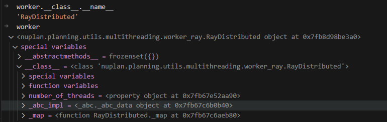


运行 `/nuplan-devkit/nuplan/planning/simulation/runner/executor.py`中的 `run_simulation`方法

run_simulation 有 map，其中 `max_size, aligned_item_lists = align_size_of_arguments(*item_lists)`

问题： `aligned_item_lists`的层次没太明白

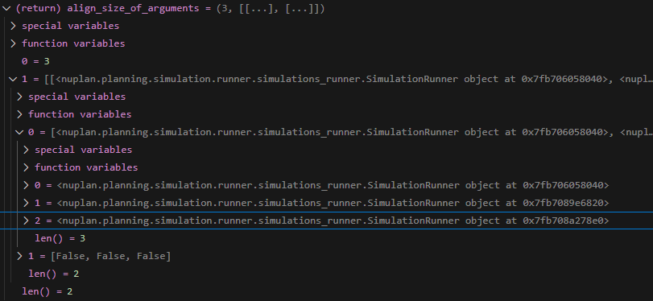


运行完生成RunnerReport，再生成results字典

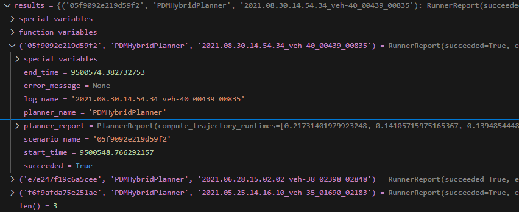


---

每一个scenario有一个planners(别的也可以有多个？)

模型在哪里？在哪里输入的？--通过`runners`，`runners`就是`2 build_simulations`的返回

输出在哪？是什么？能看到维度吗？


```shell
class variables
	AbstractPlanner
		compute_planner_trajectory
		compute_trajectory
		generate_planner_report
		initialize
		require_scenario = False
	AbstractRunner
		planner
		scenario
	AbstractSceario
		database_interval
		duration_s
		ego_vehicle_Parameters
		initial_ego_state
		initial_tracked_objects
		log_name
		
	RunnerReport
	Simulation
		get_planner_input ############
		initialize
		is_simulation_running
		propogate
		history
		history_buffer
		scenario
		setup
```


为什么会有pre-built planner? pre-built是做了什么？

planner是我理解的 PDMhybridplanner的MLP模型结构吗？还是什么？建立完planner之后的 输出是什么？

planner和runner的关系？

-- 由：`number_of_sims = len(runners)` 可以看出，runners的个数就是simulation的个数

---


# other findings

## closed 5steps

`tuplan_garage/tuplan_garage/planning/simulation/planner/pdm_planner/abstract_pdm_closed_planner.py`

首先传进来的有：

```python
    def __init__(
        self,
        trajectory_sampling: TrajectorySampling,
        proposal_sampling: TrajectorySampling,
        idm_policies: BatchIDMPolicy,
        lateral_offsets: Optional[List[float]],
        map_radius: float,
    ):
        """
        Constructor for AbstractPDMClosedPlanner
        :param trajectory_sampling: Sampling parameters for final trajectory
        :param proposal_sampling: Sampling parameters for proposals
        :param idm_policies: BatchIDMPolicy class
        :param lateral_offsets: centerline offsets for proposals (optional)
        :param map_radius: radius around ego to consider
        """
```


```python
    def _get_closed_loop_trajectory(
        self,
        current_input: PlannerInput,
    ) -> InterpolatedTrajectory:
        """
        Creates the closed-loop trajectory for PDM-Closed planner.
        :param current_input: planner input
        :return: trajectory
        """

        ego_state, observation = current_input.history.current_state

        # 1. Environment forecast and observation update
        self._observation.update(
            ego_state,
            observation,
            current_input.traffic_light_data,
            self._route_lane_dict,
        )

        # 2. Centerline extraction and proposal update
        self._update_proposal_manager(ego_state)

        # 3. Generate/Unroll proposals
        proposals_array = self._generator.generate_proposals(
            ego_state, self._observation, self._proposal_manager
        )

        # 4. Simulate proposals
        simulated_proposals_array = self._simulator.simulate_proposals(
            proposals_array, ego_state
        )

        # 5. Score proposals
        proposal_scores = self._scorer.score_proposals(
            simulated_proposals_array,
            ego_state,
            self._observation,
            self._centerline,
            self._route_lane_dict,
            self._drivable_area_map,
            self._map_api,
        )

        # 6.a Apply brake if emergency is expected
        trajectory = self._emergency_brake.brake_if_emergency(
            ego_state, proposal_scores, self._scorer
        )

        # 6.b Otherwise, extend and output best proposal
        if trajectory is None:
            trajectory = self._generator.generate_trajectory(np.argmax(proposal_scores))

        return trajectory
```


 `abstract_pdm_planner.py`

可以从 pytorch lightning的几个组成的角度来看代码架构

模型部分： 几个模型+模型接口

```python
class AbstractPDMPlanner(AbstractPlanner, ABC):
    """
    Interface for planners incorporating PDM-* variants.
    """
    _map_radius
    _iteration
    _map_api
    _route_roadblock_dict
    _route_lane_dict
    _centerline
    _drivable_area_map
    --方法--
    _load_route_dicts(self, route_roadblock_ids: List[str]) -> None
    _route_roadblock_correction(self, ego_state: EgoState) -> None
    def _get_discrete_centerline(
        self, current_lane: LaneGraphEdgeMapObject, search_depth: int = 30
    ) -> List[StateSE2]:
        """
        Applies a Dijkstra search on the lane-graph to retrieve discrete centerline.
        :param current_lane: lane object of starting lane.
        :param search_depth: depth of search (for runtime), defaults to 30
        :return: list of discrete states on centerline (x,y,θ)
        """
	def _get_starting_lane(self, ego_state: EgoState) -> LaneGraphEdgeMapObject:
        """
        Returns the most suitable starting lane, in ego's vicinity.
        :param ego_state: state of ego-vehicle
        :return: lane object (on-route)
        """        
```


`tuplan_garage/tuplan_garage/planning/simulation/planner/pdm_planner/pdm_closed_planner.py`

系列还有pdm_open_planner和hybrid

以及 abstract_pdm_planner abstract_pdm_closed_planner


## 可视化

`nuplan-devkit/nuplan/planning/script/run_nuboard.py`


# 新发现！

`class PDMHybridPlanner(AbstractPDMClosedPlanner)`里面 `param correction_horizon: time to apply open-loop correction [s]`就是来看应用pdm offset的窗口（时间长度）的

完整版：

```python
class PDMHybridPlanner(AbstractPDMClosedPlanner):
    """PDM-Closed planner class."""

    # Inherited property, see superclass.
    requires_scenario: bool = False

    def __init__(
        self,
        trajectory_sampling: TrajectorySampling,
        proposal_sampling: TrajectorySampling,
        idm_policies: BatchIDMPolicy,
        lateral_offsets: Optional[List[float]],
        map_radius: float,
        model: TorchModuleWrapper,
        correction_horizon: float,
        checkpoint_path: str,
    ):
        """
        Constructor for PDM-Hybrid.
        :param trajectory_sampling: sampling parameters for final trajectory
        :param proposal_sampling: sampling parameters for proposals
        :param idm_policies: BatchIDMPolicy class
        :param lateral_offsets: centerline offsets for proposals (optional)
        :param map_radius: radius around ego to consider
        :param model: torch model
        :param correction_horizon: time to apply open-loop correction [s]
        :param checkpoint_path: path to checkpoint for model as string
        """
```


IDM实现：在`nuplan-devkit/nuplan/planning/simulation/observation/idm/idm_agents_builder.py`中，函数`build_idm_agents_on_map_rails`。注意返回的是 `Tuple[UniqueIDMAgents, OccupancyMap]`，即，还有occupancy

在IDM实现中，用到scenario的地方是：

```
    detections = scenario.initial_tracked_objects
    map_api = scenario.map_api
    ego_agent = scenario.get_ego_state_at_iteration(0).agent # 到scenario.get_ego_state_at_iteration(0)这里为止，返回的是一个EgoState类，在该类中，有方法agent，该方法返回一个具有 EgoState 参数的 Agent 对象。即，自车也是一个agent，且该agent上有自车状态参数信息。
    
```


* Trajectory包含：
  * Expert Trajectory
  * Ego Trajectory
  * Goal
  * Traffic Light
  * RoadBlock
* Agent包含：
  * Ego
  * Vehicle
  * Pedestrian
  * Bicycle
  * Generic
  * Traffic Cone
  * Barrier
  * Czone Sign
* Map包含：
  * Lane
  * Intersection
  * Stop Line
  * Crosswalk
  * Walkway
  * Carpark
  * Lane Connector
  * Lane Line


# 其他问题

simulation中，mini和 test都ok，但是train/train_boston 和 val 都报错assert len(runners) > 0, 'No scenarios found to simulate!'

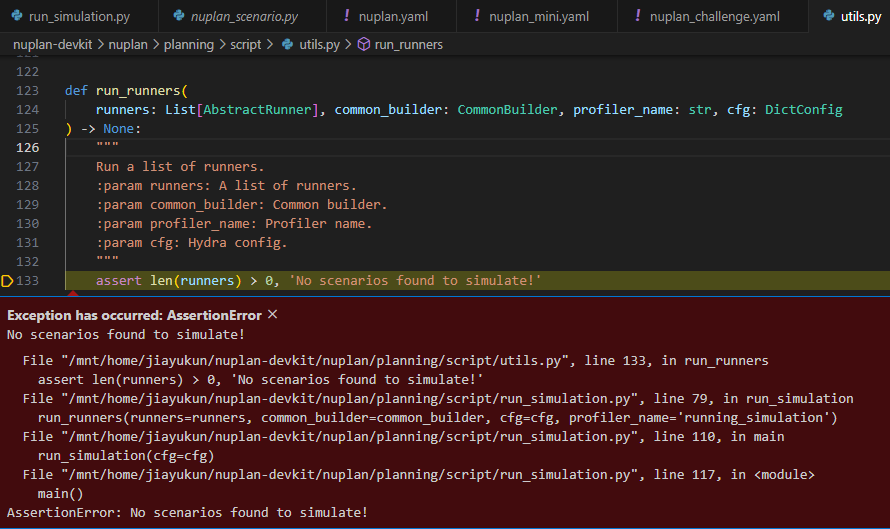
