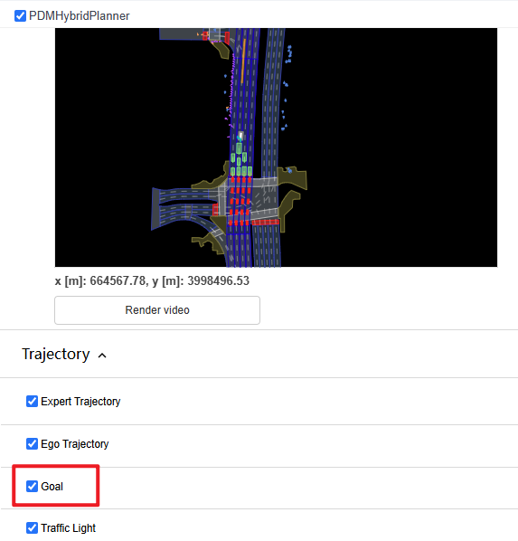

# debug过程中的问题

## 1 两段控制

两段控制，第一段：

`/nupan-devkit/nuplan/planning/simulation/controller/tracker/lqr.py`

```python
class LQRTracker(AbstractTracker):
```

第二段：

`/nupan-devkit/nuplan/planning/simulation/controller/motion_model/kinematic_bicycle.py`

问题：
经过这两段控制的输入、输出？是保存在self里面了吗？


## 2 build_observations

问题：为什么很多变量中都重复出现了同一信息？

比如：scenario-initial_ego_state中的

* agent(含义？？) 有：box（我理解是boundingbox) 、metadata(含义？？) 、velocity
* car_footprint有：oriented_box
* dynamic_car_state有：center_velocity_2d（还是速度）
* waypoint有：oriented_box、velocity


## 3 callbacks

含义？必要性？


## 4 可视化

可视化中有goal的勾选，但勾与不勾选都在场景中找不到。是在很远的位置吗？（可以帮助理解goal）




## 5 config都不要吗？

有一些是分布式（ray distributed) `callback` `main_callback` `simulation_time_controller`等 可能是需要的。

组织架构及描述见：https://zhuanlan.zhihu.com/p/686071701

思路是想在debug `run_simulation.py` 过程中，对于直接传入cfg的函数，看看最后到底是用了cfg里面的什么

```python
pl.seed_everything(cfg.seed, workers=True)
```

```
cfg.scenario_builder 具体需要什么？能不能不弄成scenario的形式？
cfg.scenario_filter
cfg.planner, cfg.planner.values()
cfg.callback ? 含义？
cfg.planner 就是pdm_hybrid_planner
cfg.ego_controller 两阶段控制
cfg.simulation_time_controller  # StepSimulationTimeController object
cfg.observation
cfg.simulation_history_buffer_duration
cfg.number_of_gpus_allocated_per_simulation   # 0
cfg.number_of_cpus_allocated_per_simulation   # 1
cfg.exit_on_failure                   		  # false
cfg.verbose                                   # false
cfg.runner_report_file
cfg.output_dir
cfg.distributed_timeout_seconds

```

