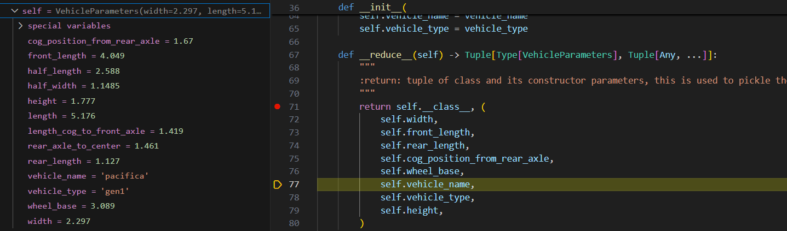

```
c.X]HxSed4l3A89^
```


# stage1

## 0 讨论

综述：https://arxiv.org/html/2306.16927

sensor level 输入为图片的比较多，之前考虑了uniAD（CVPR2023 best paper），使用数据集https://www.nuscenes.org/download，但是被GPU requirement劝退

后面考虑了NVIDIA MDP https://github.com/NVlabs/Hydra-MDP，https://developer.nvidia.com/blog/end-to-end-driving-at-scale-with-hydra-mdp/，和地平线 VAD（ICCV 2023） https://hgao-cv.github.io/VADv2/

考虑object-level，nuplan 2023 challenge 冠军方案，德国tubingen大学和博世 https://arxiv.org/pdf/2306.07962，https://danieldauner.github.io/assets/pdf/Dauner2023CORL_poster.pdf

---

learning based+MPC context-aware

PLUTO https://arxiv.org/abs/2404.14327

----


## 1 相关资料

### 1.1 nuPlan 2023 challenge

https://opendrivelab.com/challenge2023/

### 1.2 nuplan datasets downlowd

https://www.nuscenes.org/nuplan#download

### 1.3 nuplan-devkit

https://github.com/motional/nuplan-devkit/tree/master *

https://github.com/motional/nuplan-devkit/blob/master/dos/installation.md

https://nuplan-devkit.readthedocs.io/en/latest/installation.html

https://nuplan-devkit.readthedocs.io/en/latest/dataset_setup.html

### 1.4 tuplan_garage

[https://github.com/autonomousvision/tuplan_garage](https://github.com/autonomousvision/nuplan_garage) *

https://ar5iv.labs.arxiv.org/html/2306.07962?_immersive_translate_auto_translate=1

https://www.youtube.com/watch?v=ZwhXilQKULY&t=1975s


### 1.5 官方数据结构

ref `dataset_setup.md`。这里的`trainval`是把官网下载下来的`train`各子文件夹的database都放在一起了，并与`val`中database一并放入到`trainval`文件夹中。因此`trainval`一打开就是database文件。

在内部有对`trainval`和`mini`文件夹划分训练/测试/验证数据集脚本（yaml文件）。可以自己指定比例或具体的database归入情况。

```angular2html
~/nuplan
├── exp
│   └── ${USER}
│       ├── cache
│       │   └── <cached_tokens>
│       └── exp
│           └── my_nuplan_experiment
└── dataset
    ├── maps
    │   ├── nuplan-maps-v1.0.json
    │   ├── sg-one-north
    │   │   └── 9.17.1964
    │   │       └── map.gpkg
    │   ├── us-ma-boston
    │   │   └── 9.12.1817
    │   │       └── map.gpkg
    │   ├── us-nv-las-vegas-strip
    │   │   └── 9.15.1915
    │   │       └── map.gpkg
    │   └── us-pa-pittsburgh-hazelwood
    │       └── 9.17.1937
    │           └── map.gpkg
    └── nuplan-v1.1
        ├── splits
        │     ├── mini 
        │     │    ├── 2021.05.12.22.00.38_veh-35_01008_01518.db
        │     │    ├── 2021.06.09.17.23.18_veh-38_00773_01140.db
        │     │    ├── ...
        │     │    └── 2021.10.11.08.31.07_veh-50_01750_01948.db
        │     └── trainval
        │          ├── 2021.05.12.22.00.38_veh-35_01008_01518.db
        │          ├── 2021.06.09.17.23.18_veh-38_00773_01140.db
        │          ├── ...
        │          └── 2021.10.11.08.31.07_veh-50_01750_01948.db
        └── sensor_blobs   
              ├── 2021.05.12.22.00.38_veh-35_01008_01518                                           
              │    ├── CAM_F0
              │    │     ├── c082c104b7ac5a71.jpg
              │    │     ├── af380db4b4ca5d63.jpg
              │    │     ├── ...
              │    │     └── 2270fccfb44858b3.jpg
              │    ├── CAM_B0
              │    ├── CAM_L0
              │    ├── CAM_L1
              │    ├── CAM_L2
              │    ├── CAM_R0
              │    ├── CAM_R1
              │    ├── CAM_R2
              │    └──MergedPointCloud 
              │         ├── 03fafcf2c0865668.pcd  
              │         ├── 5aee37ce29665f1b.pcd  
              │         ├── ...                   
              │         └── 5fe65ef6a97f5caf.pcd  
              │
              ├── 2021.06.09.17.23.18_veh-38_00773_01140 
              ├── ...                                                                            
              └── 2021.10.11.08.31.07_veh-50_01750_01948
```

## 2 配置笔记

### 2.1 全局变量

执行`nano ~/.bashrc`，在最后面加

```python
export NUPLAN_DEVKIT_ROOT = "$HOME/nuplan-devkit/"
export NUPLAN_MAPS_ROOT="$HOME/nuplan-devkit/nuplan/dataset/maps"
export NUPLAN_DATA_ROOT="$HOME/nuplan-devkit/nuplan/dataset"
export NUPLAN_EXP_ROOT="$HOME/nuplan-devkit/nuplan/exp"
export NUPLAN_DB_FILES="$HOME/nuplan-devkit/nuplan/dataset/nuplan-v1.1/splits/trainval"
```

更换为服务器后的配置：

```python
export PYTHONPATH="${PYTHONPATH}:/mnt/home/jiayukun/nuplan-devkit"
export NUPLAN_DEVKIT_ROOT="/mnt/home/jiayukun/nuplan-devkit/"
export NUPLAN_DATA_ROOT="/mnt/home/shared_folder/nuPlan/dataset"
export NUPLAN_MAPS_ROOT="/mnt/home/shared_folder/nuPlan/dataset/maps"
export NUPLAN_EXP_ROOT="$HOME/nuplan-devkit/nuplan/exp"
```

其他人的配置过程

https://blog.csdn.net/m0_63771100/article/details/130062340

https://blog.csdn.net/qq_37795208/article/details/142530245

https://blog.csdn.net/m0_55957324/article/details/143114806?spm=1001.2014.3001.5502

服务器运行找不到conda：每次运行conda前输入`source ~/miniconda3/bin/activate`指令

https://blog.csdn.net/weixin_42314494/article/details/114264103?spm=1001.2014.3001.5502


### 2.2 train脚本-pdm_open

`train_pdm_open.sh`

```shell
TRAIN_EPOCHS=100
TRAIN_LR=1e-4
TRAIN_LR_MILESTONES=[50,75]
TRAIN_LR_DECAY=0.1
BATCH_SIZE=64
SEED=0

JOB_NAME=training_pdm_open_model
CACHE_PATH=$NUPLAN_DEVKIT_ROOT/nuplan/exp
USE_CACHE_WITHOUT_DATASET=False

python $NUPLAN_DEVKIT_ROOT/nuplan/planning/script/run_training.py \
seed=$SEED \
py_func=train \
+training=training_pdm_open_model \
job_name=$JOB_NAME \
scenario_builder=nuplan \
cache.cache_path=$CACHE_PATH \
cache.use_cache_without_dataset=$USE_CACHE_WITHOUT_DATASET \
lightning.trainer.params.max_epochs=$TRAIN_EPOCHS \
data_loader.params.batch_size=$BATCH_SIZE \
optimizer.lr=$TRAIN_LR \
lr_scheduler=multistep_lr \
lr_scheduler.milestones=$TRAIN_LR_MILESTONES \
lr_scheduler.gamma=$TRAIN_LR_DECAY \
hydra.searchpath="[pkg://tuplan_garage.planning.script.config.common, pkg://tuplan_garage.planning.script.config.training, pkg://tuplan_garage.planning.script.experiments, pkg://nuplan.planning.script.config.common, pkg://nuplan.planning.script.experiments]"
```


### 2.3 ssh转发

由于服务器上no browser，期望在本地浏览器打开jupyter book看

在服务器`conda activate nuplan`后，执行

```shell
jupyter notebook --no-browser --port=8889
```

此时服务器使用端口8889

在本地terminal执行

```shell
ssh -N -f -L localhost:8888:localhost:8889 jiayukun@10.80.42.158
```

```shell
ssh -N -f -L localhost:8888:localhost:8889 -L localhost:8899:localhost:8899 jiayukun@10.80.42.158 # debug
```

需要输入密码

```
jiayukun@10.80.42.158
c.X]HxSed4l3A89^
```

此时将服务器的8889端口转发至本地8888，本地浏览器`localhost:8888`，即可打开jupyter notebook


### 2.4 可视化笔记及问题

文件`nuplan_scenario_visualization.ipynb`

```python
# 官方提供的
import os
NUPLAN_DATA_ROOT = os.getenv('NUPLAN_DATA_ROOT', '/data/sets/nuplan')
NUPLAN_MAPS_ROOT = os.getenv('NUPLAN_MAPS_ROOT', '/data/sets/nuplan/maps')
NUPLAN_DB_FILES = os.getenv('NUPLAN_DB_FILES', '/data/sets/nuplan/nuplan-v1.1/splits/mini')
NUPLAN_MAP_VERSION = os.getenv('NUPLAN_MAP_VERSION', 'nuplan-maps-v1.0')
```

```python
# 修改为自己的
import os
NUPLAN_DATA_ROOT = os.getenv('NUPLAN_DATA_ROOT', '$HOME/nuplan/dataset')
NUPLAN_MAPS_ROOT = os.getenv('NUPLAN_MAPS_ROOT', '$HOME/nuplan/dataset/maps')
NUPLAN_DB_FILES = os.getenv('NUPLAN_DB_FILES', '$HOME/nuplan/dataset/nuplan-v1.1/trainval')
NUPLAN_MAP_VERSION = os.getenv('NUPLAN_MAP_VERSION', 'nuplan-maps-v1.0')
```

全局变量 执行`nano ~/.bashrc`，在最后面加

```python
export NUPLAN_DB_FILES="$HOME/nuplan-devkit/nuplan/dataset/nuplan-v1.1/trainval"
```


可视化问题：使用remote，本地打开，无法渲染。相关issue：

https://github.com/motional/nuplan-devkit/issues/168

https://discourse.bokeh.org/t/display-bokeh-application-in-a-remote-jupyter-notebook/3755

https://github.com/motional/nuplan-devkit/issues/118

https://github.com/bokeh/bokeh/issues/7466


经debug后可能是端口转发问题。debug指令：

```python
ssh -N -f -L localhost:8888:localhost:8889 -L localhost:8899:localhost:8899 jiayukun@10.80.42.158
```

在`nuplan_scenario_visualization.ipynb`中，设置`bokeh_port=8899`，此时服务器报`WARNING tornado.access: 403`

----

使用服务器后ok，注意打开下面面板中的port，打开bokeh写的端口。


### 2.5 simulation.sh问题及解决

我的best_model路径，二选一：

```
/mnt/home/jiayukun/nuplan-devkit/nuplan/exp/exp/training_pdm_open_model/training_pdm_open_model/2024.10.27.03.17.31/best_model/epoch=50-step=6425.ckpt
```

```python
NUPLAN_DEVKIT_ROOT/nuplan/exp/exp/training_pdm_open_model/training_pdm_open_model/2024.10.27.03.17.31/best_model/epoch=50-step=6425.ckpt
```

simulation脚本（三个：open_loop_boxes, closed_loop_nonreactive_agents, closed_loop_reactive_agents），修改为自己的路径（line3 `CHECKPOINT`)

open_loop_boxes

```shell
SPLIT=val14_split
CHALLENGE=open_loop_boxes # open_loop_boxes, closed_loop_nonreactive_agents, closed_loop_reactive_agents
CHECKPOINT=/NUPLAN_DEVKIT_ROOT/nuplan/exp/exp/training_pdm_open_model/training_pdm_open_model/training_pdm_open_model/2024.10.27.03.17.31/best_model/epoch=50-step=6425.ckpt

python $NUPLAN_DEVKIT_ROOT/nuplan/planning/script/run_simulation.py \
+simulation=$CHALLENGE \
planner=pdm_open_planner \
planner.pdm_open_planner.checkpoint_path=$CHECKPOINT \
scenario_filter=$SPLIT \
scenario_builder=nuplan \
hydra.searchpath="[pkg://tuplan_garage.planning.script.config.common, pkg://tuplan_garage.planning.script.config.simulation, pkg://nuplan.planning.script.config.common, pkg://nuplan.planning.script.experiments]"
```

报错1，`mismatched input = expecting <EOF>`，是个bug，需要修改`=`。issue中有人提到可以转义字符下，我试了未成功。我直接修改best model名称，由`epoch=50-step=6425.ckpt`为`epoch50-step6425.ckpt`。

ps：此时还说完整trace需要加`HYDRA_FULL_ERROR=1`。我用`nano ~/.bashrc`在最后加的，没看见有什么变化。

报错2，如下，路径问题

```shell
FileNotFoundError: Error instantiating 'tuplan_garage.planning.simulation.planner.pdm_planner.pdm_open_planner.PDMOpenPlanner' : [Errno 2] No such file or directory: '/mnt/home/jiayukun/nuplan-devkit/nuplan/exp/exp/simulation/open_loop_boxes/2024.11.01.03.41.38/NUPLAN_DEVKIT_ROOT/nuplan/exp/exp/training_pdm_open_model/training_pdm_open_model/2024.10.27.03.17.31/best_model/epoch50-step6425.ckpt'
```

原因是自动生成的`/exp/exp/simulation/open_loop_boxes/2024.11.01.03.41.38`路径和自己写的`CHECKPOINT`路径叠在一起了。我的做法是将best model`epoch50-step6425.ckpt`放在`/exp/exp/simulation/open_loop_boxes`下，然后`CHECKPOINT=../epoch50-step6425.ckpt`。

----

后发现问题2在本地机器中不存在该问题。问题1仍存在。


### 2.6 simulation完整版

1、将best model`epoch50-step6425.ckpt`放在`/exp/exp/simulation/open_loop_boxes`下；
2、将best model`epoch35-step4535.ckpt`放在`/exp/exp/simulation/closed_loop_reactive_agents`下；
3、对于`closed_loop_nonreactive_agents` ，无model。

#### open_loop_boxes

```shell
SPLIT=val14_split
CHALLENGE=open_loop_boxes # open_loop_boxes, closed_loop_nonreactive_agents, closed_loop_reactive_agents
CHECKPOINT=../epoch50-step6425.ckpt

python $NUPLAN_DEVKIT_ROOT/nuplan/planning/script/run_simulation.py \
+simulation=$CHALLENGE \
planner=pdm_open_planner \
planner.pdm_open_planner.checkpoint_path=$CHECKPOINT \
scenario_filter=$SPLIT \
scenario_builder=nuplan \
hydra.searchpath="[pkg://tuplan_garage.planning.script.config.common, pkg://tuplan_garage.planning.script.config.simulation, pkg://nuplan.planning.script.config.common, pkg://nuplan.planning.script.experiments]"
```


#### closed_loop_nonreactive_agents

```shell
SPLIT=val14_split
CHALLENGE=closed_loop_nonreactive_agents # open_loop_boxes, closed_loop_nonreactive_agents, closed_loop_reactive_agents

python $NUPLAN_DEVKIT_ROOT/nuplan/planning/script/run_simulation.py \
+simulation=$CHALLENGE \
planner=pdm_closed_planner \
scenario_filter=$SPLIT \
scenario_builder=nuplan \
hydra.searchpath="[pkg://tuplan_garage.planning.script.config.common, pkg://tuplan_garage.planning.script.config.simulation, pkg://nuplan.planning.script.config.common, pkg://nuplan.planning.script.experiments]"
```

#### closed_loop_reactive_agents

操作同1

```shell
SPLIT=val14_split
CHALLENGE=closed_loop_reactive_agents # open_loop_boxes, closed_loop_nonreactive_agents, closed_loop_reactive_agents
CHECKPOINT=../epoch35-step4535.ckpt

python $NUPLAN_DEVKIT_ROOT/nuplan/planning/script/run_simulation.py \
+simulation=$CHALLENGE \
planner=pdm_hybrid_planner \
planner.pdm_hybrid_planner.checkpoint_path=$CHECKPOINT \
scenario_filter=$SPLIT \
scenario_builder=nuplan \
hydra.searchpath="[pkg://tuplan_garage.planning.script.config.common, pkg://tuplan_garage.planning.script.config.simulation, pkg://nuplan.planning.script.config.common, pkg://nuplan.planning.script.experiments]"
```


###  2.7 总结（说明.txt）

```txt
两个train
	- pdm_open:   epoch50-step6425.ckpt(best model)
	- pdm_offset: epoch35-step4535.ckpt(best model)
	
三类simulation
	- pdm_open(open_loop_boxes)
	- pdm_closed(closed_loop_nonreactive_agents)
	- pdm_hybrid(closed_loop_reactive_agents)
```


## 3 模型结构（简要）

`nuplan-devkit`以`/script/experiments/training/`下`training_simple_vector_model.yaml`为例

```yaml
# @package _global_
job_name: simple_vector_model
py_func: train
objective_aggregate_mode: mean

defaults:
  - override /data_augmentation:
      - kinematic_agent_augmentation
  - override /objective:
      - imitation_objective
  - override /splitter: nuplan
  - override /model: simple_vector_model
  - override /scenario_filter: training_scenarios
  - override /training_metric:
      - avg_displacement_error
      - avg_heading_error
      - final_displacement_error
      - final_heading_error
```

### 3.1 pdm_open

`tuplan_garage` 的`training_pdm_open_model.yaml`

```yaml
# @package _global_
experiment_name: training_pdm_open_model
py_func: train
objective_aggregate_mode: mean

defaults:
  - override /data_augmentation:
  - override /objective:
      - l1_objective
  - override /splitter: nuplan
  - override /model: pdm_open_model
  - override /scenario_filter: train150k_split
  - override /training_metric:
      - avg_displacement_error
      - avg_heading_error
      - final_displacement_error
      - final_heading_error
```

比较重要的是`model`和`objective`。先看下`model`:

`tuplan_garage` 的`planning/script/training/modeling/models/pdm_open_model.py` 定义了`class PDMOpenModel`

```python
class PDMOpenModel(TorchModuleWrapper):
    '''
    直接预测自车的未来的轨迹。
    输入：自车历史状态（位置、速度、加速度）；中心线
    输出：直接预测的轨迹
    
    包含两个编码器：state_encoding 和 centerline_encoding，分别用于编码自车历史状态和中心线。
	在前向传播中，它将编码后的特征拼接在一起，并通过 planner_head 网络直接预测未来的轨迹。
    '''

    def __init__(
        self,
        trajectory_sampling: TrajectorySampling,
        history_sampling: TrajectorySampling,
        planner: AbstractPlanner,
        centerline_samples: int = 120,
        centerline_interval: float = 1.0,
        hidden_dim: int = 512,
    ):
        
    ...
    def forward(self, features: FeaturesType) -> TargetsType:
    '''
    前向传播
    接收输入特征（字典，键 "pdm_features"对应的值是一个 PDMFeature 类型）
    输出预测的未来轨迹（字典）
    步骤：
    1. 输入特征提取；获取批量大小
    2. 特征重塑和类型转换：
    从 PDMFeature 对象中提取出 ego_position（自车位置）、ego_velocity（自车速度）和 ego_acceleration（自车加速度）。将这些特征重塑为 (batch_size, -1) 的形状，并将数据类型转换为浮点数（float）。
    3. 编码自车历史状态：
    将位置、速度和加速度特征在最后一个维度上进行拼接（torch.cat），形成 state_features。将 state_features 通过 state_encoding 神经网络模块进行编码，得到 state_encodings。
    4. 编码规划中心线
    5. 解码未来轨迹：
    将编码后的自车历史状态和中心线特征在最后一个维度上进行拼接，形成 planner_features。
    将 planner_features 通过 planner_head 神经网络模块进行处理，得到 output_trajectory。
    将 output_trajectory 重塑为 (batch_size, -1, len(SE2Index)) 的形状，以匹配输出轨迹的格式。
    6. 输出结果
    '''
        self.planner_head = nn.Sequential(
            nn.Linear(self.hidden_dim * 2, self.hidden_dim),
            nn.Dropout(0.1),
            nn.ReLU(),
            nn.Linear(self.hidden_dim, self.hidden_dim),
            nn.ReLU(),
            nn.Linear(self.hidden_dim, trajectory_sampling.num_poses * len(SE2Index)),
        )    
```


`tuplan_garage` 的`planning/script/training/modeling/objectives/l1_objective.py`

```python
class L1Objective(AbstractObjective):
    """
    Objective for imitating the expert behavior via an L1-Loss function.
    """
    
```

L1，平均绝对误差，MAE

### 3.2 pdm_offset

```yaml
# @package _global_
experiment_name: training_pdm_offset_model
py_func: train
objective_aggregate_mode: mean

defaults:
  - override /data_augmentation:
  - override /objective:
      - l1_objective
  - override /splitter: nuplan
  - override /model: pdm_offset_model
  - override /scenario_filter: train150k_split
  - override /training_metric:
      - avg_displacement_error
      - avg_heading_error
      - final_displacement_error
      - final_heading_error
```

只有`model`不同

```python
class PDMOffsetModel(TorchModuleWrapper):
    '''
    预测相对于 PDM-Closed 轨迹的修正量（offset）。
    输入：
    1. 自车历史状态（位置、速度、加速度）。
    2. PDM-Closed 轨迹。
    3. 中心线。
    输出：修正后的轨迹，它是通过对 PDM-Closed 轨迹加上预测的修正量得到的。
    
    包含三个编码器：state_encoding、centerline_encoding 和 trajectory_encoding，分别用于编码自车历史状态、中心线和 PDM-Closed 轨迹。
	在前向传播中，它将编码后的特征拼接在一起，并通过 planner_head 网络预测修正量。
    '''
```


### 3.3  pdm_closed

`tuplan_garage/planning/simulation/planner/pdm_planner/abstract_pdm_closed_planner.py`

```python
    def _get_closed_loop_trajectory(
        self,
        current_input: PlannerInput,
    ) -> InterpolatedTrajectory:
        """
        Creates the closed-loop trajectory for PDM-Closed planner.
        :param current_input: planner input
        :return: trajectory
        """

        ego_state, observation = current_input.history.current_state

        # 1. Environment forecast and observation update
        self._observation.update(
            ego_state,
            observation,
            current_input.traffic_light_data,
            self._route_lane_dict,
        )

        # 2. Centerline extraction and proposal update
        self._update_proposal_manager(ego_state)

        # 3. Generate/Unroll proposals
        proposals_array = self._generator.generate_proposals(
            ego_state, self._observation, self._proposal_manager
        )

        # 4. Simulate proposals
        simulated_proposals_array = self._simulator.simulate_proposals(
            proposals_array, ego_state
        )

        # 5. Score proposals
        proposal_scores = self._scorer.score_proposals(
            simulated_proposals_array,
            ego_state,
            self._observation,
            self._centerline,
            self._route_lane_dict,
            self._drivable_area_map,
            self._map_api,
        )

        # 6.a Apply brake if emergency is expected
        trajectory = self._emergency_brake.brake_if_emergency(
            ego_state, proposal_scores, self._scorer
        )

        # 6.b Otherwise, extend and output best proposal
        if trajectory is None:
            trajectory = self._generator.generate_trajectory(np.argmax(proposal_scores))

        return trajectory
```


## 4 msgpack解码修改

仅记录。

起因是我在服务器simulation跑下来的结果无法在其他电脑上进行nuboard可视化。结果里`.msgpack.xz`文件里有我的服务器路径`/mnt/home/jiayukun`，需要对输出文件解码、修改路径、重新编码。最终结论是似乎不行，会导致文件损坏。

### 4.1 messagepack

#### 4.1.1 过程

解码为`.txt`

对`decode.txt`使用`vscode-extensions-Hex editor`打开:


`notepad++`使用`Hex`打开页面：


进行替换：

```
6d 6e 74 2f 68 6f 6d 65 2f 6a 69 61 79 75 6b 75 6e
对应mnt/home/jiayukun
68 6f 6d 65 2f 73 30 30 30 32 31 32 35 
对应home/s0002125
```


#### 4.1.2 问题

有1处地方对`mnt/home/jiayukun`编码后不是规则的`6d 6e 74 2f 68 6f 6d 65 2f 6a 69 61 79 75 6b 75 6e `，里面有一些其他:


转了一下是：（[使用工具](https://www.rapidtables.org/zh-CN/convert/number/ascii-hex-bin-dec-converter.html)）


`94 8c 04`是`"ŒETX`

`94 8c 08`是`"ŒBS`

上面这两处取代了两个`/`

```
6d 6e 74 94 8c 04 68 6f 6d 65 94 8c 08 6a 69 61 79 75 6b 75 6e
对应mnt"ŒETXhome"ŒBSjiayukun
68 6f 6d 65 94 8c 04 73 30 30 30 32 31 32 35
对应home"ŒETXs0002125
```

再进行一次替换。


总结：共两次替换，共修改5处。


#### 4.1.3 结果


#### 4.1.4 脚本

python解码脚本，输入`.msgpack.xz`，输出`.txt`（二进制）

```python
import lzma
import msgpack

def decode_msgpack_xz(file_path):
    # 读取.xz压缩文件
    with lzma.open(file_path, 'rb') as f:
        decompressed_data = f.read()

    # 解码msgpack数据
    unpacked_data = msgpack.unpackb(decompressed_data, raw=False)
    return unpacked_data

# 替换为你的文件路径
file_path = r"C:\Users\kunzi051\Desktop\2024.11.01.05.46.00\simulation_log\PDMHybridPlanner\low_magnitude_speed\2021.06.08.12.54.54_veh-26_04262_04732\b117d99525275c5c\b117d99525275c5c.msgpack.xz"

# 解码文件
unpacked_data = decode_msgpack_xz(file_path)

# 打印解码后的数据
# print(unpacked_data)
with open('decode.txt', 'wb') as f:
    f.write(unpacked_data)
```


python编码脚本，输入`.txt`，输出`.msgpack`和`.msgpack.xz`

```python
import msgpack
import lzma

# 假设 decode1.txt 文件包含解码后的数据
input_file_path = 'decode1.txt'
# 首先将数据打包成 msgpack 格式
msgpack_file_path = 'compressed_data.msgpack'

# 读取文件内容
with open(input_file_path, 'rb') as f:
    unpacked_data = f.read()

# 将数据打包成 msgpack 格式
with open(msgpack_file_path, 'wb') as f:
    f.write(msgpack.packb(unpacked_data))

# 现在将 msgpack 文件压缩成 xz 格式
xz_file_path = 'compressed_data.msgpack.xz'

# 压缩 msgpack 数据并保存为 xz 文件
with lzma.open(xz_file_path, 'wb') as f:
    f.write(msgpack.packb(unpacked_data))

print(f'Data has been compressed and saved to {xz_file_path}')
```


### 4.2 pickle

跑完simulation，输出类型为`.msgpack .msgpack.xz`，不容易解码编码及修改，期望将输出修改为`.pkl(pickle)`

在`simulation_log.py`提供了选择：

```python
@classmethod
def load_data(cls, file_path: Path) -> Any:
    """Load simulation log."""
    simulation_log_type = SimulationLog.simulation_log_type(file_path=file_path)
    if simulation_log_type == "msgpack":
        with lzma.open(str(file_path), "rb") as f:
            data = msgpack.unpackb(f.read())

            # pickle load
            data = pickle.loads(data)

            elif simulation_log_type == "pickle":
                with lzma.open(str(file_path), "rb") as f:
                    data = pickle.load(f)
                    else:
                        raise ValueError(f"Unknown serialization type: {simulation_log_type}!")

                        return data
```

`nuplan-devkit/nuplan/planning/script/config/simulation/callback/simulation_log_callback.yaml`中修改

```yaml
simulation_log_callback:
  _target_: nuplan.planning.simulation.callback.simulation_log_callback.SimulationLogCallback
  _convert_: 'all'

  output_directory: ${output_dir}
  simulation_log_dir: simulation_log      # Simulation log dir
  serialization_type: "pickle"           # A way to serialize output, options: ["pickle", "msgpack"]
```

最后一行`msgpack`改为`pickle`，重跑2.6脚本即可。

--

## 5 tuplan模型指标

The overall score of challenge 1 considers the following factors:

*   Average Displacement Error (ADE)
*   Final Displacement Error (FDE)
*   Average Heading Error (AHE)
*   Final Heading Error (FHE)
*   Miss Rate


The overall score of challenge 2&3 considers the following factors:

*   At-fault collision
*   Drivable area compliance
*   Driving direction compliance
*   Making progress
*   Time to collision (TTC)
*   Speed limit compliance
*   Ego progress along the expert's route ratio
*   Comfort

The details of each metric can be found [here](https://nuplan-devkit.readthedocs.io/en/latest/metrics_description.html).


## 6 场景选择&scenario理解

### 6.1 lane_change_split

场景的选择是在`yaml`文件里写的，具体而言：
nuplan的在`nuplan-devkit\nuplan\planning\script\config\common\scenario_filter`路径下，提供：

```python
all_scenarios.yaml
closed_loop_few_training_scenario.yaml
few_training_scenarios.yaml
nuplan_challenge_scenarios.yaml
one_continuous_log.yaml
one_hand_picked_scenario.yaml
one_of_each_scenario_type.yaml
one_percent_of_lv_strip_scenarios.yaml
simulation_test_split.yaml
training_scenarios.yaml
```

tuplan的在`tuplan_garage\tuplan_garage\planning\script\config\common\scenario_filter`路径下，提供：

```
val14_split.yaml
train150k_split.yaml
reduced_val14_split.yaml
```

提取变道场景：

1. 写一个新脚本`lane_change_split.yaml`（即下面）
2. 将文件`lane_change_split.yaml`放在路径`\tuplan_garage\tuplan_garage\planning\script\config\common\scenario_filter`下
3. 脚本（2.6节）需要改一下`SPLIT`

```yaml
_target_: nuplan.planning.scenario_builder.scenario_filter.ScenarioFilter
_convert_: 'all'

scenario_types:                     # List of scenario types to include
  - changing_lane
  - changing_lane_to_left
  - changing_lane_to_right
  - changing_lane_with_lead
  - changing_lane_with_trail
scenario_tokens: null               # List of scenario tokens to include

log_names: null                     # Filter scenarios by log names
# log_names: ${splitter.log_splits.test}  # Use all logs present in the test split
map_names: null                     # Filter scenarios by map names

num_scenarios_per_type: 50         # Number of scenarios per type
limit_total_scenarios: null        # Limit total scenarios (float = fraction, int = num) - this filter can be applied on top of num_scenarios_per_type
timestamp_threshold_s: 0         # Filter scenarios to ensure scenarios have more than `timestamp_threshold_s` seconds between their initial lidar timestamps
ego_displacement_minimum_m: null    # Whether to remove scenarios where the ego moves less than a certain amount
ego_start_speed_threshold: null     # Limit to scenarios where the ego reaches a certain speed from below
ego_stop_speed_threshold: null      # Limit to scenarios where the ego reaches a certain speed from above
speed_noise_tolerance: null         # Value at or below which a speed change between two timepoints should be ignored as noise.

expand_scenarios: false             # Whether to expand multi-sample scenarios to multiple single-sample scenarios
remove_invalid_goals: false          # Whether to remove scenarios where the mission goal is invalid
shuffle: false                      # Whether to shuffle the scenarios
```

```shell
SPLIT=lane_change_split
CHALLENGE=open_loop_boxes # open_loop_boxes, closed_loop_nonreactive_agents, closed_loop_reactive_agents
CHECKPOINT=../epoch50-step6425.ckpt

python /mnt/home/jiayukun/nuplan-devkit/nuplan/planning/script/run_simulation.py \
+simulation=$CHALLENGE \
planner=pdm_open_planner \
planner.pdm_open_planner.checkpoint_path=$CHECKPOINT \
scenario_filter=$SPLIT \
scenario_builder=nuplan \
hydra.searchpath="[pkg://tuplan_garage.planning.script.config.common, pkg://tuplan_garage.planning.script.config.simulation, pkg://nuplan.planning.script.config.common, pkg://nuplan.planning.script.experiments]"
```

```shell
SPLIT=lane_change_split
CHALLENGE=closed_loop_reactive_agents # open_loop_boxes, closed_loop_nonreactive_agents, closed_loop_reactive_agents
CHECKPOINT=../epoch35-step4535.ckpt

python $NUPLAN_DEVKIT_ROOT/nuplan/planning/script/run_simulation.py \
+simulation=$CHALLENGE \
planner=pdm_hybrid_planner \
planner.pdm_hybrid_planner.checkpoint_path=$CHECKPOINT \
scenario_filter=$SPLIT \
scenario_builder=nuplan \
hydra.searchpath="[pkg://tuplan_garage.planning.script.config.common, pkg://tuplan_garage.planning.script.config.simulation, pkg://nuplan.planning.script.config.common, pkg://nuplan.planning.script.experiments]"
```


### 6.2 log&scenerio&scene

scene & scenarios 关系 issue：

https://github.com/motional/nuplan-devkit/issues/163 --scenarios are recorded at 20Hz

https://github.com/motional/nuplan-devkit/issues/271

https://github.com/motional/nuplan-devkit/issues/269

---


模拟自定义场景？ open issue https://github.com/motional/nuplan-devkit/issues/344

用户无法创建自己的scenarios tags。现有scenarios tags都是基于规则的。issue https://github.com/motional/nuplan-devkit/issues/199

```python
PermissionError: [Errno 13] Permission denied: '/tmp/scenario_visualization/tutorial_planner/unknown/2021.10.05.07.10.04_veh-52_01442_0180...db
```


```yaml
_target_: nuplan.planning.scenario_builder.scenario_filter.ScenarioFilter
_convert_: 'all'
scenario_types:                     # List of scenario types to include
  - changing_lane
  - changing_lane_to_left
  - changing_lane_to_right
  - changing_lane_with_lead
  - changing_lane_with_trail
scenario_tokens: null               # List of scenario tokens to include
log_names: ${splitter.log_splits.test}  # Use all logs present in the test split
map_names: null                     # Filter scenarios by map names

num_scenarios_per_type: 50         # Number of scenarios per type
limit_total_scenarios: null         # Limit total scenarios (float = fraction, int = num) - this filter can be applied on top of num_scenarios_per_type
timestamp_threshold_s: 0         # Filter scenarios to ensure scenarios have more than `timestamp_threshold_s` seconds between their initial lidar timestamps
ego_displacement_minimum_m: null    # Whether to remove scenarios where the ego moves less than a certain amount
ego_start_speed_threshold: null  # Limit to scenarios where the ego reaches a certain speed from below
ego_stop_speed_threshold: null   # Limit to scenarios where the ego reaches a certain speed from above
speed_noise_tolerance: null         # Value at or below which a speed change between two timepoints should be ignored as noise.

expand_scenarios: false   # Whether to expand multi-sample scenarios to multiple single-sample scenarios
remove_invalid_goals: false          # Whether to remove scenarios where the mission goal is invalid
shuffle: false                      # Whether to shuffle the scenarios
```


从cache中理解：（这是对训练模型时有用）

缓存了对于某一个`log`下的某一个`scenario type`下的某一个`scenario`，预提取特征`pdm_features`和`trajectory`.

```
exp
    ├── 2021.05.12.22.00.38_veh-35_01008_01518
    │       ├── high_magnitude_speed
    │       │   ├── 0ac8db7583f050a4
    │       │   │     ├── pdm_features.gz
    │       │   │     └── trajectory.gz
    │       │   ├── 0bcadff718bc5392
    │       │   │     ├── pdm_features.gz
    │       │   │     └── trajectory.gz 
    │       │   └── ...
    │       │         ├── pdm_features.gz
    │       │         └── trajectory.gz  
    │       ├── low_magnitude_speed
    │       │   ├── 0ac8db7583f050a4
    │       │   │     ├── pdm_features.gz
    │       │   │     └── trajectory.gz
    │       │   ├── 0bcadff718bc5392
    │       │   │     ├── pdm_features.gz
    │       │   │     └── trajectory.gz 
    │       │   └── ...
    │       │         ├── pdm_features.gz
    │       │         └── trajectory.gz  
    │       ...
    │       └── unknown
    │           ├── 0ac8db7583f050a4
    │           │     ├── pdm_features.gz
    │           │     └── trajectory.gz
    │           ├── 0bcadff718bc5392
    │           │     ├── pdm_features.gz
    │           │     └── trajectory.gz 
    │           └── ...
    │                 ├── pdm_features.gz
    │                 └── trajectory.gz   
    ├── ...
    │   ...
    │   
    └── 2021.10.11.08.31.07_veh-50_01750_01948
		...

```


问题：

Q：windows如何解压.gz文件？

A：winrar解压+vscode-Hex editor插件。是二进制文件，打开后可读部分较少

Q：为什么会有trajectory?用的哪个model？上一次的model？pdm-open还是offset?如果上一次model不理想，也会对本次训练结果产生影响？


## 7 数据集（训练 验证 测试集）

划分：

相关issue 

https://github.com/motional/nuplan-devkit/issues/45

https://github.com/motional/nuplan-devkit/issues/342

```python
nuplan-v1.1
        ├── splits 
        │     ├── mini 
        │     │    └── All files from mini here
        │     ├── trainval
        │     │    └── Combine train and val
              └── test
                   └── test files
```

`nuplan-devkit\nuplan\planning\script\config\common\scenario_builder`路径下

```
nuplan.yaml - data_root: ${oc.env:NUPLAN_DATA_ROOT}/nuplan-v1.1/trainval
nuplan_challenge.yaml - data_root: ${oc.env:NUPLAN_DATA_ROOT}/nuplan-v1.1/test/
nuplan_mini.yaml - data_root: ${oc.env:NUPLAN_DATA_ROOT}/nuplan-v1.1/splits/mini
```


服务器下数据架构 `/mnt/home/shared_folder/nuPlan/dataset/`路径下

```
dataset
    ├── maps
    │   ├── nuplan-maps-v1.0.json
    │   ├── sg-one-north
    │   │   └── 9.17.1964
    │   │       └── map.gpkg
    │   ├── us-ma-boston
    │   │   └── 9.12.1817
    │   │       └── map.gpkg
    │   ├── us-nv-las-vegas-strip
    │   │   └── 9.15.1915
    │   │       └── map.gpkg
    │   └── us-pa-pittsburgh-hazelwood
    │       └── 9.17.1937
    │           └── map.gpkg
    └── nuplan-v1.1
        ├── splits 
        │     ├── mini 
        │     │    ├── 2021.05.12.22.00.38_veh-35_01008_01518.db
        │     │    ├── 2021.06.09.17.23.18_veh-38_00773_01140.db
        │     │    ├── ...
        │     │    └── 2021.10.11.08.31.07_veh-50_01750_01948.db
        │     └── test
        │     |    ├── 2021.05.25.12.30.39_veh-25_00005_00215.db
        │     |    ├── 2021.05.25.12.30.39_veh-25_00226_00299.db
        │     |    ├── ...
        │     |    └── 2021.10.06.08.34.20_veh-53_01089_01868.db
        │     └── train
        │     |    ├── train_boston
        │     │    │    ├── 2021.08.18.18.32.06_veh-28_00049_00111.db
        │     │    │    ├── ...
        │     |    ├── train_pittsburgh
        │     │    │    ├── ...
        │     |    ├── train_singapore
        │     │    │    ├── ...
        │     |    ├── train_vegas_1
        │     │    │    ├── ...
        │     |    ├── train_vegas_2
        │     │    │    ├── ...
        │     |    ├── train_vegas_3
        │     │    │    ├── ...
        │     |    ├── train_vegas_4
        │     │    │    ├── ...
        │     |    ├── train_vegas_5
        │     │    │    ├── ...
        │     |    └── train_vegas_6
        │     │    │    ├── ...
        │     └── val
        │     |    ├── 2021.05.12.22.00.38_veh-35_01008_01518.db
        │     |    ├── 2021.06.09.17.23.18_veh-38_00773_01140.db
        │     |    ├── ...
        │     |    └── 2021.10.11.08.31.07_veh-50_01750_01948.db
```

执行`nano ~/.bashrc`，在最后面加

```
export NUPLAN_DEVKIT_ROOT = "$HOME/nuplan-devkit/"
export NUPLAN_MAPS_ROOT="/mnt/home/shared_folder/nuPlan/dataset/maps"
export NUPLAN_DATA_ROOT="/mnt/home/shared_folder/nuPlan/dataset"
export NUPLAN_EXP_ROOT="/mnt/home/shared_folder/nuPlan/exp"
```


`test_utils_nuplan_db.py`

```python
NUPLAN_DB_FILES = [
    # Mini train
    f"{NUPLAN_DATA_ROOT}/nuplan-v1.1/splits/mini/2021.07.16.20.45.29_veh-35_01095_01486.db",
    f"{NUPLAN_DATA_ROOT}/nuplan-v1.1/splits/mini/2021.10.06.17.43.07_veh-28_00508_00877.db",
    f"{NUPLAN_DATA_ROOT}/nuplan-v1.1/splits/mini/2021.08.17.18.54.02_veh-45_00665_01065.db",
    f"{NUPLAN_DATA_ROOT}/nuplan-v1.1/splits/mini/2021.10.11.02.57.41_veh-50_01522_02088.db",
    # Mini val
    f"{NUPLAN_DATA_ROOT}/nuplan-v1.1/splits/mini/2021.06.08.16.31.33_veh-38_01589_02072.db",
    f"{NUPLAN_DATA_ROOT}/nuplan-v1.1/splits/mini/2021.08.09.17.55.59_veh-28_00021_00307.db",
    f"{NUPLAN_DATA_ROOT}/nuplan-v1.1/splits/mini/2021.06.07.18.53.26_veh-26_00005_00427.db",
    f"{NUPLAN_DATA_ROOT}/nuplan-v1.1/splits/mini/2021.10.05.07.10.04_veh-52_01442_01802.db",
    # Mini test
    f"{NUPLAN_DATA_ROOT}/nuplan-v1.1/splits/mini/2021.06.28.16.57.59_veh-26_00016_00484.db",
    f"{NUPLAN_DATA_ROOT}/nuplan-v1.1/splits/mini/2021.08.30.14.54.34_veh-40_00439_00835.db",
    f"{NUPLAN_DATA_ROOT}/nuplan-v1.1/splits/mini/2021.09.16.15.12.03_veh-42_01037_01434.db",
    f"{NUPLAN_DATA_ROOT}/nuplan-v1.1/splits/mini/2021.10.06.07.26.10_veh-52_00006_00398.db",
]
```


报错：使用服务器进行ray训练，tmp文件夹对应的挂载硬盘空间较小导致运行中出现磁盘空间不足

```
(raylet) [2024-11-11 03:02:32,771 E 3536043 3536081] (raylet) file_system_monitor.cc:111: /tmp/ray/session_2024-11-11_03-01-31_746717_3535519 is over 95% full, available space: 14270369792; capacity: 469771632640. Object creation will fail if spilling is required.
```

解决方法：修改默认存放目录

```python3
 ray.init(..., _temp_dir=your/path)
```

在ray init时指定一个新的tmp目录

```python
ray.init(_temp_dir="一个新的目录")
例如 /xxx/xxx/ray/tmp
```


## hydra

**key feature:** dynamically create a hierarchical configuration by composition and override it through config files and the command line 动态创建一个分层配置

https://hydra.cc/docs/intro/


分层配置

`hydra` 允许你将配置文件按照一定的层次结构进行组织。例如，你可以针对不同的实验环境（如开发环境、测试环境、生产环境）设置**不同的基础配置层，然后在每个基础配置层之上，再根据具体的任务或模型变体添加更细化的配置层**。这种分层结构使得配置管理更加清晰，不同层次的配置可以独立修改和扩展，而不会相互干扰。

首先，创建一个基础配置文件 `config.yaml`：

```yaml
# 基础配置文件
model:
  type: "linear_regression"
  params:
    input_dim: 10
    output_dim: 1

training:
  epochs: 10
  learning_rate: 0.01
  batch_size: 32
```

然后，在 Python 代码中使用 `hydra`：

```python
import hydra
from omegaconf import DictConfig

@hydra.main(config_path=".", config_name="config.yaml")
def main(cfg: DictConfig):
    print(f"Model type: {cfg.model.type}")
    print(f"Training epochs: {cfg.training.epochs}")
    print(f"Learning rate: {cfg.training.learning_rate}")
    print(f"Batch size: {cfg.training.batch_size}")

if __name__ == "__main__":
    main()
```

在上述示例中，我们通过 `hydra.main` 装饰器指定了配置文件的路径和名称，然后在 `main` 函数中就可以直接访问和使用配置参数了。如果我们想要在命令行中修改某个参数，比如将训练轮数改为 `20`，可以这样运行代码：

```bash
python my_script.py training.epochs=20
```

这样，`hydra` 就会自动根据命令行指定的参数值更新配置，并在程序中使用更新后的配置参数。


## STR2

https://arxiv.org/abs/2410.15774

https://github.com/Tsinghua-MARS-Lab/StateTransformer

### 输入

For rasterizations, we keep each type of road shape and each type of road user in a separate channel, represented as boolean values of occupancies. The total number of channels is 34. We rasterize the map and agents into two 224x224 images. One covers a smaller range for slow but delicate movements and one covers a larger range for fast movements. The fast OpenCV library proceeds the rasterization process during training and testing without the need for caching features ahead.

在栅格化处理中，我们将每种道路形状和每种道路用户（如车辆、行人等）分别放在不同的通道中，以占用的布尔值表示。总共有34个通道。我们将地图和代理（agents）栅格化成两个224x224的图像。一个图像覆盖较小范围，用于慢速但精细的运动；另一个图像覆盖较大范围，用于快速运动。在训练和测试期间，快速的OpenCV库负责执行栅格化处理，无需提前缓存特征。

### 数据

For NuPlan, we process the dataset into the Hugging Face Dataset format. Click [here](http://180.167.251.46:880/NuPlanSTR/nuplan-v1.1_STR.zip) to download the NuPlan dataset. Unzip the file and pass the path to the '--saved_dataset_folder' argument to use it. This dataset contains the training, validation, and the test set.

dataset pipeline

1. process NuPlan .db files to .pkl files (to agent dictionaries)
   将NuPlan .db文件处理为.pkl文件（到代理字典）
2. generate filtered scenario index and cache in .arrow files
   在.arrow文件中生成过滤的方案索引和缓存
3. generate map dictionary to pickles
   生成映射字典到pickles


`test_all_scenario_10000.yaml`

```yaml
scenario_types: null

scenario_tokens:
log_names: null
map_names: null
num_scenarios_per_type: 10000
limit_total_scenarios: null
timestamp_threshold_s: null
ego_displacement_minimum_m: null
ego_start_speed_threshold: null
ego_stop_speed_threshold: null
speed_noise_tolerance: null
expand_scenarios: false
remove_invalid_goals: true
shuffle: false
```


`test_split_4.yaml`

```yaml
scenario_types:
  - changing_lane
  - following_lane_with_lead
  - high_lateral_acceleration
  - high_magnitude_speed
  - low_magnitude_speed
  - near_multiple_vehicles
  - starting_left_turn
  - starting_right_turn
  - starting_straight_traffic_light_intersection_traversal
  - traversing_pickup_dropoff


scenario_tokens:
  - 48b0081cd2385220
  - 5af50221d55658e4

log_names: null
map_names: null
num_scenarios_per_type: null
limit_total_scenarios: null
timestamp_threshold_s: null
ego_displacement_minimum_m: null
ego_start_speed_threshold: null
ego_stop_speed_threshold: null
speed_noise_tolerance: null
expand_scenarios: null
remove_invalid_goals: true
shuffle: false
```


# stage2

1 

```shell
TRAIN_EPOCHS=5
TRAIN_LR=1e-4
TRAIN_LR_MILESTONES=[50,75]
TRAIN_LR_DECAY=0.1
BATCH_SIZE=64
SEED=0

JOB_NAME=training_pdm_open_model
CACHE_PATH=$NUPLAN_DEVKIT_ROOT/nuplan/exp
USE_CACHE_WITHOUT_DATASET=False

python $HOME/nuplan-devkit/nuplan/planning/script/run_training.py \
seed=$SEED \
py_func=train \
+training=training_pdm_open_model \
job_name=$JOB_NAME \
scenario_builder=nuplan \
cache.cache_path=$CACHE_PATH \
cache.use_cache_without_dataset=$USE_CACHE_WITHOUT_DATASET \
lightning.trainer.params.max_epochs=$TRAIN_EPOCHS \
data_loader.params.batch_size=$BATCH_SIZE \
optimizer.lr=$TRAIN_LR \
lr_scheduler=multistep_lr \
lr_scheduler.milestones=$TRAIN_LR_MILESTONES \
lr_scheduler.gamma=$TRAIN_LR_DECAY \
hydra.searchpath="[pkg://tuplan_garage.planning.script.config.common, pkg://tuplan_garage.planning.script.config.training, pkg://tuplan_garage.planning.script.experiments, pkg://nuplan.planning.script.config.common, pkg://nuplan.planning.script.experiments]"
```

```bash
overrides: ['seed=0', 'py_func=train', '+training=training_pdm_open_model', 'job_name=training_pdm_open_model', 'scenario_builder=nuplan', 'cache.cache_path=/nuplan/exp', 'cache.use_cache_without_dataset=False', 'lightning.trainer.params.max_epochs=5', 'data_loader.params.batch_size=64', 'optimizer.lr=1e-4', 'lr_scheduler=multistep_lr', 'lr_scheduler.milestones=[50,75]', 'lr_scheduler.gamma=0.1']
```


```
/mnt/home/jiayukun/nuplan-devkit/nuplan/exp/exp/simulation/open_loop_boxes/2024.11.16.13.10.47/nuboard_1731762652.nuboard
```


## nuboard运行报错

```python
During handling of the above exception, another exception occurred:
...
    140     else:
--> 141         raise ValueError(f'Expected db load path to be file, dir or list of files/dirs, but got {load_path}')
    143 return db_filenames

ValueError: Error instantiating 'nuplan.planning.scenario_builder.nuplan_db.nuplan_scenario_builder.NuPlanScenarioBuilder' : Expected db load path to be file, dir or list of files/dirs, but got /mnt/home/jiayukun/nuplan-devkit/nuplan/dataset/nuplan-v1.1/splits/mini
```

期望db文件，而不是路径？

```shell
(nuplan) (base) jiayukun@inspur:~$ source .bashrc
(base) jiayukun@inspur:~$ conda activate nuplan

(nuplan) jiayukun@inspur:~/nuplan-devkit$ python setup.py develop
```


## simulation时的底层输入

```shell
SPLIT=val14_split
CHALLENGE=open_loop_boxes # open_loop_boxes, closed_loop_nonreactive_agents, closed_loop_reactive_agents
CHECKPOINT=../epoch50-step6425.ckpt

python $NUPLAN_DEVKIT_ROOT/nuplan/planning/script/run_simulation.py \
+simulation=$CHALLENGE \
planner=pdm_open_planner \
planner.pdm_open_planner.checkpoint_path=$CHECKPOINT \
scenario_filter=$SPLIT \
scenario_builder=nuplan \
hydra.searchpath="[pkg://tuplan_garage.planning.script.config.common, pkg://tuplan_garage.planning.script.config.simulation, pkg://nuplan.planning.script.config.common, pkg://nuplan.planning.script.experiments]"
```

```shell
python $NUPLAN_DEVKIT_ROOT/nuplan/planning/script/run_simulation.py \
+simulation=open_loop_boxes
```

报错：

```shell
(nuplan) jiayukun@inspur:~/nuplan-devkit/nuplan/planning/script$ python run_simulation.py 
Primary config directory not found.
Check that the config directory '/mnt/home/jiayukun/nuplan-devkit/nuplan/planning/script/nuplan/planning/script/config/simulation' exists and readable

Set the environment variable HYDRA_FULL_ERROR=1 for a complete stack trace.
```

```shell
Traceback (most recent call last):
  File "/mnt/home/jiayukun/nuplan-devkit//nuplan/planning/script/run_simulation.py", line 110, in main
    run_simulation(cfg=cfg)
  File "/mnt/home/jiayukun/nuplan-devkit//nuplan/planning/script/run_simulation.py", line 79, in run_simulation
    run_runners(runners=runners, common_builder=common_builder, cfg=cfg, profiler_name='running_simulation')
  File "/mnt/home/jiayukun/nuplan-devkit/nuplan/planning/script/utils.py", line 133, in run_runners
    assert len(runners) > 0, 'No scenarios found to simulate!'
AssertionError: No scenarios found to simulate!
```


```shell
Available options in 'simulation':
        closed_loop_nonreactive_agents
        closed_loop_reactive_agents
        open_loop_boxes
        remote_closed_loop_nonreactive_agents
        remote_closed_loop_reactive_agents
        remote_open_loop_boxes
        validation_challenge
```


训练的时候出现报错，`expected db load path to be file, dir or list of files/dirs,but got ......../trainval`，在`nuplan/planning/script/config/commom/scenario_builder/nuplan.yaml`的`data_root`最后`trainval`改为`mini`即可


```shell
python $NUPLAN_DEVKIT_ROOT/nuplan/planning/script/run_training.py \
seed=0 \
py_func=train \
+training=training_pdm_open_model \
job_name=training_pdm_open_model \
scenario_builder=nuplan \
cache.cache_path=$NUPLAN_DEVKIT_ROOT/nuplan/exp \
cache.use_cache_without_dataset=False \
lightning.trainer.params.max_epochs=1 \
data_loader.params.batch_size=64 \
optimizer.lr=1e-4 \
lr_scheduler=multistep_lr \
lr_scheduler.milestones=[50,75] \
lr_scheduler.gamma=0.1 \
hydra.searchpath="[pkg://tuplan_garage.planning.script.config.common, pkg://tuplan_garage.planning.script.config.training, pkg://tuplan_garage.planning.script.experiments, pkg://nuplan.planning.script.config.common, pkg://nuplan.planning.script.experiments]"
```

新的在服务器中跑的PDM-open

```json
/mnt/home/jiayukun/nuplan/exp/exp/training_pdm_open_model/2024.11.26.10.29.03/best_model/epoch0-step125.ckpt
```

## simu PDM-open

```shell
SPLIT=val14_split
CHALLENGE=open_loop_boxes # open_loop_boxes, closed_loop_nonreactive_agents, closed_loop_reactive_agents
CHECKPOINT=/mnt/home/jiayukun/nuplan/exp/exp/training_pdm_open_model/2024.11.26.10.29.03/best_model/epoch0-step125.ckpt

python $NUPLAN_DEVKIT_ROOT/nuplan/planning/script/run_simulation.py \
+simulation=$CHALLENGE \
planner=pdm_open_planner \
planner.pdm_open_planner.checkpoint_path=$CHECKPOINT \
scenario_filter=$SPLIT \
scenario_builder=nuplan \
hydra.searchpath="[pkg://tuplan_garage.planning.script.config.common, pkg://tuplan_garage.planning.script.config.simulation, pkg://nuplan.planning.script.config.common, pkg://nuplan.planning.script.experiments]"
```

## simu PDM-offset

```shell
SPLIT=val14_split
CHALLENGE=closed_loop_reactive_agents # open_loop_boxes, closed_loop_nonreactive_agents, closed_loop_reactive_agents
CHECKPOINT=/mnt/home/jiayukun/nuplan/exp/exp/training_pdm_offset_model/best_model/epoch0-step125.ckpt

python $NUPLAN_DEVKIT_ROOT/nuplan/planning/script/run_simulation.py \
+simulation=$CHALLENGE \
planner=pdm_hybrid_planner \
planner.pdm_hybrid_planner.checkpoint_path=$CHECKPOINT \
scenario_filter=$SPLIT \
scenario_builder=nuplan \
hydra.searchpath="[pkg://tuplan_garage.planning.script.config.common, pkg://tuplan_garage.planning.script.config.simulation, pkg://nuplan.planning.script.config.common, pkg://nuplan.planning.script.experiments]"
```

```shell
SPLIT=lane_change_split #train150k_split
CHALLENGE=closed_loop_reactive_agents # open_loop_boxes, closed_loop_nonreactive_agents, closed_loop_reactive_agents
CHECKPOINT=/mnt/home/jiayukun/nuplan/exp/exp/pdm_offset_checkpoint.ckpt

python $NUPLAN_DEVKIT_ROOT/nuplan/planning/script/run_simulation.py \
+simulation=$CHALLENGE \
planner=pdm_hybrid_planner \
planner.pdm_hybrid_planner.checkpoint_path=$CHECKPOINT \
scenario_filter=$SPLIT \
scenario_builder=nuplan_train \
hydra.searchpath="[pkg://tuplan_garage.planning.script.config.common, pkg://tuplan_garage.planning.script.config.simulation, pkg://nuplan.planning.script.config.common, pkg://nuplan.planning.script.experiments]"
```


## train PDM-open

```shell
TRAIN_EPOCHS=1
TRAIN_LR=1e-4
TRAIN_LR_MILESTONES=[50,75]
TRAIN_LR_DECAY=0.1
BATCH_SIZE=64
SEED=0

JOB_NAME=training_pdm_open_model
CACHE_PATH=$NUPLAN_DEVKIT_ROOT/nuplan/exp
USE_CACHE_WITHOUT_DATASET=False

python $NUPLAN_DEVKIT_ROOT/nuplan/planning/script/run_training.py \
seed=$SEED \
py_func=train \
+training=training_pdm_open_model \
job_name=$JOB_NAME \
scenario_builder=nuplan \
cache.cache_path=$CACHE_PATH \
cache.use_cache_without_dataset=$USE_CACHE_WITHOUT_DATASET \
lightning.trainer.params.max_epochs=$TRAIN_EPOCHS \
data_loader.params.batch_size=$BATCH_SIZE \
optimizer.lr=$TRAIN_LR \
lr_scheduler=multistep_lr \
lr_scheduler.milestones=$TRAIN_LR_MILESTONES \
lr_scheduler.gamma=$TRAIN_LR_DECAY \
hydra.searchpath="[pkg://tuplan_garage.planning.script.config.common, pkg://tuplan_garage.planning.script.config.training, pkg://tuplan_garage.planning.script.experiments, pkg://nuplan.planning.script.config.common, pkg://nuplan.planning.script.experiments]"
```

## train PDM-offset

```shell
TRAIN_EPOCHS=1
TRAIN_LR=1e-4
TRAIN_LR_MILESTONES=[50,75]
TRAIN_LR_DECAY=0.1
BATCH_SIZE=64
SEED=0

JOB_NAME=training_pdm_offset_model
CACHE_PATH=$NUPLAN_DEVKIT_ROOT/nuplan/exp
USE_CACHE_WITHOUT_DATASET=False

python $NUPLAN_DEVKIT_ROOT/nuplan/planning/script/run_training.py \
seed=$SEED \
py_func=train \
+training=training_pdm_offset_model \
job_name=$JOB_NAME \
scenario_builder=nuplan \
cache.cache_path=$CACHE_PATH \
cache.use_cache_without_dataset=$USE_CACHE_WITHOUT_DATASET \
lightning.trainer.params.max_epochs=$TRAIN_EPOCHS \
data_loader.params.batch_size=$BATCH_SIZE \
optimizer.lr=$TRAIN_LR \
lr_scheduler=multistep_lr \
lr_scheduler.milestones=$TRAIN_LR_MILESTONES \
lr_scheduler.gamma=$TRAIN_LR_DECAY \
hydra.searchpath="[pkg://tuplan_garage.planning.script.config.common, pkg://tuplan_garage.planning.script.config.training, pkg://tuplan_garage.planning.script.experiments, pkg://nuplan.planning.script.config.common, pkg://nuplan.planning.script.experiments]"
```


```shell
TRAIN_EPOCHS=1
TRAIN_LR=1e-4
TRAIN_LR_MILESTONES=[50,75]
TRAIN_LR_DECAY=0.1
BATCH_SIZE=64


CACHE_PATH=$NUPLAN_DEVKIT_ROOT/nuplan/exp
USE_CACHE_WITHOUT_DATASET=False

python $NUPLAN_DEVKIT_ROOT/nuplan/planning/script/run_training.py \
seed=0 \
py_func=train \
+training=training_pdm_offset_model \
job_name=$JOB_NAME \
scenario_builder=nuplan \
cache.cache_path=$NUPLAN_DEVKIT_ROOT/nuplan/exp \
cache.use_cache_without_dataset=False \
lightning.trainer.params.max_epochs=1 \
data_loader.params.batch_size=64 \
optimizer.lr=1e-4 \
lr_scheduler=multistep_lr \
lr_scheduler.milestones=[50,75] \
lr_scheduler.gamma=0.1 \
hydra.searchpath="[pkg://tuplan_garage.planning.script.config.common, pkg://tuplan_garage.planning.script.config.training, pkg://tuplan_garage.planning.script.experiments, pkg://nuplan.planning.script.config.common, pkg://nuplan.planning.script.experiments]"
```


## debug - run_simu - json

在`nuplan-devkit/nuplan/planning/script/config/simulation/default_simulation.yaml`下加了两个tuplan `searchpath`

```
    - pkg://tuplan_garage.planning.script.config.common
    - pkg://tuplan_garage.planning.script.config.simulation
```


```json
{
    // Use IntelliSense to learn about possible attributes.
    // Hover to view descriptions of existing attributes.
    // For more information, visit: https://go.microsoft.com/fwlink/?linkid=830387
    "version": "0.2.0",
    "configurations": [
        
        {
            "name": "Python Debugger: Current File",
            "type": "debugpy",
            "request": "launch",
            "program": "${file}",
            "console": "integratedTerminal",
            "args": [
                "+simulation=closed_loop_reactive_agents",
                "planner=pdm_hybrid_planner",
                "planner.pdm_hybrid_planner.checkpoint_path=/mnt/home/jiayukun/nuplan/exp/exp/training_pdm_offset_model/best_model/epoch0-step125.ckpt",
                "scenario_filter=val14_split",
                "scenario_builder=nuplan"
            ]
        }
    ]
}
```


## debug - run_train - json

```python
{
    // Use IntelliSense to learn about possible attributes.
    // Hover to view descriptions of existing attributes.
    // For more information, visit: https://go.microsoft.com/fwlink/?linkid=830387
    "version": "0.2.0",
    "configurations": [
        
        {
            "name": "Python Debugger: Current File",
            "type": "debugpy",
            "request": "launch",
            "program": "${file}",
            "console": "integratedTerminal",
            "args": [
                "seed=0",
                "py_func=train",
                "+training=training_pdm_offset_model",
                "job_name=training_pdm_offset_model",
                "scenario_builder=nuplan",
                "cache.cache_path=/mnt/home/jiayukun/nuplan-devkit/nuplan/exp",
                "cache.use_cache_without_dataset=False",
                "lightning.trainer.params.max_epochs=1",
                "data_loader.params.batch_size=64",
                "optimizer.lr=1e-4",
                "lr_scheduler=multistep_lr",
                "lr_scheduler.milestones=[50,75]",
                "lr_scheduler.gamma=0.1",
                "hydra.searchpath=[\"pkg://tuplan_garage.planning.script.config.common\", \"pkg://tuplan_garage.planning.script.config.training\", \"pkg://tuplan_garage.planning.script.experiments\", \"pkg://nuplan.planning.script.config.common\", \"pkg://nuplan.planning.script.experiments\"]"
            ]
        }
    ]
}
```


log_name-scenario_name-scenario_type-token

```
'2021.08.30.14.54.34_veh-40_00439_00835'-'05f9092e219d59f2'-'changing_lane'-'05f9092e219d59f2'
'2021.06.28.15.02.02_veh-38_02398_02848'-'e7e247f19c6a5cee'-'changing_lane_to_left'-'e7e247f19c6a5cee'
'2021.05.25.14.16.10_veh-35_01690_02183'-'f6f9afda75e251ae'-'changing_lane'-'f6f9afda75e251ae'
```


## 学习笔记

_get_discrete_centerline该函数自己复现 考虑寻找可视化教程帮助理解

理解车道图lane_graph

```python
    def _get_discrete_centerline(
        self, current_lane: LaneGraphEdgeMapObject, search_depth: int = 30
    ) -> List[StateSE2]:
        """
        Applies a Dijkstra search on the lane-graph to retrieve discrete centerline.
        :param current_lane: lane object of starting lane.
        :param search_depth: depth of search (for runtime), defaults to 30
        :return: list of discrete states on centerline (x,y,θ)
        """

        roadblocks = list(self._route_roadblock_dict.values())
        roadblock_ids = list(self._route_roadblock_dict.keys())

        # find current roadblock index
        start_idx = np.argmax(
            np.array(roadblock_ids) == current_lane.get_roadblock_id()
        )
        roadblock_window = roadblocks[start_idx : start_idx + search_depth]

        graph_search = Dijkstra(current_lane, list(self._route_lane_dict.keys()))
        route_plan, path_found = graph_search.search(roadblock_window[-1])

        centerline_discrete_path: List[StateSE2] = []
        for lane in route_plan:
            centerline_discrete_path.extend(lane.baseline_path.discrete_path)

        return centerline_discrete_path
```




# stage3

思路：

1. 读数据
2. 处理整理数据，作为输入
3. 处理cfg `cfg = parse_hydra_config(args)`，里面用 `parser.add_argument`的方式把参数加进去
4. 实例化planner `class AbstractPlanner`


点的表示 `a list of [x, y, yaw]`
